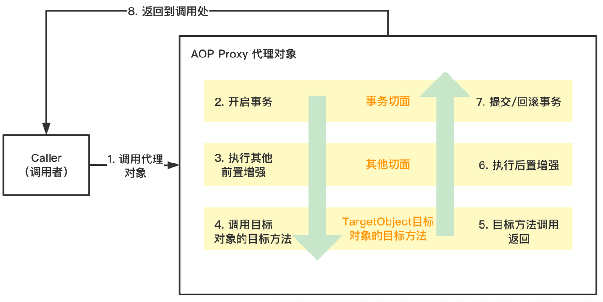

# 前言

AOP 在 Spring 项目中的使用是非常广泛的，例如日志、数据库事务、权限校验和访问控制等等场景。但是据了解对于 AOP 所实现的功能，在特定场景下会发生失效：

> 在同一个类中，调用使用注解方式的AOP功能的方法，目标方法的注解则会失效，即无法实现预期的功能控制，例如事务、权限等。

# AOP 方法作用原理



在项目中正常情况下，调用的对象是AOP代理的对象，而非实际的目标对象或者操作实例对象。 但是在类内部的方法中，调用同一个类中定义的方法，则调用的是当前的对象，而不是代理对象，则代理失效，注解失效。

# 具体例子

1. 自定义一个注解`@Log`用于加到指定方法上记录一些信息。

```java
@Retention(RetentionPolicy.RUNTIME)
@Target(ElementType.METHOD)
public @interface Log {
}
```

2. 然后写一个`Aspect`类来进行拦截增强处理

```java
@Component
@Aspect
public class LogAspect {
 
    @Pointcut("execution (* com.ac.aoptest.service..*.*(..))")
    public void logPointcut() {
 
    }
 
    @Around("logPointcut()")
    public void around(JoinPoint point) {
        String methodName = point.getSignature().getName();
        Object[] args = point.getArgs();
        Class<?>[] argTypes = new Class[point.getArgs().length];
        for (int i = 0; i < args.length; i++) {
            argTypes[i] = args[i].getClass();
        }
        Method method = null;
        try {
            method = point.getTarget().getClass().getMethod(methodName, argTypes);
        } catch (Exception e) {
            e.printStackTrace();
        }
        //获取方法上的注解
        Log log = method.getAnnotation(Log.class);
        if (log != null) {
            //演示方法执行前，记录一行日志
            System.out.println("before:" + methodName);
        }
        try {
            //执行方法
            ((ProceedingJoinPoint) point).proceed();
        } catch (Throwable throwable) {
            throwable.printStackTrace();
        } finally {
            if (log != null) {
                //演示方法执行后，记录一行日志
                System.out.println("after:" + methodName);
            }
        }
    }
}
```

3. 写一个`Service`类

```java
@Component
public class HelloService {
     
    @Log
    public void hello(String s) {
        System.out.println("\thello:" + s);
    }
 
    public void sayHello(String s) {
        this.hello(s);
    }
 
}
```

4. 启动类

```java
@ComponentScan("com.ac")
@Configuration
@EnableAspectJAutoProxy
public class Application {
 
    public static void main(String[] args) {
        AnnotationConfigApplicationContext context = new AnnotationConfigApplicationContext(Application.class);
        HelloService helloService = context.getBean(HelloService.class);
        helloService.hello("world-1");
        System.out.println("\n");
        helloService.sayHello("world-2");
    }
}
```

输出如下：

```
before:hello
    hello:world-1
after:hello
    hello:world-2
```

可以看出`sayHello`方法并未被 AOP 增强。原因上述原理即可解释，因为调用到`sayHello`方法时使用的是原始的`HelloService`的实例，而不是代理的实例。所以并没有被 AOP 增强。

# 解决方法

## 1. 用 @Autowired 注入自身的实例

直接在`HelloService`中注入自身实例，并在`sayHello`方法中使用自身实例调用即可。

```java
@Autowired
private HelloService helloService;

public void sayHello(String s) {
    helloService.hello(s);
}
```

## 2. 从 Spring 上下文获取增强后的实例引用

与1类似

```java
@Autowired
private ApplicationContext applicationContext;

public void sayHello(String s) {
    applicationContext.getBean(HelloService.class).hello(s);
}
```

## 3. 利用 AopContext

这个方法直接获取代理实例，但是需要在主启动类入口的注解上加上`@EnableAspectJAutoProxy(exporseProxy = true)`。

```java
public void sayHello(String s) {
    HelloService helloService = (HelloService) AppContext.currentProxy();
    helloService.hello(s);
}
```