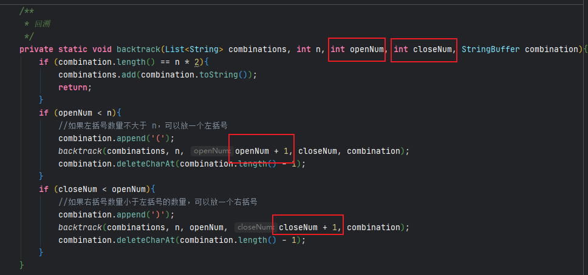
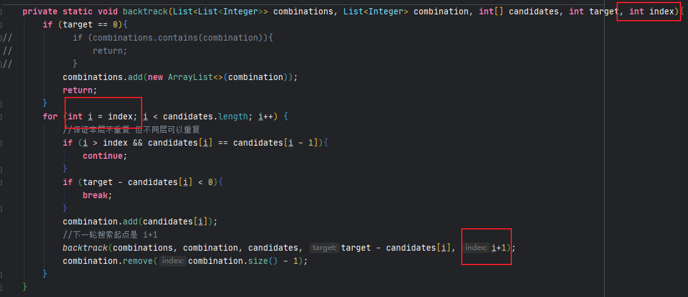
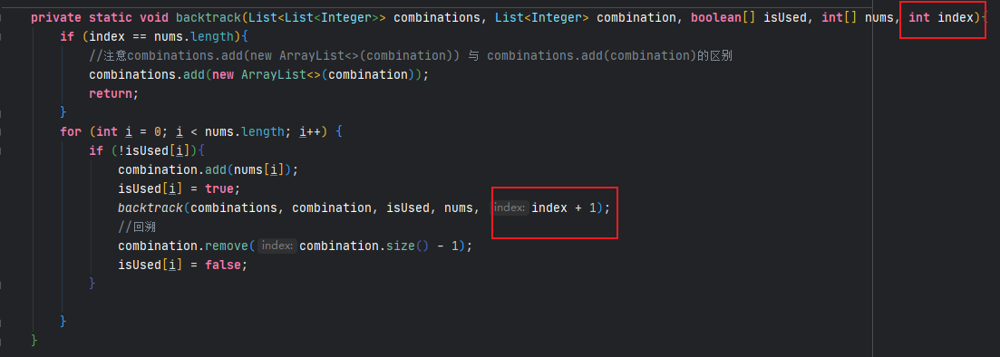
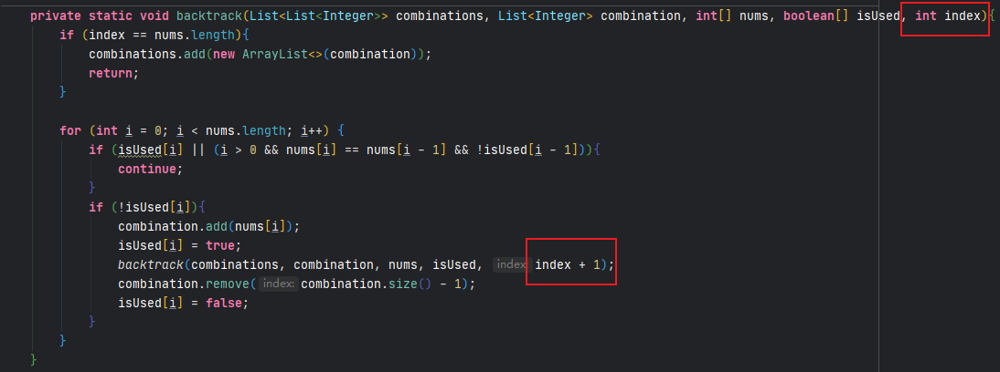
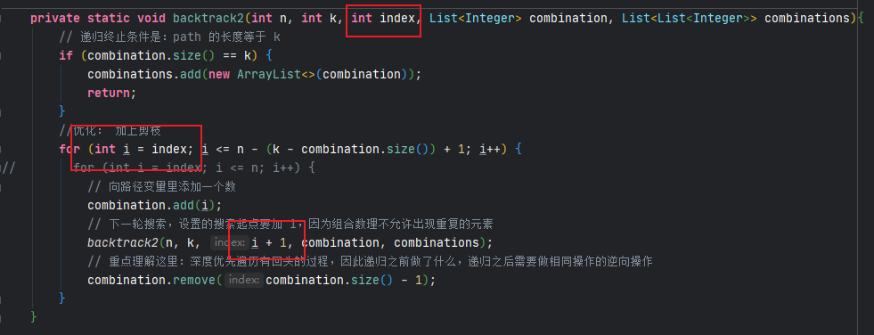

# 什么是回溯法

回溯法是一种搜索方式，只要有递归就会有回溯

回溯的本质是穷举，穷举所有可能，然后选出我们想要的答案。对回溯进行优化可以加一些剪枝的操作，但是也不会改变回溯法就是穷举的本质

**剪枝精髓是：for循环在寻找起点的时候要有一个范围，如果这个起点到集合终止之间的元素已经不够题目要求的k个元素了，就没有必要搜索了**

# 应用

- 组合问题：N个数里面按一定规则找出k个数的集合
- 切割问题：一个字符串按一定规则有几种切割方式
- 子集问题：一个N个数的集合里有多少符合条件的子集
- 排列问题：N个数按一定规则全排列，有几种排列方式
- 棋盘问题：N皇后，解数独等等

组合无序，排列有序

# 理解

回溯法可以理解为**树形结构**，因为回溯法解决的问题都是在集合中递归查找子集，集合的大小就构成了树的宽度，递归的深度，都构成的树的深度

递归是需要有终止条件的，所以一定是一颗高度有限的树

# 模板 --（重要）

- 回溯函数模板返回值和参数

**返回值**：回溯算法中函数返回值一般为void

**参数**：一般先写逻辑，然后需要什么参数，就填什么参数

```java
void backtrack(参数)
```

- 回溯函数终止条件

因为回溯法可以理解为树形结构，所以一般来说，搜索到叶子节点时，也就是找到了满足条件的一条答案，把这个答案存起来，并结束本层递归

```java
if (终止条件){
    存放结果;
    return;
}
```

- 回溯搜索的遍历过程

回溯法一般是在集合中递归搜索，集合的大小构成了树的宽度，递归的深度构成了树的深度


```java
for (选择 : 本层集合中元素（树中节点孩子的数量就是集合的大小）) {
    处理节点;
    backtrack(路径, 选择列表);  //递归
    回溯，撤销处理结果
}
```

**for循环是横向遍历，backtrack是纵向遍历**，这样就把这棵树全遍历完了。一般来说，搜索叶子节点就是找的其中一个结果

故回溯法模板如下：

```java
void backtrack(参数) {
    if (终止条件) {
        存放结果;
        return;
    }
    
    for (选择 : 本层集合中元素（树中节点孩子的数量就是集合的大小）) {
        处理节点;
        backtrack(路径, 选择列表);   //递归
        回溯，撤销处理结果
    }
}
```

# 算法题

下面的题目主要包括排列和组合

1. [leetcode-17. 电话号码的字母组合](https://leetcode-cn.com/problems/letter-combinations-of-a-phone-number/)
2. [leetcode-22. 括号生成](https://leetcode-cn.com/problems/generate-parentheses/)
3. [leetcode-39. 组合总和](https://leetcode-cn.com/problems/combination-sum/)
4. [leetcode-40. 组合总和2](https://leetcode-cn.com/problems/combination-sum-ii/)
5. [leetcode-46. 全排列](https://leetcode-cn.com/problems/permutations/)
6. [leetcode-47. 全排列2](https://leetcode-cn.com/problems/permutations-ii/)
7. [leetcode-77. 组合](https://leetcode-cn.com/problems/combinations/)
8. [leetcode-78. 子集](https://leetcode-cn.com/problems/subsets/)

# 难点分析

通过上述题目，可以知道回溯算法的难点在于回溯函数参数的选择以及纵向遍历时递归到下一层时参数的变化，尤其注意区分排列和组合














# 参考

1. [代码随想录-回溯算法理论基础](https://programmercarl.com/%E5%9B%9E%E6%BA%AF%E7%AE%97%E6%B3%95%E7%90%86%E8%AE%BA%E5%9F%BA%E7%A1%80.html#%E5%85%B6%E4%BB%96%E8%AF%AD%E8%A8%80%E7%89%88%E6%9C%AC)
