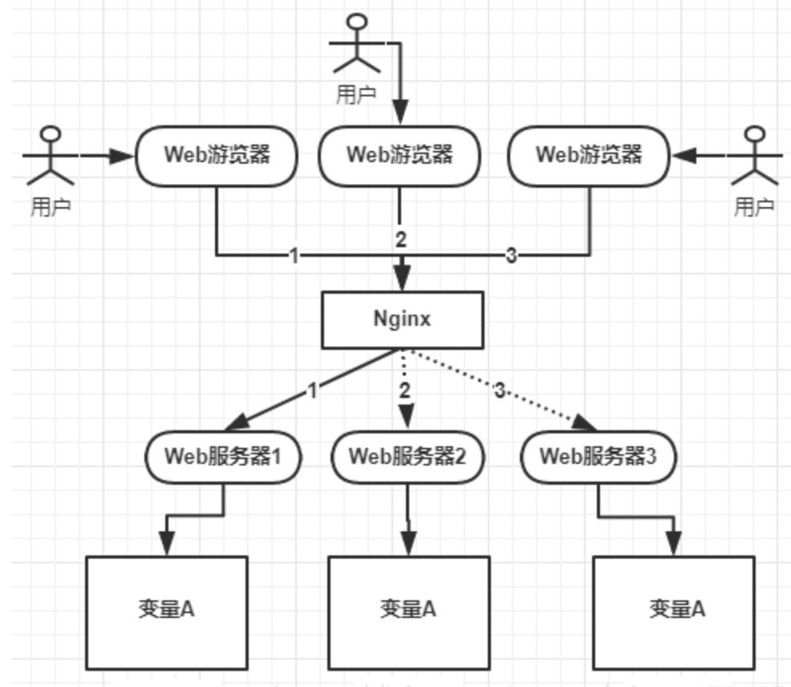
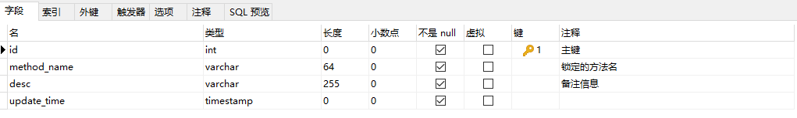
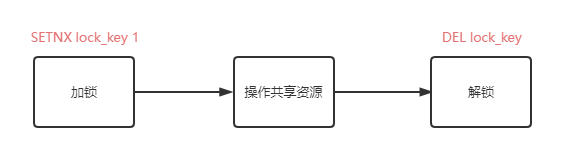
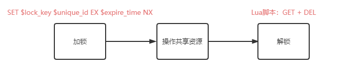
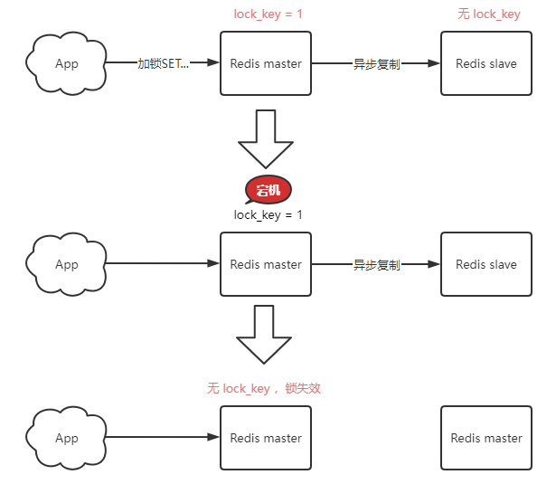
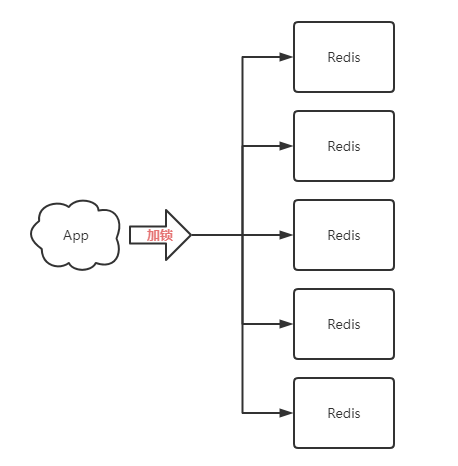

# 前言

 与分布式锁相对应的是**单机锁**，我们在写多线程程序时，避免同时操作一个共享变量产生数据问题，通常会使用一把锁来**互斥**，以保证共享变量的正确性，其适用范围是在**同一个进程中**。

那么换做是多个进程同时操作一个共享资源，这些资源已经不是在**线程**之间共享了，而是属于**进程**之间共享的资源。比如一个应用部署到几台机器上做负载均衡，如下图：



如上图所示，变量 A 存在三个服务器的内存中（这个变量 A 主要体现是在一个类中的一个成员变量，是一个有状态的对象），如果不加任何控制的话，变量 A 同时会再分配一块内存，三个请求发过来同时对这个变量操作，显然结果是不对的。即使不是同时发送过来，单个请求分别操作三个不同内存区域的数据，变量 A 之间不存在共享，也不具有可见性，处理的结果也是不对的。

由于分布式系统多线程、多进程并且分布在不同机器上，这将使原单机部署情况下的并发控制锁策略失效，单纯的应用并不能提供分布式锁的能力。为了解决这个问题就需要一种跨机器的互斥机制来控制共享资源的访问，这就是分布式锁要解决的问题。

# 分布式锁应该具备的条件

分布式锁：是指在分布式的部署环境下，通过锁机制来让多客户端互斥的对共享资源进行访问。

1. 在分布式系统环境下，一个方法在同一时间段只能被一个机器的一个线程执行
2. 高可用和的获取锁和释放锁
3. 高性能的获取锁和释放锁
4. 具备可重入特性
5. 具备锁失效机制，防止死锁
6. 具备非阻塞锁特性，即没有获取到锁将直接返回获取锁失败

# 分布式锁的三种实现方式

分布式场景中的数据一致性问题一直是一个比较重要的话题。

> 分布式的CAP理论告诉我们“任何一个分布式系统都无法同时满足一致性`(Consistency)`、可用性`(Availability)`和分区容错性`(Partition tolerance)`，最多只能同时满足**两项**。”所以，很多系统在设计之初就要对这三者做出取舍。在互联网领域的绝大多数的场景中，都需要**牺牲强一致性来换取系统的高可用性**，系统往往只需要保证“**最终一致性**”，只要这个最终时间是在用户可以接受的范围内即可。

目前主流的实现方式有三种从实现的复杂度上来看，从上往下难度依次增加：

1. 基于数据库实现
2. 基于 Redis 实现
3. 基于 ZooKeeper 实现

## 基于数据库实现

基于数据库的实现方式的核心思想是：在数据库中创建一个表，表中包含**方法名**等字段，并在**方法名字段上创建唯一索引**，想要执行某个方法，就使用这个方法名向表中插入数据，成功插入则获取锁，执行完成后删除对应的行数据释放锁。

1. 创建一个表



2. 若要执行某个方法，就使用这个方法名向表中插入数据

   ```sql
   INSERT INTO method_lock (method_name, desc) VALUES ('methodName', '测试的methodName');
   ```

   因为对`method_name`做了**唯一性约束**，这里如果有多个请求同时提交到数据库的话，数据库会保证只有一个操作可以成功，那么我们就可以认为操作成功的那个线程获得了该方法的锁，可以执行方法体内容。

3. 成功插入则获取锁，执行完成后删除对应的行数据释放锁

   ```sql
   delete from method_lock where method_name ='methodName';
   ```

**缺点**：

- 数据库的可用性和性能将直接影响分布式锁的可用性和性能，所以数据库需要双机部署、数据同步、主备切换。
- 不具备可重入的特性，因为同一个线程在释放锁之前，行数据一直存在，无法再次成功插入数据，所以，需要在表中新增一列，用于记录当前获取到锁的机器和线程信息，在再次获取锁的时候，先查询表中机器和线程信息是否和当前机器和线程相同，若相同则直接获取锁。
- 没有锁失效机制，因为有可能出现成功插入数据后，服务器宕机了，对应的数据没有被删除，当服务恢复后一直获取不到锁，所以，需要在表中新增一列，用于记录失效时间，并且需要有定时任务清除这些失效的数据。
- 不具备阻塞锁特性，获取不到锁直接返回失败

## 基于 ZooKeeper 的实现方式

ZooKeeper是一个为分布式应用提供一致性服务的开源组件，它内部是一个分层的文件系统目录树结构，规定同一个目录下只能有一个唯一文件名。基于ZooKeeper实现分布式锁的步骤如下：

1. 创建一个目录`mylock`
2. 线程 A 想获取锁就在 `mylock`目录下创建临时顺序节点
3. 获取`mylock`目录下所有的子节点，然后获取比自己小的兄弟节点，如果不存在，则说明当前线程顺序号最小，获得锁
4. 线程 B 获取所有节点，判断自己不是最小节点，设置监听比自己次小的节点
5. 线程 A 处理完，删除自己的节点，线程 B 监听到变更事件，判断自己是不是最小的节点，如果是则获得锁

**优点**：具备高可用、可重入、阻塞锁特性，可解决失效死锁问题。

**缺点**：因为需要频繁的创建和删除节点，性能上不如 Redis 方式。

## 基于 Redis 的实现方式

选用 Redis 实现分布式锁的原因：

- Redis 性能比较高
- Redis 命令对此支持较好，实现起来比较方便


【分析】

1. **实现分布式锁**

   使用`SETNX`命令，表示`SET if Not eXists`，即如果 key 不存在，才会设置它的值，否则不做操作。返回1表示加锁成功，0表示加锁失败。

   加锁成功的客户端就可以去操作**共享资源**，操作完成后及时释放锁，使用`DEL`命令删除这个 key 即可释放锁。

   

   **缺陷**：出现死锁。

   原因：客户端1拿到锁后，业务处理异常没有及时释放锁或者进程挂了没有释放锁，那么其他客户端就会一直拿不到这个锁了

2. **如何避免死锁**

   给这个 key 设置一个**过期时间**。

   ```shell
   SETNX lock 1    // 加锁
   EXPIRE lock 10  // 10s后自动过期
   ```

   **缺陷**：依旧可能发生死锁

   原因：加锁和过期是2条命令，可能出现只执行了第一条，发生异常情况第2条来不及执行的情况，所以过期时间设置失败

   在 Redis 2.6.12 之后，Redis 扩展了 SET 命令的参数

   ```shell
   SET lock 1 EX 10 NX  // 一条命令保证原子性执行
   ```

   这样可以解决死锁问题，但是还存在两个严重的问题：

   1. **锁过期**：客户端 1 操作共享资源耗时太久，导致锁被自动释放，之后被客户端 2 持有
   2. **释放别人的锁**：客户端 1 操作共享资源完成后，却又释放了客户端 2 的锁

   锁被别人释放的解决办法是客户端在加锁时，设置一个**唯一标识**进去，然后在释放锁时，先判断这把锁是否是自己的，伪代码如下：

   ```
   // 锁是自己的，才释放
   if redis.get("lock") == $uuid:
       redis.del("lock")
   ```

   这里释放锁使用的是`GET + DEL`两条命令，因此又会出现前面的原子性问题，当客户端1执行`GET`判断锁是自己的后，客户端2执行了`SET`命令强制获取到锁，此时客户端1执行`DEL`却释放了客户端2的锁。

   `Lua`脚本可以解决这个问题。

   Redis 处理请求是**单线程**执行的，因此执行一个`Lua`脚本时，其他请求必须等待，这样一来，`GET + DEL`就不会插入其他命令了。

   安全释放锁的 Lua 脚本如下：

   ```lua
   // 判断锁是自己的，才释放
   if redis.call("GET",KEYS[1]) == ARGV[1]
   then
           return redis.call("DEL",KEYS[1])
   else
           return 0
   end
   ```

   【小结】

   目前为止，基于 Redis 实现的分布式锁的流程如下：

   - 加锁：

   ```shell
   SET $lock_key $unique_id EX $expire_time NX
   ```

   - 操作共享资源
   - 释放锁：`Lua`脚本，先判断锁是否是自己的，再释放

   

3. **锁过期时间不好评估怎么办？**

   解决方案：加锁时，先设置一个**过期时间**，然后开启一个**守护进程**，定时去检测这个锁的失效时间，如果锁要过期了，操作共享资源还没有完成， 那么就对锁进程**续期**，重新设置过期时间。

   若使用`Java`技术栈，那么可以使用`Redisson`。`Redisson`是一个 `Java`实现的 `Redis SDK`客户端，在使用分布式锁时，它就采用了**自动续期**的方案来避免锁过期，这个守护进程我们一般也把它叫做**看门狗**线程。

   [Redisson-Redis Java客户端](https://github.com/redisson/redisson)

   【小结】

   前面的问题及解决方案如下：

   - 死锁：设置过期时间
   - 过期时间评估不好，锁提前过期：守护进程， 自动续期
   - 锁被别人释放：锁写入唯一标识，释放锁线检查标识，再释放

4. **Redis 集群模式发生主从切换时，这个分布式锁安全吗？**

   之前分析的场景都是锁在**单个** Redis 实例中可能产生的问题，并没有涉及到 Redis 的部署架构细节，但在使用 Redis 时，一般会采用**主从集群 + 哨兵**的模式部署。

   下面有一个场景：

   1. 客户端 1 在主库上执行 SET 命令，加锁成功
   2. 此时，主库异常宕机，SET 命令还未同步到从库上（主从复制是异步的）
   3. 从库被哨兵提升为新主库，这个锁在新的主库上，丢失了

   

   解决方案：**Redlock （红锁）**。

5. **Redlock**

   Redlock 的方案基于2个前提：

   1. 不再需要部署**从库**和**哨兵**实例，只部署**主库**，他们之间没有任何关系，都是孤立的实例
   2. 但主库要部署多个，官方推荐至少5个

   

   Redlock 的具体使用：

   1. 客户端先获取「当前时间戳T1」
   2. 客户端依次向这 5 个 Redis 实例发起加锁请求（用前面讲到的 SET 命令），且每个请求会设置超时时间（毫秒级，要远小于锁的有效时间），如果某一个实例加锁失败（包括网络超时、锁被其它人持有等各种异常情况），就立即向下一个 Redis 实例申请加锁
   3. 如果客户端从 >=3 个（大多数）以上 Redis 实例加锁成功，则再次获取「当前时间戳T2」，如果 T2 - T1 < 锁的过期时间，此时，认为客户端加锁成功，否则认为加锁失败
   4. 加锁成功，去操作共享资源
   5. 加锁失败，向「全部节点」发起释放锁请求（前面讲到的 Lua 脚本释放锁）

# 基于 Redis 的分布式锁的实现

1. `Redisson`**实现简单分布式锁**

2. `Redis`**自定义注解实现分布式锁**：`SpringBoot` + `Jedis` + `AOP`


源码地址：[redis-lock](https://gitee.com/acacac13/redis-lock)

# 参考

1. [什么是分布式锁？实现分布式锁的三种方式 - 刘清政的博客](https://www.cnblogs.com/liuqingzheng/p/11080501.html)
2. [使用Redis实现分布式锁和ZK实现分布式锁有什么区别，分别有哪些场景? - 知乎](https://www.zhihu.com/question/452803310/answer/1933678024)
3. [基于Redis的分布式锁实现 - 掘金](https://juejin.cn/post/6844903830442737671#heading-16)
4. [基于redis的分布式锁实现 - 博客园](https://www.cnblogs.com/xiaoxiongcanguan/p/10718202.html)
5. [Springboot分布式锁实践（redis）- 博客园](https://www.cnblogs.com/carrychan/p/9431137.html)
6. [实现基于redis的分布式锁并集成spring-boot-starter - CSDN](https://blog.csdn.net/litterfrog/article/details/83377589)

