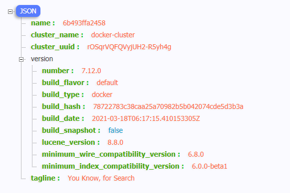
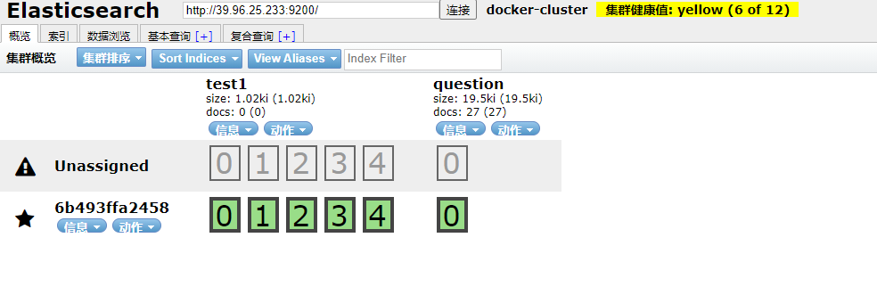

# Docker部署ElasticSearch

## 1.1 拉取镜像

```bash
docker pull elasticsearch:7.12.0
```

## 1.2 创建容器并启动

ElasticSearch的默认端口是9200，把宿主环境9200端口映射到Docker容器中的9200端口，就可以访问到Docker容器中的ElasticSearch服务了，同时把这个容器明明为elasticsearch

```basic
docker run -d --name elasticsearch -p 9200:9200 -p 9300:9300 -e ES_JAVA_OPTS="-Xms256m -Xmx256m" -e "discovery.type=single-node" 镜像id
```

## 1.3 配置内存

避免elasticsearch占用内存过多设置其初始内存和最大内存，修改容器中的==jvm.options==配置文件

```bash
修改里面

-Xms256m
-Xmx256m
```

## 1.4 配置跨域

### 1.4.1 进入容器

进入容器中修改相应的配置信息

```bash
docker exec -it elasticsearch /bin/bash
```

### 1.4.2 进行配置

```bash
# 显示文件
ls
结果如下：
LICENSE.txt  README.textile  config  lib   modules
NOTICE.txt   bin             data    logs  plugins

# 进入配置文件夹
cd config

# 显示文件
ls
结果如下：
elasticsearch.keystore  ingest-geoip  log4j2.properties  roles.yml  users_roles
elasticsearch.yml       jvm.options   role_mapping.yml   users

# 修改配置文件
vi elasticsearch.yml

# 加入跨域配置
http.cors.enabled: true
http.cors.allow-origin: "*"
```

## 1.5 重启容器

由于修改了配置，因此需要重启ElasticSearch容器

```bash
docker restart elasticsearch
```



# Docker部署ElasticSearch-head

安装==ElasticSearch-head==的原因是需要又一个管理界面进行查看ElasticSearch的相关信息

## 2.1 拉取镜像

```bash
docker pull mobz/elasticsearch-head:5
```

## 2.2 运行容器

```bash
docker run -d --name es_admin -p 9100:9100 镜像id
```



## 2.3 常见问题

创建索引失败

```bash
docker exec -it es_admin /bin/bash
```

使用此命令进入es_head插件安装目录终端

编辑 **/usr/src/app/_site/vendor.js**

```bash
1. 6886行 /contentType: "application/x-www-form-urlencoded 
    改成 contentType: "application/json;charset=UTF-8" 
2. 7574行 var inspectData = s.contentType === "application/x-www-form-urlencoded" && 
    改成 var inspectData = s.contentType === "application/json;charset=UTF-8" &&
```

