#  JVM 与 Java 体系结构

  JVM 是一个跨语言的平台

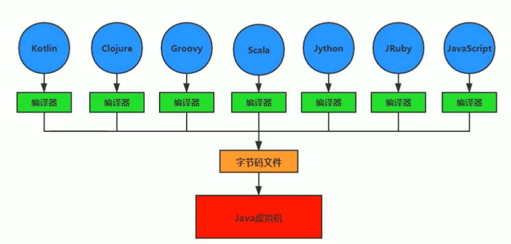

**虚拟机概念**

所谓虚拟机`(Vitual Machine)`，就是一台虚拟的计算机。它是一款软件，用来执行一系列虚拟计算机指令。大体上，虚拟机可以分为**系统虚拟机**和**程序虚拟机**。

- Visual Box ，VMware 就是属于系统虚拟机，**完全是对物理计算机的仿真**，提供了一个可运行完整操作系统的软件平台。
- 程序虚拟机的典型代表就是 Java 虚拟机， **专门为执行单个计算机程序而设计**，在 Java 虚拟机中执行的指令我们称为 Java 字节码指令。

## Java 虚拟机

Java 虚拟机是一台执行 Java 字节码的虚拟计算机，它拥有独立的运行机制，其运行的 Java 字节码也未必由 Java 语言编译而成。

JVM 平台的各种语言可以共享 Java 虚拟机带来的跨平台性、优秀的垃圾回收器，以及可靠的即时编译器。

**Java 技术的核心就是 Java 虚拟机**，因为所有的 Java 程序都运行在 Java 虚拟机内部。

- 作用：

  Java 虚拟机就是二进制字节码的运行环境，负责装在字节码到其内部，解释/编译为对应平台上的机器指令执行。

- 特点：

  一次编译，到处运行

  自动内存管理

  自动垃圾回收功能

**JVM 的位置**

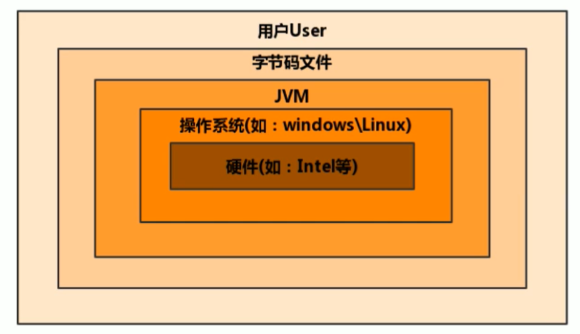

JVM 是运行在操作系统之上的，它与硬件没有直接的交互。

**JVM 的整体结构**

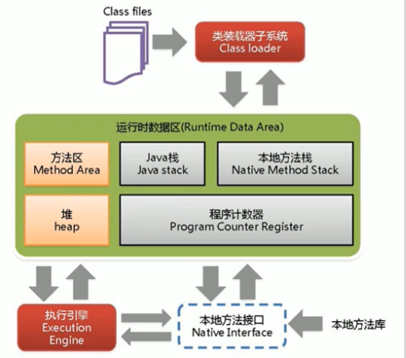

**Java 代码执行流程**

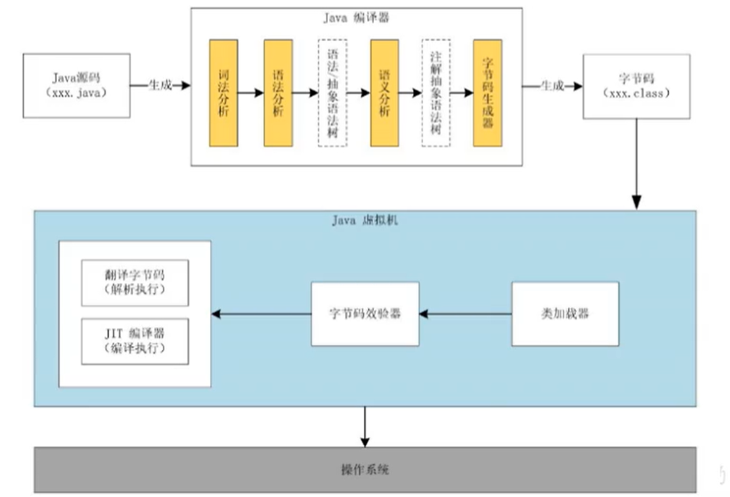

## JVM 的架构模型

Java 编译器输入的指令流基本上是一种基于**栈的指令集结构**，另外一种指令集架构则是基于**寄存器的指令集架构**。

## JVM 的生命周期

虚拟机的启动

Java 虚拟机的启动是通过引导类加载器（bootstrap class loader）创建一个初始类（initial class）来完成的，这个类是由虚拟机的具体实现指定的。

虚拟机的执行

- 一个运行中的 Java 虚拟机有着一个清晰的任务：执行 Java 程序
- 程序开始执行时他才开始运行，程序结束时他就停止
- 执行一个所谓的 Java 程序的时候，真真正正在执行的是一个叫做 Java 虚拟机的进程

虚拟机的退出

- 程序正常执行结束
- 程序在执行过程中遇到了异常或错误而异常终止
- 由于操作系统出现错误而导致 Java 虚拟机进程终止
- 某线程调用 Runtime 类或 System 类的 exit 方法，或 Runtime 类的 halt 方法，并且 Java 安全管理器也允许这次 exit 或 halt 操作
- 除此之外，`JNI(Java Native Interface)`规范描述了用 JNI Invocation API 来加载或卸载 Java 虚拟机时，Java 虚拟机的退出情况

## JVM 发展历程

SUN Classic VM、Exact VM、**HotSpot VM**、**JRockit VM**、**IBM J9 VM**、KVM、CDC/CLDC HotSpot、Azul VM、BEA Liquid VM、Apache Harmony、Microsoft JVM、TaobaoJVM、Dalvik VM、**Graal VM**

# 类加载子系统

## 类加载子系统的作用

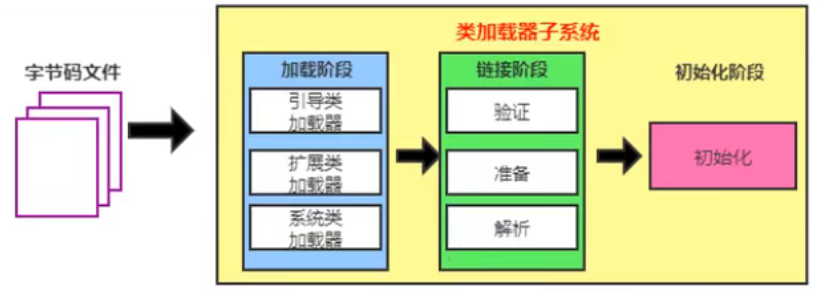

- 类加载子系统负责从文件系统或者网络中加载 class 文件， class 文件在文件开头有特定的文件标识
- ClassLoader 只负责 class 文件的**加载**，至于它是否可以运行，则由 Execution Engine 决定
- 加载的类信息存放于一块称为**方法区**的内存空间。除了类的信息外，方法区中还会存放运行时常量池信息，可能还包括字符串字面量和数字常量（这部分常量信息是 cllass 文件中常量池部分的内存映射）

## 类加载器 ClassLoader 角色

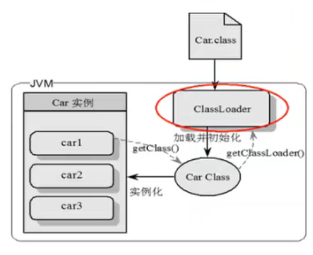

1. class file 存在与本地硬盘上，可以理解为设计师画在纸上的模板，而最终这个模板在执行的时候是要加载到 JVM 中来根据这个文件实例化出 n 个一模一样的实例。
2. class file 加载到 JVM 中，被称为 DNA 元数据模板，放在方法区。
3. 在 class 文件 -> JVM -> 最终称为元数据模板，此过程就要一个运输工具（类装载器 Class Loader），扮演一个快递员的角色。

## 类的加载过程

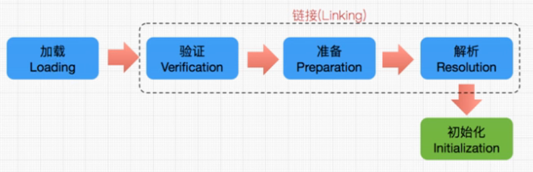

### 加载

1. 通过一个类的全限定名获取定义此类的二进制字节流
2. 将这个字节流所代表的静态存储结构转化为**方法区**的运行时数据结构
3. 在内存中生成一个代表这个类的`java.lang.Class`对象，作为方法区这个类的各种数据的访问入口

补充：加载`.class`文件的方式

- 从本地系统中直接加载
- 通过网络获取，典型场景：Web Applet
- 从`zip`压缩包中读取，成为日后`jar`、`war`格式的基础
- 运行时计算生成，使用最多的是：[动态代理](https://cloud.tencent.com/developer/article/1461796)技术
- 由其他文件生成，典型场景：`JSP`应用
- 从专有数据库中提取`.class`文件，比较少见
- 从加密文件中获取，典型的防`Class`文件被反编译的保护措施

### 链接

- 验证`(Verify)`
  - 目的是确保`Class`文件的字节流中包含信息符合当前虚拟机要求，保证被加载类的正确性
  - 主要包括四种验证，文件格式验证，元数据验证，字节码验证，符号引用验证
- 准备`(Prepare)`
  - 为类变量分配内存并且设置该类变量的默认初始值，即零值
  - 这里不包含用`final`修饰的`static`，因为`final`在编译的时候就会分配了，准备阶段会显式初始化
  - **这里不会为实例变量分配初始化**，类变量会分配在方法区中，而实例变量是会随着对象一起分配到`Java`堆中
- 解析`(Resolve)`
  - 将常量池内的符号引用转换为直接引用的过程
  - 解析操作往往会伴随着`JVM`在执行完初始化之后再执行
  - 符号引用就是一组符号来描述所引用的目标。直接引用就是直接指向目标的指针、相对偏移量或一个间接定位到目标的句柄
  - 解析动作主要是针对类或接口、字段、类方法、接口方法、方法类型等

### 初始化

- 初始化阶段就是执行类构造器方法`<clinit>()`的过程
- 此方法不需定义，是`javac`编译器自动收集类中的所有类变量的赋值动作和静态代码块中的语句合并而来
- 构造器方法中指令按语句在源文件中出现的顺序执行
- `<clinit>()`不同于类的构造器
- 若该类具有父类，`JVM`会保证子类的`<clinit>()`执行前，父类的`<clinit>()`已经执行完毕
- 虚拟机必须保证一个类的`<clinit>()`方法子啊多线程下被同步加锁

## 类加载器的分类

- `JVM`支持两种类型的类加载器。分别为引导类加载器`(Bootstrap ClassLoader)`和自定义类加载器`(User-Defined ClassLoader)`

- 从概念上来讲，自定义类加载器一般指的是程序中由开发人员自定义的一类加载器，但是`Java`虚拟机规范却没有这么定义，而是将所有派生于抽象类`ClassLoader`的类加载器都划分为自定义加载器

- 无论类加载器的类型和如何划分，在程序最常见的类加载器始终只有3个

  - `Bootstrap Class Loader` 引导类加载器
  - `Extension Class Loader` 扩展类加载器
  - `System Class Loader` 系统类加载器

  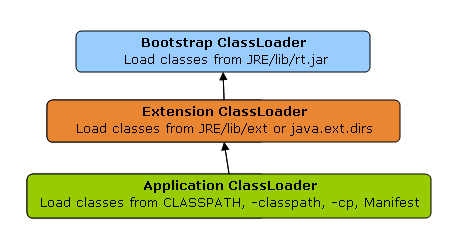

### 虚拟机自带的加载器

#### 启动类加载器 （引导类加载器，Bootstarp ClassLoader）

- 这个类加载是用`C/C++`实现的，嵌套在`JVM`内部
- 它用来加载`Java`的核心库，用于提供`JVM`自身需要的类
- 并不继承自`java.lang.ClassLoader`，没有父加载器
- 加载扩展类和应用程序类加载器，并指定为他们的父类加载器
- 出于安全考虑，`Bootstrap`启动类加载器只加载包名为`java`、`javax`、`sun`等开头的类

#### 扩展类加载器（Extension ClassLoader）

- `Java`编写，由`sun.misc.Launcher$ExtClassLoader`实现
- 派生于`ClassLoader`类
- 父类加载器为启动类加载器
- 从`java.ext.dirs`系统属性所指定的目录中加载类库，或从`JDK`的安装目录的`jre/lib/ext`子目录（扩展目录）下加载类库。如果用户创建的`JAR`放在此目录下，也会自动由扩展类加载器加载

#### 应用程序类加载器（系统类加载器，AppClassLoader）

- `java`编写，由`sun.misc.Launcher$AppClassLoader`实现
- 派生于`ClassLoader`类
- 父类加载器为扩展类加载器
- 它负责加载环境变量`classpath`或系统属性`java.class.path`指定路径下的类库
- 该类是程序中默认的类加载器，一般来说，`Java`应用的类都是由它来完成加载
- 通过`ClassLoader$getSystemClassLoader()`方法可以获取到该类加载器

### 用户自定义的加载器

需要自定义类加载器的原因

- 隔离加载类
- 修改类加载的方式
- 扩展加载源
- 防止源码泄露

用户自定义类加载器实现步骤：

1. 通过继承抽象类`java.lang.ClassLoader`类的方式实现
2. 把自定义的类加载逻辑写在`findClass()`方法中
3. 在没有太过于复杂的需求时，可以直接继承`URLClassLoader`类，避免自己编写`findClass()`方法及前期获取字节码流的方式，使自定义类加载器编写更加简洁

### 关于 ClassLoader

`ClassLoader`类是一个抽象类，其后所有的类加载器都继承自`ClassLoader`（不包括启动类加载器）

| 方法名称                                               | 描述                                                         |
| :----------------------------------------------------- | :----------------------------------------------------------- |
| `getParent()`                                          | 返回该类加载器的超类加载器                                   |
| `loadClass(String name)`                               | 加载名称为`name`的类，返回结果为`java.lang.Class`类的实例    |
| `findClass(String name)`                               | 查找名称为`name`的类，返回结果为`java.lang.Class`类的实例    |
| `findLoadedClass(String name)`                         | 查找名称为`name`的已经被加载过的类，返回结果为`java.lang.Class`类的实例 |
| `defineClass(String name, byte[] b, int off, int len)` | 把字节数组`b`中的内容转换为一个`Java`类，返回结果为`java.lang.Class`类的实例 |
| `resolveClass(Class<?> c)`                             | 连接指定的一个`Java`类                                       |

`sun.misc.Launcher`是一个`Java`虚拟机的入口应用。

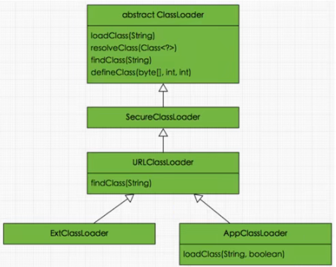

**获取 ClassLoader 的途径**

1. 获取当前类的`ClassLoader`

   ```java
   clazz.getClassLoader();
   ```

2. 获取当前线程上下文的`ClassLoader`

   ```java
   Thread.currentThread().getContextClassLoader()
   ```

3. 获取系统的`ClassLoader`

   ```java
   ClassLoader.getSystemClassLoader()
   ```

4. 获取调用者的`ClassLoader`

   ```java
   DriverManager.getCallerClassLoader()
   ```

## 双亲委派机制

Java 虚拟机对 class 文件采用的是**按需加载**的方式，也就是说当需要使用该类时才会将它的 class 文件加载到内存生成 class 对象。而且加载某个类的 class 文件时，Java 虚拟机采用的是**双亲委派模式**，即把请求交由父类处理，它是一种任务委派模式。

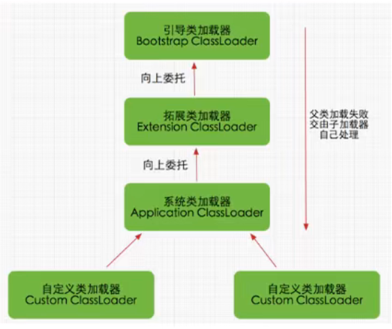

1. 如果一个类加载器收到了类加载请求，它并不会自己先去加载，而是把这个请求委托给父类的加载器去执行；
2. 如果父类加载器还存在其父类加载器，则进一步向上委托，依次递归，请求最终将到达顶层的启动类加载器；
3. 如果父类加载器可以完成类加载任务，就成功返回，倘若父类加载器无法完成此加载任务，子加载器才会尝试自己去加载，这就是双亲委派模式。

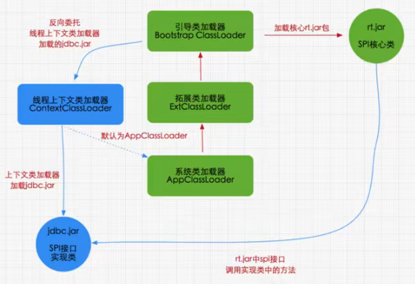

**双亲委派机制优势**

- 避免重复加载
- 保护程序安全，防止核心`API`被篡改
  - 自定义类：`java.lang.String`
  - 自定义类：`java.lang.ShkStart`

### 沙箱安全机制

自定义 String 类，但是在加载自定义 String 类的时候会率先使用引导类加载器加载，而引导类加载器在加载的过程中会先加载 jdk 自带的文件`(rt.jar包中java\lang\string.class)`，报错信息说没有 main 方法：就是因为加载的是 rt.jar 包中的 String 类。这样可以保证对 java 核心源代码的保护，这就是**沙箱安全机制**。

## 其他

在`JVM`中表示两个`class`对象是否为同一个类存在两个必要条件：

- 类的完整类名必须一致，包括包名
- 加载这个类的`ClassLoader`实例对象必须相同

即在`JVM`中，即使这两个类对象（`class`对象）来源同一个`class`文件，被同一个虚拟机所加载，但只要加载它们的`classLoader`实例对象不同，那么这两个类对象也是不相等的。

### 对类加载器的引用

JVM 必须知道一个类型是由启动加载器加载的还是由用户类加载器加载的。如果一个类型是由用户类加载器加载的，那么 JVM 会**将这个类加载器的一个引用作为类型信息的一部分保存在方法区中**。当解析一个类型到另一个类型的引用的时候，JVM 需要保证这两个类型的类加载器是相同的。

### 类的主动使用和被动使用

Java 程序对类的使用方式分为：主动使用和被动使用。

主动使用，又分为七种情况：

1. 创建类的实例
2. 访问某个类或接口的静态变量，或者对该静态变量赋值
3. 调用类的静态方法
4. 反射（比如：`class.forName ("com.xxx.Test")`）
5. 初始化一个类的子类
6. `Java`虚拟机启动时被标明为启动类的类
7. `JDK 7`开始提供的动态语言支持：`java.lang.invoke.MethodHandle`实例的解析结果`REF_getstatic`、`REF_putstatic`、`REF_invokestatic`句柄对应的类没有初始化，则初始化

除了以上七种情况，其他使用 Java 类的方式都被看作是对**类的被动使用**，都**不会导致类的初始化**。

# 运行时数据区

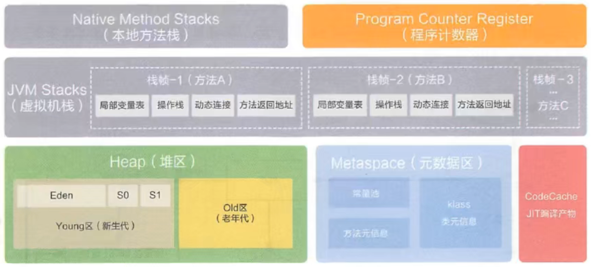

**线程**

- 线程时一个程序里的运行单元。`JVM`允许一个应用有多个线程并行的执行。
- 在`Hotspot JVM`里，每个线程都与操作系统的本地线程直接映射。
  - 当一个`Java`线程准备好执行以后，此时一个操作系统的本地线程也同时创建。`Java`线程执行终止后，本地线程也会回收。
- 操作系统负责所有线程的安排调度到任何一个可用的`CPU`上。一旦本地线程初始化成功，它就会调用`Java`线程中的`run()`方法。

## 程序计数器（PC 寄存器）

`JVM`中的`PC`寄存器是对物理`PC`寄存器的一种抽象模拟。

**作用**

`PC`寄存器用来存储指向下一条指令的地址，也即将要执行的指令代码。由执行引擎读取下一条指令。

`PC`寄存器是唯一一个不会发生`OOM`的区域。

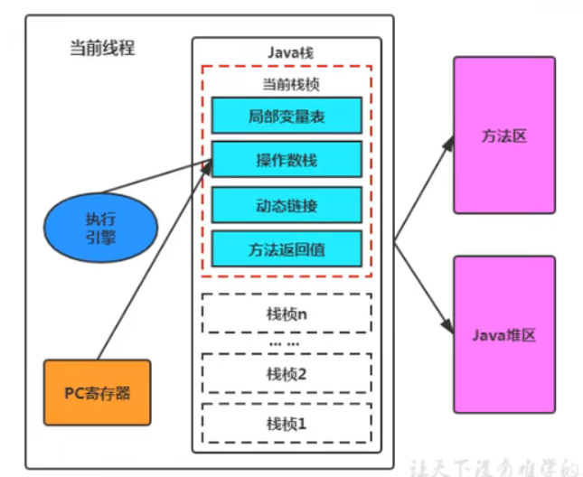

**常见问题**

1. 使用`PC`寄存器存储字节码指令地址有什么用呢？为什么使用`PC`寄存器记录当前线程的执行地址呢？

   因为`CPU`需要不停的切换各个线程，这时候切换回来以后，就得知道接着从哪开始继续执行。

   `JVM`的字节码解释器就需要通过改变`PC`寄存器的值来明确下一条应该执行什么样的字节码指令。

   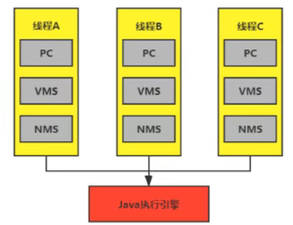

   2. `PC`寄存器为什么会被设定为线程私有？

      多线程在一个特定的时间段内只会执行其中某一个线程方法，`CPU`会不停地做任务切换，这样必然导致经常终断或者恢复，为了能够准确地记录各个线程正在执行的当前字节码指令地址，最好的办法自然是为每一个线程都分配一个`PC`寄存器，这样各个线程之间便可以进行独立计算，从而不会出现相互干扰的情况。

      由于`CPU`时间片轮限制，众多线程在并发执行过程中，任何一个确定的时刻，一个处理器或者多核处理器中的一个内核，只会执行某个线程中的一条指令。

      这样必然导致经常中断或恢复，如何保证分毫无差呢？每个线程在创建后，都会产生自己的程序计数器和栈帧，程序计数器在各个线程之间互不影响。

## 虚拟机栈

### 概述

栈是运行时的单位，而堆是存储的单位。即栈解决程序的运行问题，堆解决数据存储的问题。

**定义**

`Java`虚拟机栈`(Java virtual Machine stack)`，早期也叫`Java`栈。每个线程在创建时都会创建一个虚拟机栈，其内部保存一个个的栈帧`(stack Frame)`，对应着一次次的`Java`方法调用。是线程私有的。

**生命周期**

生命周期和线程一致。

**作用**

主管`Java`程序的运行，它保存方法的局部变量、部分结果，并参与方法的调用和返回。

**栈的特点**

- 栈是一种快速有效的分配存储方式，访问速度仅次于程序计数器
- `JVM`直接对`Java`栈的操作只有两个：
  - 每个方法执行，伴随着进栈（入栈、压栈）
  - 执行结束后的出栈工作
- 对于栈来说不存在垃圾回收问题

**栈中可能出现的异常**

`Java`虚拟机规范允许`java`栈的大小是动态的或者是固定不变的

- 如果采用固定大小的`java`虚拟机栈，那每一个线程的`java`虚拟机栈容量可以在线程创建的时候独立选定。如果线程请求分配的栈容量超过`java`虚拟机栈允许的最大容量，`java`虚拟机将会抛出一个`StackOverFlowError`异常
- 如果`java`虚拟机栈可以动态扩展，并且在尝试扩展的时候无法申请到足够的内存，或者在创建新的线程时没有足够的内存去创建对应的虚拟机栈，那`java`虚拟机将会抛出以一个`OutOfMemoryError`异常

### 栈的存储单位

- 每个线程都有自己的栈，栈中的数据是以栈帧`(Stack Frame)`的格式存在的。
- 线程上正在执行的每个方法都对应一个栈帧。
- 栈帧是一个内存区块，是一个而数据集，维系着方法执行过程中的各种信息。

不同线程中所包含的栈帧是不允许存在相互引用的，即不可能在一个栈帧中引用另一个线程的栈帧。

**栈帧的内部结构**

每个栈帧中存储着：

- 局部变量表`(Local Variables)`
- 操作数栈`(Operand Stack)`
- 动态链接`(Dynamic Linking)`
- 方法返回地址`(Return Address)`
- 附加信息

### 局部变量表

- 定义为一个数字数组，主要用于**存储方法参数和定义在方法体内的局部变量**，这些数据类型包括各类基本数据类型、对象引用 (reference)，以及 returnAddress 类型。
- 由于局部变量表是建立在线程的栈上，是线程的私有数据，因此**不存在数据安全问题**。
- **局部变量表所需的容量大小是在编译期确定下来的**，并保存在方法的 Code 属性的 maximum local variables 数据项中。在方法运行期间是不会改变局部变量表的大小的。

**关于 Slot 的理解**

- 局部变量表，最基本的存储单元是`Slot`（变量槽）。
- 在局部变量表里，32位以内的类型只占用一个`slot`（包括`returnAddress`类型），64位的类型（`long`和`double`）占用两个`slot`。
- `JVM`为局部变量表中的每一个`Slot`分配一个访问索引，通过这个索引即可成功访问到局部变量表中指定的局部变量值。
- 当一个实例方法被调用的时候，它的方法参数和方法体内部定义的局部变量将会按照顺序被复制到局部变量表中的每一个`slot`上。
- 如果需要访问局部变量表中一个64位的局部变量值时，只需要使用前一个索引即可。
- 如果当前帧是由构造方法或者实例方法创建的，那么该对象引用`this`将会存放在`index`为0的`slot`处，其余的参数按照参数表顺序继续排列。

**Slot 的重复利用**

**栈帧中的局部变量表中的槽位是可以重复利用的**，如果一个局部变量过了其作用域，那么在其作用域之后申明的新的局部变量就很有可能会复用过期局部变量的槽位，从而达到节省资源的目的。

**静态变量与局部变量对比**

类变量有两次初始化的机会，一次是在“准备阶段”，执行系统初始化，对类变量设置零值，另一次是在“初始化”阶段，赋予程序员在代码中定义的初始值。局部变量在使用前必须显式的赋值。

**局部变量表中的变量也是重要的垃圾回收根节点，只要被局部变量表中直接或间接引用的对象都不会被回收。**

### 操作数栈

- 每一个独立的栈帧中除了包含局部变量表以外，还包含一个后进先出`(Last-In-First-Out)`的操作数栈，也可以称之为表达式栈`(Expression Stack)`。
- 操作数栈，在方法执行过程中，根据字节码指令，往栈中写入数据或提取数据，即入栈/出栈。
- 操作数栈，主要用于保存计算过程的中间结果，同时作为计算过程中变量临时的存储空间。
- 操作数栈并非采用访问索引的方式来进行数据访问的，而是只能通过标准的入栈和出栈操作来完成一次数据访问。

### 栈顶缓存(Top-of-Stack-Cashing)技术

基于栈式架构的虚拟机所使用的零地址指令更加紧凑，但完成一项操作的时候必然需要使用更多的入栈和出栈指令，也就需要更多的指令分派次数和内存读/写次数。由于操作数是存储在内存中的，因此频繁地执行内存读/写操作必然会影响执行速度。因此`HotSpot JVM`的设计者们提出了栈顶缓存技术，将栈顶元素全部缓存在物理`CPU`的寄存器中，来降低对内存的读写次数，提升执行引擎的执行效率。

### 动态链接

每一个栈帧内部都包含一个指向**运行时常量池**中**该栈帧所属方法的引用**。包含这个引用的目的就是为了支持当前方法的代码能够实现动态链接`(Dynamic Linking)`。比如：`invokedynamic`指令。

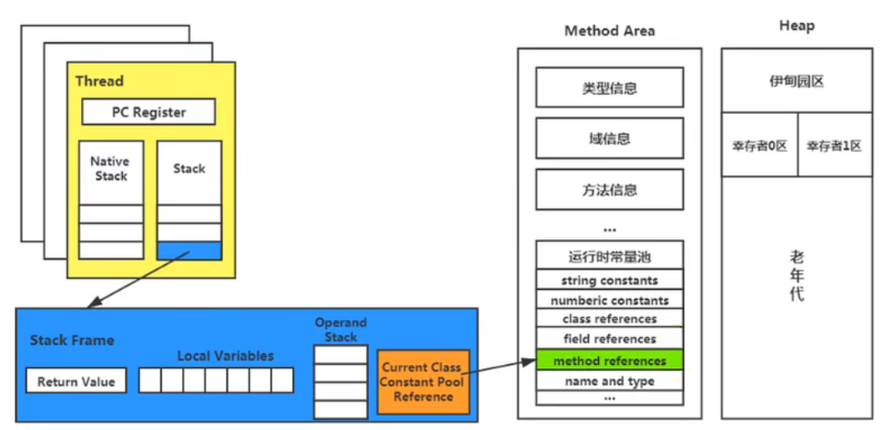

常量池的作用：提供一些符号和常量，便于指令的识别。

## 本地方法栈


## 方法区


## 堆
