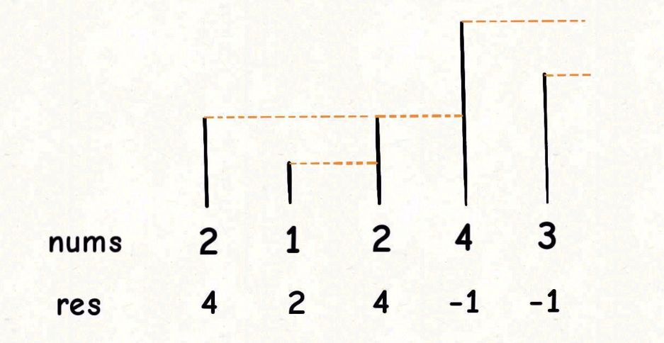
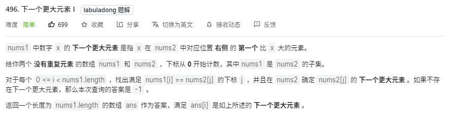
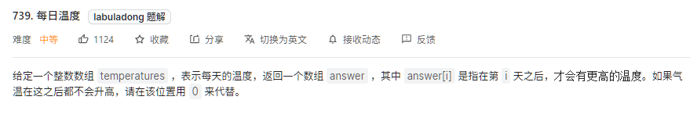
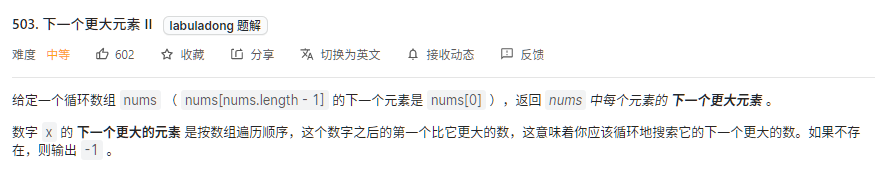
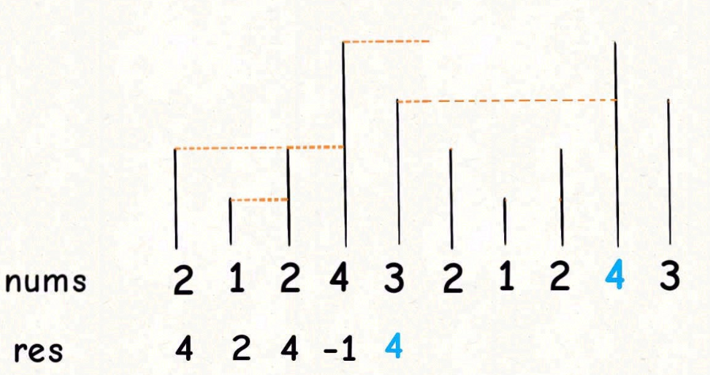

# 单调栈模板

栈是一种简单的先进后出的数据结构，单调栈实际上就是栈，只是利用了一些逻辑，使得每次新元素入栈后，栈内元素都保持有序。单调栈的用途不太广泛，只处理一种典型的问题，叫做`Next Greater Element`。

题目如下：提供数组`nums`，请返回一个等长的结果数组，结果数组种对应索引存储着下一个更大元素，如果没有更大的元素，就存-1。



```java
int[] nextGreaterElement(int[] nums) {
    int[] res = new int[nums.length];
    LinkedList<Integer> stack = new LinkedList<>();
    // 倒序遍历
    for(int i = nums.length - 1; i >= 0; i--) {
        // 判定高低
        while(!stack.isEmpty() && stack.peek() <= nums[i]) {
            // 栈顶小则出栈
            stack.pop();
        }
        // nums[i] 后面的 next great number
        res[i] = stack.isEmpty() ? -1 : stack.peek();
        stack.push(nums[i]);
    }
    return res;
}
```

以上就是单调队列解决问题的模板。for 循环要从后往前扫描元素，因为借助的是栈的结构，倒着入栈，就是正着出栈。while 循环是把两个 个子高 的元素排除，因为他们的存在没有意义，前面挡着个更高的元素，所以不可能作为后续进来的元素的`Next Great Number`了。

这个算法的时间复杂度其实是`O(n)`，从整体来看：总共有 `n` 个元素，每个元素都被 `push` 入栈了一次，而最多会被 `pop` 一次，没有任何冗余操作。所以总的计算规模是和元素规模 `n` 成正比的，也就是 `O(n)` 的复杂度。

[LeetCode496题-下一个更大元素 I](https://leetcode-cn.com/problems/next-greater-element-i/)



```java
    public int[] nextGreaterElement(int[] nums1, int[] nums2) {
        int n = nums1.length;
        int[] res = new int[n];

        LinkedList<Integer> stack = new LinkedList<>();
        Map<Integer, Integer> map = new HashMap<>();
        for (int i = nums2.length - 1; i >= 0; i--) {
            while (!stack.isEmpty() && stack.peek() <= nums2[i]) {
                stack.pop();
            }
            map.put(nums2[i], stack.isEmpty() ? -1 : stack.peek());
            stack.push(nums2[i]);
        }
        for (int i = 0; i < n; i++) {
            res[i] = map.get(nums1[i]);
        }
        return res;
    }
```

# 问题变形

[LeetCode739题-每日温度](https://leetcode-cn.com/problems/daily-temperatures/)



相同的思路，直接使用模板稍作改动。

```java
public int[] nextGreaterElement(int[] nums1, int[] nums2) {
    int n = nums1.length;
    int[] res = new int[n];

    LinkedList<Integer> stack = new LinkedList<>();
    Map<Integer, Integer> map = new HashMap<>();
    for (int i = nums2.length - 1; i >= 0; i--) {
        while (!stack.isEmpty() && stack.peek() <= nums2[i]) {
            stack.pop();
        }
        map.put(nums2[i], stack.isEmpty() ? -1 : stack.peek());
        stack.push(nums2[i]);
    }
    for (int i = 0; i < n; i++) {
        res[i] = map.get(nums1[i]);
    }
    return res;
}
```

# 处理循环数组

[LeetCode503题-下一个更大元素 II](https://leetcode-cn.com/problems/next-greater-element-ii/)



一般通过`%`运算符取模，来获得环形特效。**对于这种需求，常用套路就是将数组长度翻倍**。



思路就是把这个双倍长度的数组构造出来，然后套用算法模板。但是，**我们可以不用构造新数组，而是利用循环数组的技巧来模拟数组长度翻倍的效果**。

```java
public int[] nextGreaterElements(int[] nums) {
    LinkedList<Integer> stack = new LinkedList<>();
    int n = nums.length;
    int[] answer = new int[n];

    // 单调栈模板
    for (int i = 2 * n - 1; i >= 0; i--) {
        while (!stack.isEmpty() && stack.peek()  <= nums[i % n]) {
            stack.pop();
        }
        answer[i % n] = stack.isEmpty() ? -1 : stack.peek();
        stack.push(nums[i % n]);
    }
    return answer;
}
```

