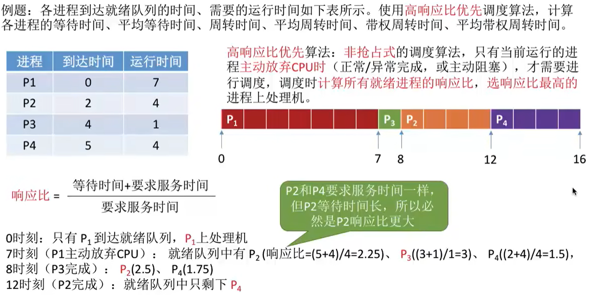

# 操作系统概念

## 基本概念

**操作系统**（Operating System，OS）是指控制和管理整个计算机系统的硬件和软件资源，并合理地组织调度计算机的工作和资源的分配，以提供给用户和其他软件方便的接口和环境，它是计算机系统中最基本的**系统软件**。


**功能**

1. 作为系统资源的管理者
  
  
  
2. 作为用户和计算机硬件之间的接口
  
  - 命令接口：允许用户直接使用
    - 联机命令接口：用户说一句，系统做一句。如 cmd 命令行。
    - 脱机命令接口：用户说一堆，系统做一堆。如执行 .bat 脚本文件。
  - 程序接口：允许用户通过程序间接使用，由一组系统调用组成，程序接口 = **系统调用**
  - GUI：图形用户界面（Graphical User Interface）
  
  
  
3. 作为最接近硬件的层次
  
  需要提供的功能和目标：实现对硬件机器的拓展。
  

**操作系统的特征**

- 并发
  
  操作系统的并发性指计算机系统种同时存在着多个运行着的程序。
  
- 共享
  
  共享即资源共享，指系统中的资源可供内存中多个并发执行的进程共同使用。
  
  - 互斥资源共享
    
    一个时间段内只允许一个进程访问该资源。如不同进程同时要使用摄像头。
    
  - 同时资源共享
    
    允许一个时间段内由多个进程“同时”对它们进行访问。“同时”往往是宏观的，微观上可能是交替地进行访问的。如多个进程同时发送文件。
    
- 虚拟
  
  虚拟是指把一个物理上的实体变为若干个逻辑上的对应物。物理实体是实际存在的，而逻辑上对应物是用户感受到的。
  
  - 空分复用技术（如虚拟存储器技术）
  - 时分复用技术（如虚拟处理器）
- 异步
  
  异步是指在多个程序环境下，允许多个程序并发执行，但由于资源有限，进程的执行不是一贯到底的，而是走走停停，以不可预知的速度推进，这就是进程的异步性。
  

**并发和共享互为存在条件，没有并发和共享，就谈不上虚拟和异步，因此并发和共享是操作系统的两个最基本的特征**

**OS 发展和分类**


## 运行机制和体系结构

首先**指令**分可以为两种。

- 特权指令
  
  不允许用户使用。
  
- 非特权指令
  

**CPU的两种状态**

- 用户态（目态）
  
  此时 CPU 只能执行非特权指令。
  
- 核心态（管态）
  
  特权指令和非特权指令都可以执行。
  

**程序**又可以根据使用的指令分为两种

- 内核程序
  
  操作系统的内核程序是系统的管理者，即可以执行特权指令，也可以执行非特权指令，运行在核心态。
  
- 应用程序
  
  为了保证系统能够安全运行，普通应用程序只能执行非特权指令，运行在用户态。
  


**操作系统内核**

内核是计算机上配置的底层软件，是操作系统最基本、最核心的部分。


操作系统的体系结构：大内核和微内核


## 中断和异常


1. 中断发生时，CPU 立即进入**核心态**
2. 当中断发生后，当前运行的进程暂停运行，并由操作系统内核对中断进行处理
3. 对于不同的中断信号，会进行不同的处理

发生了中断，就意味着需要操作系统介入，开展管理工作。由于操作系统的管理工作（比如进程切换、分配 IO 设备等）需要使用特权指令，因此 CPU 要从用户态转为核心态。中断可以使 CPU 从**用户态切换为核心态，使操作系统获得计算机的控制权**。有了中断，才能实现多道程序并发执行。

用户态和核心态之间的切换是怎么实现的？

用户态 -> 核心态 是通过**中断**实现的，并且中断是唯一途径。

核心态 -> 用户态 的切换是通过执行一个特权指令，将程序状态字（PSW）的标志位设置为“用户态”。


**外中断的处理过程**

1. 执行完每个指令之后，CPU 都要检查当前是否有外部中断信号
2. 如果检测到外部中断信号，则需要保护被中断进程的 CPU 环境（如程序状态字 PSW、程序计数器 PC、各种通用寄存器）
3. 根据中断信号类型转入相应的中断处理程序
4. 恢复原进程的 CPU 环境并退出中断，返回原进程继续往下执行

## 系统调用

操作系统作为用户和计算机硬件之间的接口，需要向上提供一些简单易用的服务。主要包括命令接口和程序接口。其中，程序接口由一组系统调用组成。“系统调用”是操作系统提供给应用程序使用的接口，可以理解为一种可供应用程序调用的特殊函数，应用程序可以发出系统调用请求来获得操作系统的服务。

系统中的各种共享资源都由操作系统统一掌管，因此在用户程序中，凡是与资源有关的操作（如存储分配、IO 操作、文件管理等），都必须通过系统调用的方式向操作系统提出服务请求，由操作系统代为完成。这样可以**保证系统应用的稳定性和安全性**。


凡是与资源有关的操作、会直接影响到其他进程的操作，一定需要操作系统介入，即需要通过系统调用来实现。

**系统调用与库函数的区别**


**系统调用的过程**


传递调用参数 -> 执行陷入指令（用户态）-> 执行系统调用相应服务程序（核心态）-> 返回用户程序

注意：

1. 陷入指令是在用户态执行的，执行陷入指令之后立即引发一个内中断，从而 CPU 进入核心态
2. 发出系统调用请求是在用户态，而对系统调用的相应处理在核心态下进行
3. 陷入指令是唯一一个只能在用户态执行，而不可在核心态执行的指令

# 进程

为了方便操作系统管理，完成各程序并发执行，引入了进程、进程实体的概念。系统为每个运行的程序配置了一个数据结构，称为进程控制块（PCB），用来描述进程的各种信息（如程序代码存放位置）。

PCB、程序段、数据段三部分构成了**进程实体（进程映像）**。一般情况下，我们把进程实体就简称为进程，例如，所谓创建进程，实质上是创建进程实体中的 PCB ；而撤销进程，实质上是撤销进程实体中的 PCB。

**注意：PCB 是进程存在的唯一标志**


从不同的角度，进程可以有不同的定义，比较传统典型的定义有：

1. 进程是程序的一次**执行过程**。
2. 进程是一个程序及其数据在处理机上顺序执行时**所发生的活动**。
3. 进程是具有独立功能的程序在数据集合上**运行的过程**，它是系统进行资源分配和调度的一个独立单位。

引入进程实体后，可把进程定义为：

进程是进程实体的运行过程，是系统进行资源分配和调度的一个独立单位。

**注**：严格来说，进程实体和进程并不一样，进程实体是静态的，进程则是动态的。不过一般来说可以认为进程实体就是进程。因此我们也可以说“进程是由程序段、数据段、PCB 三部分组成”。

## 进程的组成


- PCB
  
  操作系统通过 PCB 来管理进程，因此 PCB 中应该包含操作系统对其进行管理所需的各种信息。
  
- 程序段
  
  程序代码即存放在此
  
- 数据段
  
  程序运行时使用、产生的运算数据。如全局变量、局部变量、宏定义的常量就存放在数据段内。
  


## 进程的组织

进程的组成讨论的是一个进程内部由哪些部分构成的问题，而进程的组织讨论的是多个进程之间的组织方式问题。


## 进程的特征


## 进程的状态与转换


注意：在单核处理机环境下，每个时刻最多只有一个进程处于运行态。（双核环境下可以同时有两个进程处于运行态）


## 进程控制


进程控制的主要功能是对系统中的所有进程试试有效的管理，它具有创建新进程、撤销已有进程、实现进程状态转换等功能。

用**原语**实现进程控制。原语的特点是执行期间不允许中断，只能一气呵成。这种不可被中断的操作即**原子操作**。

原语采用“关中断指令”和“开中断指令”实现。显然，关/开中断指令的权限非常大，必然是只允许在核心态下执行的特权指令。

**进程控制相关的原语**

无论哪个原语，要做的无非是三件事情：

1. 更新 PCB 中的信息（如修改进程状态标志、将运行环境保存到 PCB、从 PCB 恢复运行环境）
  1. 所有的进程控制原语一定都会修改进程状态标志
  2. 剥夺当前运行进程的 CPU 使用权必然需要保存其运行环境
  3. 某进程开始运行前必然要恢复其运行环境
2. 将 PCB 插入合适的队列
3. 分配/回收资源


**注意：进程的阻塞和唤醒原语必须成对使用。**


## 进程通信

进程通信顾名思义就是指进程之间的信息交换。进程是分配系统资源的单位（包括内存地址空间），因此**各进程**拥有的**内存地址空间相互独立**。

为了保证安全， 一个进程不能直接访问另一个进程的地址空间。但是进程之间的信息交换又是必须实现的。为了保证进程间的安全通信，操作系统提供了一些方法。


### 共享存储


两个进程对共享空间的访问必须是互斥的（互斥访问通过操作系统提供的工具实现）。

- 基于数据结构的共享：
  
  比如共享空间里只能放一个长度为10的数组。这种共享方式速度慢、限制多，是一种**低级通信**的方式。
  
- 基于存储区的共享：
  
  在内存中画出一块共享存储区，数据的形式、存放位置都由进程控制，而不是操作系统。相比之下，这种共享方式的速度更快，是一种**高级通信**方式。
  

### 管道通信


“管道”是指用于连续读写进程的一个共享文件，又名 pipe 文件。其实就是在内存中开辟一个大小固定的缓冲区。

1. 管道只能采用**半双工通信**，某一时间段内只能实现单向的传输。如果要实现**双向同时通信**，则**需要设置两个管道**。
2. 各进程要互斥地访问管道。
3. 数据以字符流的形式写入管道，当**管道写满**时，写进程的 write() 系统调用将被**阻塞**，等待读进程将数据取走。当读进程将数据全部取走后，**管道变空**，此时读进程的 read() 系统调用将被**阻塞**。
4. 如果没写满，就不允许读。如果没读空，就不允许写。
5. 数据一旦被读出，就从管道中被抛弃，这就意味着**读进程最多只能有一个**，否则可能会有读错数据的情况。

### 消息传递

进程间的数据交换以**格式化的消息**（Message）为单位。进程通过操作系统提供的“发送消息/接收消息”两个**原语**进行数据交换。


## 线程概念和多线程模型

可以把线程理解为“轻量级进程”。线程是一个基本的 CPU 执行单元，也是程序执行流的最小单位。引入线程后，不仅是进程之间可以并发，进程内各线程之间也可以并发，从而进一步提升了系统的并发度，使得一个进程内也可以并发处理各种任务。

引入线程后，进程只作为除 CPU 之外的系统资源的分配单元（如打印机、内存地址空间都是分配给进程的）。


### 线程的属性

1. 线程是处理机调度的单位
2. 多 CPU 计算机中，各个线程可占用不同的 CPU
3. 每个线程都有一个线程 ID、线程控制块（TCB）
4. 线程也有就绪、阻塞、运行三种基本状态
5. 线程几乎不拥有系统资源
6. 同一进程的不同线程间共享进程的资源
7. 由于共享内存地址空间，同一进程中的线程间通信甚至无需系统干预
8. 同一进程中的线程切换 ，不会引起进程切换
9. 不同进程中的线程切换，会引起进程切换
10. 切换同进程内的线程，系统开销很小
11. 切换进程，系统开销较大

### 线程的实现方式


用户级线程由应用程序通过线程库实现。所有的**线程管理工作**都由**应用程序负责**（包括线程切换）。

用户级线程中，线程切换可以在用户态下即可完成，无需操作系统干预。在用户看来，是有多个线程。但在操作系统内核看来，并意识不到线程的存在。“用户级线程”就是“从用户视角看能看到的线程”。


内核级线程的管理工作由操作系统内核完成。线程调度、切换工作都由内核负责，因此内核级线程的切换必然需要在核心态下才能完成。“内核级线程”就是“从操作系统内核视角看能看到的线程”。

在同时支持用户级线程和内核级线程的系统中，可采用二者组合的方式：将 n 个用户级线程映射到 m 个内核级线程上（n >= m）。


**注意：操作系统只“看得见”内核级线程，因此只有内核级线程才是处理机分配的单位。**

例如：上面的模型，该进程由两个内核级线程，三个用户级线程组成，在用户看来，这个进程中有三个线程。但即使该进程在一个4核处理机的计算机上运行，也最多只能分配到两个核，最多只能有两个用户线程并行执行。

### 多线程模型

- 多对一
  
  多个用户级线程映射到一个内核级线程，每个用户进程只对应一个内核线程。
  
  **优点**：用户级线程的切换在用户空间即可完成，不需要切换到核心态，线程管理的系统开销小，效率高。
  
  **缺点**：当一个用户级线程被阻塞后，整个进程都会被阻塞，并发度不高。多个线程不可在多核处理机上并行运行。
  
- 一对一
  
  一个用户级线程映射到一个内核级线程，每个用户进程有用户级线程同数量的内核级线程。
  
  **优点**：当一个线程被阻塞后，别的线程还可以继续执行，并发能力强。多线程可在多核处理机上并行执行。
  
  **缺点**：一个用户进程会占用多个内核级线程,线程切换由操作系统内核完成，需要切换到核心态，因此线程管理的成本高，开销大。
  
- 多对多
  
  n 用户级线程映射到 m 个内核级线程（n >= m）。每个用户进程对应 m 个内核级线程。
  
  克服了多对一模型并发度不高的缺点，又克服了一对一模型中一个用户进程占用太多内核级线程，开销太大的缺点。
  

## 处理机调度

### 概念、层次


在多道程序系统中，进程的数量往往是多于处理机的个数的，这样不可能同时并行地处理各个进程。**处理机调度**，就是从就绪队列中按照一定的算法选择一个进程并将处理机分配给它运行，以实现进程的并发执行。

### 高级调度（作业调度）

按照一定的原则从外存上处于后备队列的作业中挑选一个（或多个）作业，给他们分配内存等必要资源，并**建立相应的进程**（建立 PCB），以使它获得竞争处理机的权利。

高级调度是辅存（外存）与内存之间的调度。每个作业只调入一次，调出一次。**作业调入时会建立相应的 PCB，作业调出时才撤销 PCB。**高级调度主要是指调入问题，因为只有调入的时机需要操作系统来确定，但调出的时机必然是作业运行结束才调出。

### 中级调度（内存调度）

引入了虚拟存储技术之后，可将暂时不能运行的进程调至外存等待。等它重新具备了运行条件且内存又稍有空闲时，再重新调入内存。这么做的目的是为了**提高内存利用率**和**系统吞吐量**。

暂时调到外存等到的进程状态为挂起状态。值得注意的是，PCB 并不会一起调到外存，而是会常驻内存。PCB 中会记录进程数据在外存中的存放位置，进程状态等信息，操作系统通过内存中的 PCB 来保持对各个进程的监控、管理。被挂起的进程 PCB 会被放到的**挂起队列**中。

中级调度 （内存调度），就是决定将哪个处于挂起状态的进程重新调入内存。一个进程可能会被多次调出、调入内存，因此**中极调度发生的频率要比高级调度更高**。

### 进程的挂起态和七状态模型

暂时调到外存等待的进程状态为**挂起状态（挂起态，suspend）**

挂起态又可以进一步细分为**就绪挂起**、**阻塞挂起**两种状态。


### 低级调度（进程调度）

其主要任务是按照某种方法和策略从就绪队列中选取一个进程，将处理机分配给它。进程调度是操作系统中**最基本的一种调度**，在一般的操作系统中都必须配置进程调度。

进程调度的频率很高，一般几十毫秒一次。


## 进程调度


### 进程调度的时机

进程调度（低级调度），就是按照某种算法从就绪队列中选择一个进程为其分配处理机。

需要进行进程调度与切换的情况：

- 当前运行的进程**主动放弃**处理机
  - 进程正常终止
  - 运行过程中发生异常而终止
  - 进程主动请求阻塞（如等待 IO）
- 当前运行的进程**被动放弃**处理机
  - 分给进行的时间片用完
  - 有更紧急的事情需要处理（如 IO 中断）
  - 有更高优先级的进程进入就绪队列

不能进行进程调度与切换的情况：

- 在**中断处理过程中**。中断处理过程复杂，与硬件密切相关，很难做到在中断处理过程中进行进程切换。
- 进程在**操作系统内核程序临界区**中。
- 在**原子操作过程中**（原语）。原子操作不可中断，要一气呵成（如之前讲过的修改 PCB 中进程状态标志，并把 PCB 放到相应队列）。


### 进程调度的方式

- **非剥夺调度方式**，又称非抢占方式。即，只允许进程主动放弃处理机。在运行过程中即便有更紧迫的任务到达，当前进程依然会继续使用处理机。直到该进程终止或主动要求进入阻塞态。
  
  实现简单，系统开销小但是无法及时处理紧急任务，适合于早期的批处理系统。
  
- **剥夺调度方式**，又称抢占方式。当一个进程正在处理机上执行时，如果有一个更重要或更紧迫的进程需要使用处理机，则立即暂停正在执行的进程，将处理机分配给更重要紧迫的那个进程。
  
  可以优先处理更紧急的进程，也可实现让各进程按时间片轮流执行的功能（通过时钟中断）。适合于分时操作系统、实时操作系统。
  

### 进程的切换与过程

**狭义的进程调度**指的是从就绪队列中选中一个要运行的进程。这个进程可以是刚刚被暂停执行的过程，也可能是另一个进程，后一种情况就需要进程切换。

**进程切换**是指一个进程让出处理机，由另一个进程占用处理机的过程。

**广义的进程调度**包含了选择一个进程和进程切换的两个步骤：

1. 对原来的运行进程各种数据的保存
2. 对新的进程各种数据的恢复

## 调度算法的评价指标


### CPU 利用率

CPU 利用率：指 CPU “忙碌”的时间占总时间的比例。

利用率 = 忙碌的时间 / 总时间

### 系统吞吐量

系统吞吐量：单位时间完成作业的数量

系统吞吐量 = 总共完成了多少作业 / 总共花费时间

### 周转时间

周转时间是指从作业被提交给系统开始，到作业完成为止的这段时间间隔。

它包括四个部分：

1. 作业在外存后备队列上等待作业调度（高级调度）的时间
2. 进程在就绪队列上等待进程调度（低级调度）的时间
3. 进程在 CPU 上执行的时间
4. 进程等待 IO 操作完成的时间

后三项在一个作业的整个处理中，可能发生多次。

- 周转时间 = 作业完成时间 - 作业提交时间
  
- 平均周转时间 = 各作业周转时间之和 / 作业数
  
- 带权周转时间 = 作业周转时间 / 作业实际运行时间 = （作业完成时间 - 作业提交时间）/ 作业实际运行的时间
  
- 平均带权周转时间 = 各作业带权周转时间之和 / 作业数
  

### 等待时间

等待时间指进程/作业**处于等待处理机状态时间之和**，等待时间越长，用户满意度越低。

对于**进程**来说，等待时间就说指进程建立后**等待被服务的时间之和**，在等待 IO 完成的期间其实进程也是在被服务的，所以不计入等待时间。

对于**作业**来说，不仅要考虑**建立进程后的等待时间，还要加上作业在外存后备队列中等待的时间**。

### 响应时间

响应时间是指从用户提交请求到首次产生响应所用的时间。

## 调度算法

- 先来先服务（FCFS）
- 短作业优先（SJF）
- 搞响应比优先（HRRN）
- 时间片轮转调度算法（RR）
- 优先级调度算法
- 多级反馈队列调度算法

### 先来先服务 FCFS


**算法思想**

公平

**算法规则**

按照作业/进程到达的先后顺序进行服务

**用于作业/进程调度**

用于作业调度时，考虑的是哪个作业先到达后备队列；用于进程调度时，考虑的是哪个进程先到达就绪队列

**是否可抢占**

非抢占式的算法

**优缺点**

优点：公平、算法实现简单。

缺点：排在长作业后面的短作业需要等待很长时间，带权周转时间很大，对短作业来说用户体验不好。

**是否会导致饥饿**

不会

### 短作业优先 SJF


**算法思想**

追求最少的平均等待时间，最少的平均周转时间、最少的平均带权周转时间

**算法规则**

最短的作业/进程优先得到服务（所谓“最短”，是指要求服务时间最短）

**用于作业/进程调度**

即可用于作业调度，也可用于进程调度。用于进程调度时称为“短进程（**SPF**，Shortest Process First）优先算法”

**是否可抢占**

SJF 和 SPF 是**非抢占式**的算法。但是**也有抢占式的版本**--最短剩余时间优先算法（**SRTN**，Shortest Remaining Time Next）


**优缺点**

优点：“最短的”平均等待时间、平均周转时间。

缺点：不公平。**对短作业有利，对长作业不利。**可能产生饥饿现象。另外，作业/进程的运行时间是由用户提供的，并不一定真实，不一定能做到真正的短作业优先。

**是否会导致饥饿**

会。如果源源不断地有短作业/进程到来，可能使长作业/进程长时间得不到服务，产生“饥饿”现象。如果一直得不到服务，则称为“饿死”。

### 高响应比优先 HRRN



**算法思想**

综合考虑作业/进程的等待时间和要求服务的时间

**算法规则**

在每次调度时先计算各个作业/进程的响应比，选择响应比最高的作业/进程为其服务

响应比 = （等待时间 + 要求服务时间） / 要求服务时间

**用于作业/进程调度**

既可用于作业调度，也可用于进程调度

**是否可抢占？**

非抢占式的算法。因此只有当前运行的作业/进程主动放弃处理机时，才需要调度，才需要计算响应比

**优缺点**

综合考虑了等待时间和运行时间（要求服务时间）

等待时间相同时，要求服务时间短的优先（SJF 的优点）

要求服务时间相同时，等待时间长的优先（FCFS 的优点）

对于长作业来说，随着等待时间越来越久，其响应比也会越来越大，从而避免了长作业饥饿问题

**是否会导致饥饿**

不会

### 时间片轮转调度算法（RR）


**算法思想**

公平地、轮流地为各个进程服务，让每个进程在一定时间间隔内都可以得到响应。

**算法规则**

按照各进程到达就绪队列的顺序，轮流让各个进程执行一个**时间片**（如100ms）。若进程未在一个时间片内执行完，则剥夺处理机，将进程重新放到就绪队列队尾重新排队。

**用于作业/进程调度**

用于进程调度（只有作业放入内存建立了相应的进程后，才能被分配处理机时间片）。

**是否可抢占？**

若进程未能在时间片内运行完，将被强行剥夺处理机使用权，因此时间片轮转调度算法属于**抢占式**的算法。由时钟装置发出**时钟中断**来通知 CPU 时间片已到。

**优缺点**

优点：公平；响应快；适用于分时操作系统

缺点：由于高频率的进程切换，因此有一定开销；不区分任务的紧急程度。

**是否会导致饥饿**

不会

【注意】

如果**时间片太大**，使得每个进程都可以在一个时间片内就完成，则时间片轮转调度算法**退化为先来先服务**调度算法，并且**会增大进程响应时间**。因此**时间片不能太大**。

另一方面，进程调度、切换是有时间代价的（保存、恢复运行环境），因此如果**时间片太小**，会导致**进程切换过于频繁**，系统会花大量的时间来处理进程切换，从而导致实际用于进程执行的时间比例减少。可见**时间片也不能太小**。

一般来说，设计时间片时要让切换进程的开销占比不超过1%。

### 优先级调度算法


**算法思想**

随着计算机的发展，特别是实时操作系统的出现，越来越多的应用场景需要根据任务的紧急程度来决定处理顺序。

**算法规则**

每个作业/进程有各自的优先级，调度时选择优先级最高的作业/进程。

**用于作业/进程调度**

既可用于作业调度，也可用于进程调度。甚至，还会用于在之后学习的 IO 调度中。

**是否可抢占？**

抢占式、非抢占式都有。区别在于：非抢占式只需在进程主动放弃处理机时进行调度即可，而抢占式还需在就绪队列变化时，检查是否会发生抢占。

**优缺点**

优点：用优先级区分紧急程度、重要程度，适用于实时操作系统。可灵活地调整对各种作业/进程的偏好程度。

缺点：若源源不断地有高优先级进程到来，则可能导致饥饿。

**是否会导致饥饿**

会

【补充】

就绪队列未必只有一个，可以按照不同优先级来组织。另外，也可以把优先级高的进程排在更靠近队头的位置。

根据优先级是否可以动态改变，可将优先级分为**静态优先级**和**动态优先级**两种。

静态优先级：创建进程时确定，之后一直不变

动态优先级：创建进程时有一个初始值，之后会根据情况动态地调整优先级。

通常系统进程优先级高于用户进程，前台进程优先级高于后台进程，操作系统更偏好 IO 型进程（或称 IO 繁忙型进程），与 IO 型进程相对的是计算型进程（或称 CPU 繁忙型进程）。

### 多级反馈队列算法


**算法思想**

对其他调度算法的折中权衡。

**算法规则**

1. 设置多级就绪队列，各级队列优先级从高到低，时间片从小到大；
2. 新进程到达时先进入第1级队列，按 FCFS 原则排队等待被分配时间片，若用完时间片进程还未结束，则进程进入下一级队列队尾。如果此时已经是在最下级的队列，则重新放回该队列队尾；
3. 只有第 k 级队列为空时，才会为 k + 1 级队头的进程分配时间片。

**是否可抢占？**

**抢占式**的算法。在 k 级队列的进程运行过程中，若更上级的队列（1 ~ k - 1 级）中进入了一个新进程，则由于新进程处于优先级更高的队列中，因此新进程会抢占处理机，原来运行的进程放回 k 级队列队尾。

**优缺点**

- 对各类型进程相对公平（FCFS 的优点）；
- 每个新到达的进程都可以很快得到响应（RR 的优点）；
- 短进程只用较少的时间就可完成（SPF 的优点）；
- 不必实现估计进程的运行时间（避免用户作假）；
- 可灵活地调整对各类进程的偏好程度，比如 CPU 密集型进程、IO 密集型进程（拓展：可以将因 IO 而阻塞的进程重新放回原队列，这样 IO 型进程就可以保持较高优先级）。

**是否会导致饥饿**

会

## 进程同步 进程互斥

**进程同步**

进程具有**异步性**的特征。异步性是指，各并发执行的进程以各自独立的、不可预知的速度向前推进。**同步**亦称直接制约关系，它是指为完成某种任务而建立的两个或多个进程，这些进程因为需要在某些位置上协调它们的工作次序而产生的制约关系。进程间的直接制约关系就是源于它们之间的相互合作。

**进程互斥**

进程的“并发”需要“共享”的支持。各个并发执行的过程不可避免的需要共享一些系统资源。

两种资源共享方式：

- 互斥共享方式
  
  系统中的某些资源，虽然可以提供给多个进程使用，但**一个时间段内只允许一个进程访问该资源**。
  
- 同时共享方式
  
  系统中的某些资源，**允许一个时间段内由多个进程“同时”对它们进程访问**。
  

我们把一个时间段内只允许一个进程使用的资源称为**临界资源**。许多物理设备（如摄像头、打印机）都属于临界资源。此外还有许多变量、数据、内存缓冲区等都属于临界资源。

对临界资源的访问，必须**互斥**地进行。互斥，亦称**间接制约关系**。进程互斥指当一个进程访问某临界资源时，另一个想要访问该临界资源的进程必须等待。当前访问临界资源的进程访问结束，释放该资源之后，另一个进程才能去访问临界资源。

对于临界资源的互斥访问，可以在逻辑上分为如下四个部分：


为了实现对临界资源的互斥访问，同时保证系统整体性能，需要遵循以下原则：

1. 空闲让进。临界区空闲时，可以允许一个请求进入临界区的进程立即进入临界区
2. 忙则等待。当已有进程进入临界区时，其他试图进入临界区的进程必须等待
3. 有限等待。对请求访问的进程，应保证能在有限时间内进入临界区（保证不会饥饿）
4. 让权等待。当进程不能进入临界区时，应立即释放处理机，防止进程忙等待

## 进程互斥的软件实现方法


### 单标志法

算法思想：两个进程在**访问完临界区后**会把使用临界区的权限转交给另一个进程。也就是说**每个进程进入临界区的权限只能被另一个进程赋予**。


单标志法存在的主要问题是：违背“空闲让进”原则。

### 双标志先检查法

算法思想：设置一个布尔型数组 flag[]，数组中各个元素用来**标记各进程想进入临界区的意愿**，比如“flag[0] = true”意味着0号进程 P0 现在想要进入临界区。每个进程在进入临界区之前先检查当前有没有别的进程想进入临界区，如果没有，则把自身对应的标志 flag[i] 设为 true，之后开始访问临界区。


双标志先检查法的主要问题是：违反“忙则等待”原则。原因在于，进入区的“检查”和“上锁”两个处理不是一气呵成的。“检查”后，“上锁”前可能发生进程切换。

### 双标志后检查法

算法思想：双标志先检查法的改版。前一个算法的问题是先“检查”后“上锁”，但是这两个操作又无法一气呵成，因此导致了两个进程同时进入临界区的问题。因此，人们又想到先“上锁”后“检查”的方法，来避免上述问题。


双标志后检查法虽然解决了“忙则等待”的问题，但是有违背了“空闲让进”和“有限等待”原则，会因各进程都长期无法访问临界资源而产生“饥饿”现象。

### Peterson 算法

算法思想：双标志后检查法中，两个进程都争着想进入临界区，但是谁也不让谁，最后谁都无法进入临界区。Gary L.Peterson 想到了一种方法，如果双方都争着想进入临界区，那可以让进程尝试“孔融让梨”，主动让对方先使用临界区。


Peterson 算法用软件方法解决了进程互斥问题，遵循了空闲让进 、忙则等待、有限等待三个原则，但是依然未遵循让权等待的原则。

Peterson 算法相较于之前三种软件解决方案来说，是最好的，但依然不够好。

## 进程互斥的硬件实现方法


### 中断屏蔽方法

利用“开/关中断指令”实现（与原语的实现思想相同，即在某进程开始访问临界区到结束访问为止都不允许被中断，也就不能发生进程切换，因此也不可能发生两个同时访问临界区的情况）


优点：简单、高效

缺点：不适合多处理机；只适用于操作系统内核进程，不适用于用户进程（因为开/关中断指令只能运行在内核态，这组指令如果能让用户随意使用会很危险）

### TestAndSet 指令

简称 TS 指令，也有地方称为 TestAndSetLock 指令，或 TSL 指令。

TSL 指令**是用硬件实现的**，执行的过程不允许被中断，只能一气呵成。


相比软件实现方法，TSL 指令把“上锁”和“检查”操作用硬件的方式变成了一气呵成的原子操作。

优点：实现简单，无需像软件实现方法那样严格检查是否会有逻辑漏洞；适用于多机处理环境。

缺点：不满足“让权等待”原则，暂时无法进入临界区的进程会占用CPU并循环执行TSL指令，从而导致“忙等”。

### Swap 指令

有的地方也叫 Exchange 指令，或简称 XCHG 指令。
Swap 指令是用硬件实现的，执行的过程不允许被中断，只能一气呵成。


优点：实现简单，无需像软件实现方法那样严格检查是否会有逻辑漏洞;适用于多处理机环境。

缺点：不满足“让权等待”原则，暂时无法进入临界区的进程会占用CPu并循环执行TSL指令，从而导致“忙等”。

## 信号量机制

回顾之前的进程互斥的解决方案存在的问题有：

1. 在双标志先检查法中，进入区的“检查”、“上锁”操作无法一气呵成，从而导致了两个进程有可能同时进入临界区的问题；
  
2. 所有的解决方案都无法实现“让权等待”。
  

因此出现了信号量机制。

用户进程可以通过操作系统提供的**一对原语**来对**信号量**进行操作，从而很方便的实现了进程互斥，进程同步。

信号量其实就是一个变量（可以是一个整数，也可以是更复杂的记录型变量），可以用一个信号量来表示**系统中某种资源的数量**，比如，系统中有一个打印机，就可以设置一个初值为1的信号量。

原语是一种特殊的程序手段，其执行能一气呵成，不可被中断。原语是由关中断/开中断指令实现的。软件解决方案的主要问题是由“进入区的各种操作无法一气呵成”，只要能把进入区和退出区的操作用原语实现，就能解决这个问题。

一对原语：wait(S) 和 signal(S) ，S 表示函数调用时传入的信号量参数。也叫 P 和 V 操作。

### 整型信号量

用整型变量表示，用来表示系统中某种资源的数量。

举例：

```java
// 初始化信号量 S，表示当前系统中可用的打印机数量
int S = 1;

// wait 原语，相当于“进入区”
void wait(int S) {
    // 资源数不够则循环等待
    while(S <= 0);
    // 资源数够则占用一个资源
    S--;
}

// signal 原语，相当于“退出区”
void signal(int S) {
    // 使用完资源后，在退出区释放资源
    S++;
} 

进程 Pn：
...
wait(S);  // 进入区，申请资源
使用打印机...
signal(S);  // 退出区，释放资源
...
```

存在的问题：在 wait 原语的 while 循环处，若没有资源会一直等下去。不满足“让权等待”，会造成“忙等”。

### 记录型信号量

整型信号量会存在“忙等”的问题，因此提出了“记录型信号量”，即用记录型数据结构表示的信号量。

```java
// 定义
typedef struct {
    int value;  // 剩余资源数
    struct process *L;  // 等待队列
} semaphore

// 进程需要使用资源，用 wait 原语申请
void wait (Semaphore S) {
    S.value--;
    if (S.value < 0) {
        block(S.L);  // 运行态 -> 阻塞态
    }
}

// 进程使用完资源后，通过 signal 原语释放
void signal (Semaphore S) {
    S.value++;
    if (S.value <= 0) {
        wakeup(S.L);  // 阻塞态 -> 就绪态
    }
} 
```

## 信号量机制应用

### 实现进程互斥

1. 分析并发的关键活动，划定临界区（如对临界资源打印机的访问就在临界区）
  
2. 设置互斥信号量 mutex，初值为**1**
  
3. 在临界区之间执行 P(mutex)
  
4. 在临界区之后执行 V(mutex)
  

### 实现进程同步

进程同步是指让各并发进程按要求有序推进。

1. 分析什么地方需要同步关系，即必须保证一前一后
  
2. 设置同步信号量 S，初始为**0**
  
3. 在“前操作”之后执行 V(S)
  
4. 在“后操作”之前执行 P(S)
  

### 实现进程的前驱关系

前驱关系实际上是多层的同步关系。进程 P1 中有句代码 S1，进程 P2中有句代码 S2，...进程 P6 中有句代码 S6。


1. 为每一对前驱关系各设置一个同步变量
  
2. 在“前操作”之后对相应的同步变量执行 V 操作
  
3. 在“后操作”之前对相应的同步变量执行 P 操作
  


## 生产者-消费者问题

系统中有一组生产者进程，生产者进程每次生产一个产品放入缓冲区，消费者进程每次从缓冲区中取出一个产品并使用。

- 只有缓冲区没满时，生产者才能把数据放入缓冲区，否则必须等待
  
- 只有缓冲区不空时，消费者才能从中取数据，否则必须等待
  
- 缓冲区是临界资源，各进程必须互斥地访问
  

有时候是消费者需要等待生产者生产，有时候是生产者要等待消费者消费，这是两个不同的“一前一后”问题，因此需要设置两个同步信号量。实现“一前一后”，需要“前V后P”。

## 吸烟者问题

假设一个系统有**三个抽烟者**进程和**一个供应者**进程。每个抽烟者不停地卷烟并抽掉它，但是要卷起并抽掉一支烟，抽烟者需要有三种材料：烟草、纸和胶水。三个抽烟者中，第一个拥有烟草、第二个拥有纸、第三个拥有胶水。供应者进程无限地提供三种材料，供应者每次将两种材料放在桌子上，拥有剩下那种材料的抽烟者卷一根烟并抽掉它，并给供应者进程一个信号告诉完成了，供应者就会放另外两种材料在桌上，这个过程一直重复。


## 读者-写者问题

有读者，写者两组并发进程共享一个文件，当两个或两个以上读进程同时访问共享数据时，不会产生副作用，但写进程与其他进程同时访问共享数据时则可能导致数据不一致的错误。

因此有要求：

1. 允许多个读者执行读操作
  
2. 只允许一个写者之行写操作
  
3. 任一写者在完成写操作之前不允许其他读者或写者工作
  
4. 写者执行写操作前，应让已有的读者和写者全部退出
  

具体实现中的核心思想在于 count。


潜在问题：只要有读进程在读，写进程就需要一直阻塞等待，可能“饿死”，因此在这个算法中是读进程优先的。

改进：相对公平的先来先服务原则。

## 哲学家进餐问题

5名哲学家，一人一只筷子，只有思考和进餐两个状态，必须拿起左右两只筷子才能进餐。

关键在于解决进程死锁。

方案：

各哲学家拿筷子这件事必须互斥地执行。这就保证了即使一个哲学家在拿筷子拿到一半时被阻塞，也不会有其他的哲学家继续尝试拿筷子。这样的话，当前正在进餐的哲学家放下筷子后，被阻塞的哲学家就可以获得等待的筷子了。


## 管程

为什么引入管程？

信号量机制存在的问题：编写程序难，易出错。管程是引入的一种高级同步机制。

管程是一种特殊的软件模块，有这些部分组成：

1. 局部于管程的数据结构说明；
  
2. 对该数据结构进行操作的一组过程；
  
3. 对局部于管程的共享数据设置初始值的语句；
  
4. 管程有一个名字。 
  

管程的基本特征：

1. 局部于管程的数据只能被局部于管程的过程所访问；
  
2. 一个进程只有通过调用管程内的过程才能进入管程访问共享数据；
  
3. 每次仅允许一个进程在管程内执行某个内部过程。
  

### 用管程解决生产者消费者问题


引入管程的目的无非就是要更方便地实现进程互斥和同步。

1. 需要在管程中定义共享数据（如生产者消费者问题的缓冲区）
  
2. 需要在管程中定义用于访问这些共享数据的“入口”--其实就是一些函数
  
3. 只有通过这些特定的“入口”才能访问共享数据
  
4. 管程中有很多“入口”，但是每次只能开放其中一个，并且只能让一个进程或线程进入（这种互斥特性是由编译器负责实现的，程序员不用关心）
  
5. 可在管程中设置条件变量及等待/唤醒操作以解决同步问题。可以让一个进程或线程在条件变量上等待（此时，该进程应先释放管程的使用权，也就是让出“入口”）；可以通过唤醒操作将等待条件变量上的进程或线程唤醒。
  

### Java 中类似于管程的机制

`synchronized`，Java 中如果用关键字`synchronized`来描述一个函数，那么这个函数同一个时间段内只能被一个线程调用。

## 死锁

死锁：在并发环境下，各进程因竞争资源而造成的一种互相等待对方手里的资源，导致各进程都阻塞，都无法向前推进的现象，就是“死锁”。

饥饿：由于长期得不到想要的资源，某进程无法向前推进的现象。比如：在短进程优先（SPF）算法中，若有源源不断的短进程到来，则长进程将一直得不到处理机，从而发生长进程“饥饿”。

死循环：某进程执行过程中一直跳不出来某个循环的现象。

三者的区别：

|     | 区别  |
| --- | --- |
| 死锁  | 死锁一定是“循环等待对方手里的资源”导致的，因此如果有死锁现象，那至少有两个或两个以上的进程同时发生死锁。且发生死锁的进程一定处于阻塞态。 |
| 饥饿  | 可能只有一个进程发生饥饿。发生饥饿的进程既可能是阻塞态（长期得不到 IO 设备），也可能是就绪态（长期得不到处理机）。 |
| 死循环 | 可能只有一个进程发生死循环。死循环的进程可以上处理机运行（可以是运行态），只不过无法像期待的那样顺利推进。死锁和饥饿问题是由于操作系统分配资源的策略不合理导致的，而死循环是由代码逻辑的错误导致的。 |

### 死锁产生的必要条件

- 互斥条件
  
- 不剥夺条件
  
- 请求和保持条件
  
- 循环等待条件
  

【注意】发生死锁时一定有循环等待，但是发生循环等待时未必死锁。

### 死锁的处理策略

1. 预防死锁。破坏死锁产生的四个必要条件中的一个或几个。
  
2. 避免死锁。用某种方法防止系统进入不安全状态，从而避免死锁（银行家算法）。
  
3. 死锁的检测和解除。允许死锁的发生，不过操作系统会负责检测出死锁的发生，然后采取某种措施解除死锁。
  

### 预防死锁

互斥条件：只有对必须互斥使用的资源的争抢才会导致死锁。

方案：

如果把只能互斥使用的资源改造为允许共享使用，则系统不会进入死锁状态。比如 SPOOLing 技术。

缺点：并不是所有的资源都可以改造。

不剥夺条件：不能强行夺走，只能主动释放。

方案：

- 当某个进程请求新的资源得不到满足时，必须立即释放保持对所有资源，待以后需要时再重新申请。
  
- 当某个进程需要的资源被其他进程所占有的时候，可以由操作系统协助，将想要的资源进行剥夺。（如剥夺调度方式）
  

缺点：

1. 实现复杂
  
2. 可能造成前一阶段工作失效
  
3. 反复申请和释放资源会加大系统开销，降低系统吞吐量
  
4. 方案一可能导致进程饥饿
  

请求和保持条件：进程保持了至少一个资源，但又提出新的资源请求，且保持不放自己的资源。

方案：

可以采用**静态分配**方法，即进程在运行前一次申请完它所需要的全部资源，在它的资源未满足前，不让它投入运行。

缺点：有些资源可能只需要用很短的时间，因此如果进程的整个运行期间都一直保持着所有资源，就会造成严重的资源浪费，资源利用率极低。另外也可能导致饥饿。

循环等待条件：存在进程资源的循环等待链。

方案：

可采用**顺序资源分配**法。首先给系统中的资源编号，规定每个进程必须按编号递增的顺序请求资源，编号相同的资源一次申请完。有大编号的资源的进程不会逆向申请小编号的资源。

缺点：

1. 不方便增加新的设备，因为可能需要重新分配编号
  
2. 进程实际使用资源的顺序可能和编号递增顺序不一致，导致资源浪费
  
3. 必须按规定次序申请资源，用户编程麻烦
  

### 避免死锁

安全序列：指如果系统按照这种序列分配资源，则每个进程都能顺利完成。只要能找出一个安全序列，系统就是安全状态，安全序列不唯一。

如果系统处于安全状态，就**一定**不会发生死锁。如果系统进入不安全状态，就**可能**发生死锁。

因此可以在资源分配之前预先判断这次分配是否会导致系统进入不安全状态，以此决定是否答应资源分配请求，这也是银行家算法的核心思想。


安全序列：P1，P3，P0，P2，P4

银行家算法步骤：

1. 检查此次申请是否超过了之前声明的最大需求数
  
2. 检查此时系统剩余的可用资源是否还能满足这次请求
  
3. 试探分配，更改各数据结构
  
4. 用安全性算法检查此次分配是否会导致系统进入不安全状态
  

### 死锁的检测和解除

为了死锁检测，必须：

1. 用某种数据结构来保存资源的请求和分配信息
  
2. 提供一种算法，利用上述信息来检测系统是否已进入死锁状态。
  


死锁检测算法用一句话概括就是，依次消除与不阻塞进程相连的边，直到无边可消。

用死锁检测算法化简资源分配图以后，还连着的那些边就是死锁进程。

解除死锁的主要方法有：

1. **资源剥夺法**。挂起某些死锁进程，并抢占他的资源，将这些资源分配给其他的死锁进程。但应防止被挂起的进程长时间得不到资源而饥饿。
  
2. **撤销进程法**。强制撤销部分或全部进程，并剥夺这些进程的资源。实现简单，但代价大。
  
3. **进程回退法**。让一个或多个进程回退到足以避免死锁的地步。这就要求系统记录进程的历史信息，设置还原点。
  

# 内存管理

内存管理的职责

1. 负责内存空间的分配和回收
  
2. 需要提供某种技术从逻辑上对内存空间进行**扩充**
  
3. 需要提供**地址转换**功能，负责程序的逻辑地址和物理地址的转换
  
4. 需要提供**内存保护**功能，保证各进程在各自的存储空间内运行，互不干扰
  

## 覆盖与交换

### 覆盖技术

覆盖技术：用来解决程序大小超过物理内存总和的问题。

思想：将程序分为多个段，常用的段常驻内存，不常用的需要时调入内存。内存中分一个固定区和一个覆盖区。


必须由程序员声明覆盖结构，操作系统完成自动覆盖。缺点是对用户不透明，增加用户编程负担。覆盖技术只存在于早期的操作系统当中。

### 交换技术

交换技术的思想：内存空间紧张时，系统将内存中某些进程暂时换出外存，把外存中某些已具备运行条件的进程换入内存（进程在内存与磁盘间动态调度）。

暂时换出外存等待的进程状态为挂起状态（挂起态，suspend），挂起态又可以分为就绪挂起和阻塞挂起两种状态。

1. 应在磁盘的什么位置存放被换出的进程？
  
  具有对换功能的操作系统中，通常把磁盘空间分为文件区和对换区两部分。文件区主要用于存放文件，主要追求存储空间的利用率，因此对文件区空间的管理采用**离散分配方式**；对换区空间只占磁盘空间的小部分，被换出的进程数据就存放在对换区。对换区空间的管理主要追求换入换出速度，因此采用连续分配方式。
  
2. 什么时候应该交换？
  
  交换通常在许多进程运行且内存吃紧时进行，而系统负荷降低就暂停。
  
3. 应该换出哪些进程？
  
  可优先换出阻塞进程；可换出优先级低的进程；为了防止优先级低的进程在被调入内存后很快又被换出，有的系统还会考虑进程在内存的驻留时间...
  

**注意**：PCB 会常驻内存，不会被换出外存

覆盖技术与交换技术的区别是：覆盖技术是对于单个进程而言的，交换技术是对于多个进程之间的。

## 连续分配管理方式

连续分配指为用户进程分配的必须是一个连续的内存空间。

### 单一连续分配


在单一连续分配中，内存被分为**系统区**和**用户区**。系统区通常位于内存的低地址部分，用于存放操作系统相关数据；用户区用于存放用户进程相关数据。

内存中只能有一道用户程序，用户程序独占整个用户空间。

优点：实现简单，无外部碎片，可以采用覆盖技术扩充内存，不一定需要采取内存保护。

缺点：只能用于单用户、单任务的操作系统中，有内部碎片。

### 固定分区分配

把用户区域划分成若干固定大小的分区，在每个分区中只装入一道作业。这样就形成了最早的最简单的一种可运行多道程序的内存管理方式。

### 分区大小相等

缺乏灵活性，但是很适合用一台计算机控制多个相同对象的场合。

### 分区大小不相等

增加了灵活性，可以满足不同大小的进程需求。根据常在系统中的作业大小情况进行划分。

### 动态分区分配

可变分区分配。这种分配方式不会预先划分内存分区，而是在进程装入内存时，根据进程度大小动态地建立分区，并使分区的大小正好适合进程的需要。因此系统分区的大小和数目是可变的。

1. 系统要用什么样的数据结构记录内存的使用情况？
  
  空闲分区表：每个空闲分区表对应一个表项。表项中包含分区号、分区大小、分区起始地址等信息。
  
  空闲分区链：每个分区的起始部分和末尾部分分别设置前向指针和后向指针。起始部分处还可记录分区大小等信息。
  
2. 当很多分区都可以满足需求时，应该选择哪个分区进行分配？
  
  **四种动态分区算法**。
  
3. 如何进行分区的分配和回收操作？
  

动态分区分配没有内部碎片，但是有外部碎片。

内部碎片，分配给某进程的内存区域中，如果有些部分没用上。

外部碎片，是指内存中某些空闲分区太小而无法利用。外部碎片可用“紧凑”技术解决。

## 动态分区分配算法

### 首次适应算法（First Fit）

算法思想：每次都从低地址开始查找，找到第一个能满足大小的空闲分区。

实现：空闲分区以地址递增的次序排列。每次分配内存时顺序查找空闲分区链（或空闲分区表），找到大小满足要求的第一个空闲分区。

### 最佳适应算法（Best Fit）

算法思想：由于动态分区分配是一种连续的分配方式，为各进程分配的空间必须是连续的一整片区域。因此为了保证当“大进程”到来时能有连续的大片空间，可以尽可能留下大片空闲区，优先使用更小的空闲区。

实现：空闲分区按容量递增次序链接。每次分配内存时顺序查找空闲分区链或空闲分区表，找到大小能满足要求的第一个空闲分区。

缺点：每次选最小的分区，会留下越来越多的外部碎片。

### 最坏适应算法（Worst Fit）

又称最大适应算法。

算法思想：为了解决最佳适应算法产生大量外部碎片的问题，可以在每次分配时优先使用最大的连续空闲区，这样分配后剩余的空闲区就不会太小，更方便使用。

实现：空闲分区按容量递减次序链接。每次分配内存时顺序查找空闲分区链或空闲分区表，找到大小能满足要求的第一个空闲分区。

缺点：导致后来的“大进程”无内存分区可用。

### 邻近适应算法（Next Fit）

算法思想：首次适应算法每次都从链头开始查找的。这可能会导致低地址部分出现很多小的空闲分区，而每次分配查找时，都要经过这些分区，因此也增加了查找的开销。如果每次都从上次查找结束的位置开始检索，就能解决上述问题。

实现：空闲分区以地址递增的顺序排列。每次分配内存时从上次查找结束的位置开始查找空闲分区链或空闲分区表，找到大小能满足要求的第一个空闲分区。


## 非连续分配管理方式

为用户进程分配的可以是一些分散的内存空间。

### 基本分页存储管理

思想：把内存分为一个个相等的小分区，再按照分区大小把进程拆分成一个个小部分。

将内存空间分为一个个大小相等的分区，每个分区就是一个页框，或叫内存块。每个页框有一个编号即页框号，从0开始。

将用户进程的地址空间也分为与页框大小相等的一个个区域，称为页面。每个页面也有编号，即页号，从0开始。

注意：进程的最后一个页面可能没有页框那么大，因此页框不能太大，否则会产生过大的内存碎片。

操作系统以页框为单位给进程分配内存空间，进程的页面与内存的页框是一一对应的关系，各个页面可以放到不相邻的页框中。

思考：如何实现逻辑地址到物理地址的转换？

1. 算出逻辑地址对应的页号；
  
2. 要知道该页号对应页面在内存中的起始地址；
  
3. 算出逻辑地址在页面内的“偏移量”；
  
4. 物理地址 = 页面地址 + 业内偏移量。
  

如何计算：

- 页号 = 逻辑地址 / 页面长度 （取除法的整数部分）
  
- 页内偏移量 = 逻辑地址 % 页面长度 （取除法的余数部分）
  
- 为了方便计算一般页面大小都是2的幂次
  

#### 页表

为了能知道进程的每个页面在内存中存放的位置，操作系统要**为每个进程建立一张页表**。

1. 一个进程对应一张页表；
  
2. 进程的每一页对应一个页表项；
  
3. 每个页表项由“页号”和“块号”组成；
  
4. 页表记录进程页面和实际存放的内存块之间的对应关系；
  
5. 每个页表项的长度是相同的，页号是“隐含”的（只需要知道页表存放的起始位置和页表项长度，即可找到各个页号对应的页表项存放的位置）。
  

#### 基本地址变换机构

用于实现逻辑地址到物理地址转换的一组硬件机构。基本地址变换机构可以借助进程的页表将逻辑地址转换为物理地址。通常在系统中设置一个页表寄存器（PTR），存放页表在内存中的起始地址F和页表长度M。线程未执行时，页表的起始地址和页表长度放在进程控制块（PCB）中，当进程被调度时，操作系统内核会把它们放到页表寄存器中。

1. 根据逻辑地址计算出页号、页内偏移量；
  
2. 判断页号是否越界（比较页号和页表长度）；
  
3. 查询页表，找到页号对应的页表项，确定页面存放的内存块号；
  
4. 用内存块号和页内偏移量得到物理地址；
  
5. 访问内存单元。
  


结论：在分页存储管理的系统中，只要确定了每个页面的大小，逻辑地址结构就确定了。因此，**页式管理中地址是一维的**。即，只要给出一个逻辑地址，系统就可以自动地算出页号、页内偏移量两个部分。

#### 具有快表的地址变换机构

##### 局部性原理

- 时间局部性：执行某条指令后可能再次执行或者访问某个数据后可能再次访问。（程序中循环导致）
  
- 空间局部性：访问某个存储单元后可能访问其附近的。（很多数据比如数组在内存中都是连续存放的）
  

由于局部性原理，可能连续很多次查到的都是同一个页表项，所以提出快表的概念，用于存放页表的一部分副本，提高访问速度。

##### 快表

快表又称联想寄存器（TLB），是一种访问速度比内存快很多的高速缓冲存储器，用来存放当前访问的若干页表项，加速地址变换的过程。内存中的页表常称为慢表。

快表相当于一个缓存的概念，访问过内存中的页表后会在快表中存一份页号到内存块号的副本，下次访问时，先去快表中进行寻找，若命中，则将内存块号与页内偏移量进行拼接访问即可，仅需一次访存；若未命中则需访问内存中的页表，进行类似的步骤，需要两次访存。

#### 两级页表

单级页表存在两个主要的问题：

- 根据页号查询页表的方法，页表要求连续内存空间进行存放，因此页表很大时，需要占用很多个连续的页框。
  
- 根据局部性原理可知，很多时候，**进程在一段时间内只需要访问某几个页面就可以正常运行了**。因此也没有必要让整个页面都常驻内存。
  

因为页表必须连续存放，所以可以将页表再分页。

可将页表进行分组，使每个内存块刚好可以放入个分组。另外，要为离散分配的页表再建立一张页表，称为页目录表， 或称外层页表。

**地址转换**

1. 按照地址结构将逻辑地址拆分成三部分；
  
2. 从 PCB 中读出页目录表始址，再根据一级页号查页目录表，找到下一级页表在内存中的存放位置；
  
3. 根据二级页号查表，找到最终想访问的内存块号；
  
4. 结合页内偏移量得到物理地址。
  

**几个细节**

- 多级页表中，各级页表的大小不能超过一个页面。若两级页表不够，可以分更多级。
  
- 多级页表的访存次数（假设没有快表机构）-- N级页表访问一个逻辑地址需要N+1次访存。
  

### 基本分段存储管理

与分页最大的区别就是--离散分配时所分配地址空间的基本单位不同。

#### 分段

进程的地址空间：按照程序自身的逻辑关系划分为若干个段，每个段都有一个段名，每段从0开始编址。

内存分配规则：以段为单位进行分配，每个段在内存中占据连续空间，但各段之间可以不相邻。


分段系统的逻辑地址结构由段号（段名）和段内地址（段偏移量）组成。

段号位数决定了每个进程最多可以分多少段，段内地址位数决定了每个段的最大长度是多少。

#### 段表

程序分为多段，每段离散地装入内存，为保证程序正常运行，就必须从物理内存中找到各个逻辑段中的存放位置。为此，需为每个进程建立一张段映射表，简称“段表”。

1. 每个段对应一个段表项，其中记录了该段在内存中的起始位置（又称“基址”）和段的长度；
  
2. 各个段表项的长度是相同的，占48位，6个字节。
  

#### 地址变换

1. 由逻辑地址得到段号、段内地址；
  
2. 段号与段表寄存器中的段长度比较，检查是否越界；
  
3. 由段表始址、段号找到对应段表项；
  
4. 根据段表中记录的段长，检查段内地址是否越界；
  
5. 由短标中的“基址 + 段内地址”得到最终的物理地址；
  
6. 访问目标单元。
  

#### 分段与分页的对比

- 页是信息的**物理单位**。分页的主要目的是为了实现离散分配，提高内存利用率。分页仅仅是系统管理上的需要，完全是系统行为，对用户是不可见的。
  
- 段是信息的逻辑单位。分段的主要目的是更好地满足用户需求。一个段通常包含一组属于一个逻辑模块的信息。分段对用户是可见的，用户编程时需要显式地给出段名。
  
- 页的大小固定且由系统决定。段的长度却不固定，决定于用户编写的程序。
  
- 分页的用户进程地址空间是**一维**的，程序员只需给出一个记忆符即可表示一个地址。
  
- 分段的用户进程地址空间是**二维**的，程序员在标识一个地址时，既要给出段名，也要给出段内地址。
  
- 分段比分页更容易实现信息的共享和保护，页面不是按逻辑模块划分的，这就很难实现共享。
  

访问一个逻辑地址需要几次访存？

分页（单级页表）：第一次--查页表，第二次--访问目标内存单元，共两次。

分段：第一次--查段表，第二次--访问目标内存单元，共两次。与分页类似，分段系统中也可以引入**快表**机构，将近期访问过的段表项放到快表中，这样可以少一次访问，加快地址变换速度。

### 段页式管理方式

|     | 优点  | 缺点  |
| --- | --- | --- |
| 分页管理 | 内存空间利用率高，不会产生内存碎片，只会有少量的页内碎片 | 不方便按照逻辑模块实现信息的共享和保护 |
| 分段管理 | 很方便按照逻辑模块实现信息的共享和保护 | 如果段长过大，为其分配很大的连续空间会很不方便。另外，段式管理会产生外部碎片 |


段页式系统的逻辑地址结构由段号、页号、业内地址（业内偏移量）组成。

- 段号的位数决定了每个进程最多可以分几个段
  
- 页号位数决定了每个段最大有多少页
  
- 页内偏移量决定了页面大小、内存块大小是多少
  

“分段“对用户是可见的，程序员编程时需要显式地给出段号、段内地址。而是将各段”分页“对用户是不可见的。系统会根据段内地址自动划分页号和页内偏移量。因此段页式管理的地址结构是二维的。

一个进程对应一个段表，一个段表对应多个页表，所以一个进程会对应多个页表。

#### 地址转换

1. 根据逻辑地址得到段号、页号和业内偏移量；
  
2. 判断段号是否越界。若 S >= M，则产生越界中断，否则继续执行；
  
3. 查询段表，找到对应的段表项，段表项的存放地址是 F+S*段表项长度；
  
4. 检查页号是否越界，若页号 >= 页表长度，则产生越界中断，否则继续执行；
  
5. 根据页表存放块号、页号查询页表，找到对应页表项；
  
6. 根据内存块号、页内偏移量得到最终的物理地址；
  
7. 访问目标内存单元。
  
  三次访存，可引入快表，以段号和页号作为关键字查询快表，即可找到最终的目标页面存放位置，引入快表后仅需要一次访存。
  

## 虚拟内存

### 传统存储管理方式的特征


**一次性**：作业必须一次性全部装入内存后才能开始运行。这会造成两个问题：

1. 作业很大时，不能全部装入内存，导致大作业无法运行；
  
2. 当大量作业要求运行时，由于内存无法容纳所有作业，因此只有少量作业才能运行，导致多道程序并发度下降。
  

**驻留性**：一旦作业被装入内存，就会一直驻留在内存中，直至作业运行结束。事实上，在一个时间段内，只需要访问作业的一小部分数据即可正常运行，这就导致了内存中会驻留大量的、暂时用不到的数据，浪费了宝贵的内存资源。

### 局部性原理

**时间局部性**：如果执行了程序中的某条指令，那么不久后这条指令很有可能再次执行；如果某个数据被访问过，不久之后该数据很可能再次被访问。（因为程序中存在大量的循环）

**空间局部性**：一旦程序访问了某个存储单元，在不久之后，其附近的存储单元也很有可能被访问。（因为很多数据在内存中都是连续存放的，并且程序的指令也是顺序地在内存中存放的）

如何应用局部性原理？

**高速缓冲技术**的思想：将近期会频繁访问到的数据放到更高速的存储器中，暂时用不到的数据放在更低速存储器中。快表机构就是将近期常访问的页表项副本放到更高速的联想寄存器中。

### 虚拟内存定义和特征

基于局部性原理，在程序装入时，可以将程序中很快会用到的部分装入内存，暂时用不到的部分留在外存，就可以让程序开始执行。

在程序执行过程中，当所访问的信息不在内存时，由操作系统负责将所需信息从外存调入内存，然后继续执行程序。

若内存空间不够，由操作系统负责将内存中暂时用不到的信息换出到外存。

在操作系统的管理下，在用户看来似乎有一个比实际内存大的多的内存，这就是虚拟内存。

**主要特征**

- 多次性：无需在作业运行时一次性全部装入内存，而是允许被分成多次调入内存。
  
- 对换性：在作业运行时无需一直常驻内存，而是允许在作业运行过程中，将作业换入、换出。
  
- 虚拟性：从逻辑上扩充了内存的容量，使用户看到的内存容量，远大于实际的容量。
  

### 如何实现虚拟内存

虚拟内存技术，允许一个作业分多次调入内存，实现需要建立在**离散分配**的内存管理方式基础上。


与基本分页/分段式管理方式区别：

- 访问的信息不在内存时，由操作系统负责将所需信息从外存调入内存（请求调页功能）
  
- 内存空间不够时，将内存中暂时用不到的信息换出到外存（页面置换功能）
  

### 请求分页管理方式

#### 页表机制

请求页表项增加了4个字段。


#### 缺页中断机构

在请求分页系统中，每当要访问的页面不在内存时，便产生一个缺页中断，然后由操作系统的缺页中断处理程序处理中断。

此时缺页的进程阻塞，放入阻塞队列，调页完成后再将其唤醒，放回就绪队列。

如果内存中有空闲块，则为进程分配一个空闲块，将所缺页面装入该块，并修改页表中相应的页表项。

如果内存中没有空闲块，则由也看置换算法选择一个页面淘汰，若该页面在内存期间被修改过，则要将其写回外存。未修改过的页面不用写回外存。

缺页中断属于内中断。

#### 地址变换机构

与基本分页不同点：

- 找到页表项是需要检查页面是否在内存中；
  
- 若页面不在内存中，需要请求调页；
  
- 若内存空间不够，还需换出页面；
  
- 页面调入内存后，需要修改相应页表项。
  

在具有快表机构的请求分页系统中，访问一个逻辑地址时，若发生缺页，则地址变换步骤是：

查快表（未命中）-- 查慢表（发现未调入内存）-- 调页（调入的页面对应的表项会直接加入快表）-- 查快表（命中）-- 访问目标内存单元。

#### 页面置换算法


##### 最佳置换算法（OPT）

每次选择淘汰的页面将是以后永不使用，或者在最长时间内不再被访问的页面，这样可以保证最低的缺页率。


整个过程缺页中断发生了9次，页面置换发生了6次。

注意：缺页时未必发生页面置换。若还有可用的空闲内存块，就不用进行页面置换。

**性能最好，但无法实现**。

##### 先进先出置换算法（FIFO）

每次选择淘汰的页面是最早进入内存的页面。

实现方法：把调入内存的页面根据调入的先后顺序排成一个队列，需要换出页面时选择队头页面即可。队列的最大长度取决于系统为进程分配了多少个内存块。


分配三个内存块时，缺页9次。


分配四个内存块时，缺页10次。

Belady异常 -- 当为进程分配的物理块数增大时，缺页次数不减反增的异常现象。

只有 FIFO 算法会产生 Belady 异常。另外，FIFO 算法**虽然实现简单**，但是该算法与进程实际运行时的规律不适应，因为先进入的页面也有可能最经常被访问。因此，**算法性能差**。

##### 最近最久未使用置换算法（LRU）

每次淘汰的页面是最近最久未使用的页面。

实现方法：赋予每个页面对应的页表项中，用访问字段记录该页面自上次被访问以来所经历的时间t。当需要淘汰一个页面时，选择现有页面中 t 值最大的，即最近最久未使用的页面。


该算法的实现需要专门的硬件支持，**虽然算法性能好，接近 OPT 算法，但是实现困难，开销大**。

##### 时钟置换算法（CLOCK）

是一种性能和开销较均衡的算法，又称为**CLOCK 算法**，或**最近未用算法**（NRU，Not Recently Used）。

简单 CLOCK 算法实现方法：为每一个页面设置一个访问位，再将内存中的页面都通过链接指针链接成一个循环队列。当某页被访问时，其访问位置为1。当需要淘汰一个页面时，只需检查页的访问位。如果是0，就选择该页换出；如果是1，则将它置0，暂不换出，继续检查一个页面，若第一轮扫描中所有页面都是1，则将这些页面的访问位依次置为0后，再进行第二轮扫描。

##### 改进型的时钟置换算法

简单的时钟置换算法仅考虑到一个页面最近是否被访问过。事实上，如果被淘汰的页面没有被修改过，就不需要执行 I/O 操作写回外存。只有被淘汰的页面被修改过时，才需要写回外存。

因此，除了考虑一个页面最近有没有被访问过之外，操作系统还应考虑页面有没有被修改过。在其他条件都相同时，应优先淘汰没有修改过的页面，避免 I/O 操作。这就是改进型的时钟置换算法的思想。

修改位=0，表示页面没有被修改过；修改位=1，表示页面被修改过。采用（访问位，修改位）的形式表示各页面状态。


**算法开销小，性能也不错**。

#### 页面分配策略

##### 驻留集

指请求分页存储管理中给进程分配的物理块的集合。

在采用了虚拟存储技术的系统中，驻留集大小一般小于进程的总大小。若驻留集太小，会导致缺页频繁；太大又会导致多道程序并发度下降，资源利用率降低。

##### 页面分配策略

两种分配策略

- 固定分配：操作系统为每个进程分配一组固定数目的物理块，在进程运行期间不再改变。即，驻留集大小不变。
  
- 可变分配：先为每个进程分配一定数目的物理块，在进程运行期间，可根据情况做适当的增加或减少。即，驻留集大小可变。
  

##### 页面置换策略

两种置换策略

- 局部置换：发生缺页时只能选择进程自己的物理块进行置换。
  
- 全局置换：可以将操作系统保留的空闲物理块分配给缺页进程，也可以将别的进程持有的物理块置换到外存，再分配给缺页进程。
  


全局置换中进程拥有的物理块数量必然会改变，因此不可能是固定分配。

##### 何时调入页面

- 预调页策略：一般用于进程运行前。
  
- 请求调页策略：进程运行时，发现缺页再调页。
  

##### 从何处调页

- 对换区：采用连续存储方式，速度更快；文件区：采用离散存储方式，速度更慢。
  
- 对换取足够大：运行将数据从文件复制到对换区，之后所有的页面调入、调出都是在内存与对换区之间进行。
  
- 对换区不够大：不会修改的数据每次都从文件区调入；调出的页面都写回对换区，再次使用时从对换区调入。
  
- UNIX 方式：第一次使用的页面都从文件区调入；调出的页面都写回对换区，再次使用时从对换区调入。
  

##### 抖动（颠簸）现象

页面频繁换入换出的现象。主要原因是**分配给进程的物理块不够**。

##### 工作集

指在某段时间间隔里，进程实际访问页面的集合。


**一般来说，驻留集大小不能小于工作集大小，否则进程运行过程中将频繁缺页**。