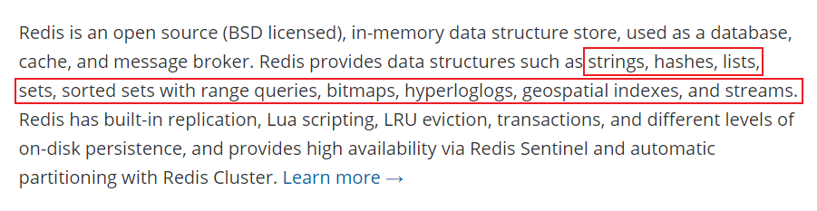

# NoSQL概述

## 为什么要用NoSQL

用户的个人信息，社交网络，地理位置。用户自己产生的数据，用户日志等爆发式的增长

这时候就需要使用NoSQL数据库

> 1、单机MySQL的年代


90年代，一个基本的网站访问量一般不会太大，单个数据库完全足够，那个时候，更多的是使用静态网页html，服务器没有太大压力

瓶颈

1、数据量如果太大，一个机器放不下

2、数据的索引（B + Tree），一个机器内存放不下

3、访问量（读写混合），一个服务器承受不了

出现以上情况就需要晋级

> 2、Memcached（缓存）+ MySQL + 垂直拆分

网站80%的情况都是在读，每次查询数据库十分麻烦，因此使用缓存来保证效率

发展过程：优化数据结构和索引 --> 文件缓存（IO）--> Memcached


## 什么是NoSQL

> NoSQL

NoSQL = Not Only SQL （不仅仅是SQL）

关系型数据库： 表格，行，列（POI）

泛指非关系型数据库，随着web2.0互联网的诞生！ 传统的关系型数据库很难对付web2.0时代！尤其是超大规模的高并发的社区！ 暴露出很多难以克服的问题，NoSQL在当今大数据的环境下发展十分迅速，Redis是发展最快的，而且是是当下必须要掌握的

很多数据类型用户的个人信息，社交网络，地理位置。这些数据类型的存储不需要一个固定的格式，不需要多余的操作就可以横向扩展的！Map<String, Object>使用键值对来控制！

> NoSQL特点

解耦！

1、方便扩展（数据之间没有关系，很好扩展）

2、大数据高性能（Redis一秒写8万次，读取11万，NoSQL的缓存记录级，是一种细粒度的缓存，性能会比较高）

3、数据类型是多样型的（不需要事先设计数据库！随取随用！如果是数据量十分大的表，很多人就无法设计了）

4、传统RDBMS和NoSQL

```
传统的RDBMS
- 结构化组织
- SQL
- 数据和关系都存在单独的表中 row col
- 操作语言，数据定义语言
- 严格的一致性
- 基础的事务
- ... ... 
```

```
Nosql
- 不仅仅是数据
- 没有固定的查询语言
- 键值对存储，列存储，文档存储，图形数据库（社交关系）
- 最终一致性
- CAP定理和BASE
- 高性能，高可用，高可扩展
- ... ... 
```

> 了解：3V + 3高

大数据时代的3V：主要是描述问题的

​	1、海量的Volume

​	2、多样的Variety

​	3、实时Velocity

大数据时代的3高：主要是对程序的要求

​	1、高并发

​	2、高可扩（随时水平拆分，机器不够了，可以扩展机器来）

​	3、高性能 （保证用户体验和性能）

真正的实践：NoSQL + RDBMS一起使用

技术没有高低之分，看如何使用！

## 阿里演进分析


```
# 1、商品的基本信息
	名称、价格、商家信息；
	关系型数据库姐可以解决了！ MySQL/Oracle（淘宝早年就去IOE了）
	淘宝内部的MySQL不是大家用的MySQL
	
# 2、商品的描述、评论（文字比较多）
	文档型数据库中，MongoDB
	
# 3、图片
	分布式文件系统 FastDFS
	- 淘宝自己的	TFS
	- Google的 GFS
	- Hadoop HDFS
	- 阿里云的	oss
	
# 4、商品的关键字（搜索）
	- 搜索引擎 solr elasticsearch
	- ISearch： 多隆
	
# 5、商品热门的波段信息
	- 内存数据库
	- Redis	Tair、Memache
	
# 6、商品的交易，外部的支付接口
	- 三方应用
```

大型互联网应用的问题：

- 数据类型太多了
- 数据源繁多，经常重构
- 数据要改造，大面积改造

解决问题：


以上都是NoSQL的入门概述

## NoSQL的四大分类

**KV键值对：**

- 新浪：**Redis**
- 美团：Redis + Tair
- 阿里、百度：Redis + memcache

**文档型数据库（bson格式和json一样）**

- **MongoDB**（一般必须掌握）
  - MongoDB是一个基于分布式文件存储的数据库，C++编写，主要用来处理大量的文档
  - MongoDB是一个介于关系型数据库和非关系型数据库中间的产品！MongoDB是非关系型数据库中功能最丰富，最像关系型数据库的
- ConthDB

**列存储数据库**

- **HBase**
- 分布式文件系统

**图关系型数据库**


- 他不是存图形，放的是关系，比如：朋友圈社交网络，广告推荐
- **Neo4j**，InfoGrid

> 四者对比！

|       分类        |                   Examples举例                   |                         典型应用场景                         |                    数据模型                     | 优点                                                         | 缺点                                                         |
| :---------------: | :----------------------------------------------: | :----------------------------------------------------------: | :---------------------------------------------: | ------------------------------------------------------------ | ------------------------------------------------------------ |
| 键值（key-value） | Tokyo Cabinet/Tyrant,Redis, Voldemort,Oracle BDB | 内容缓存，主要用于处理大量数据的高访问负载，也用于一些日志系统等等。[3] | Key指向value的键值对，通常用hash table来实现[3] | 查找速度快                                                   | 数据无结构化，通常只被当作字符串或者二进制数据               |
|   列存储数据库    |              Cassandra, HBase,Riak               |                       分布式的文件系统                       |       以列簇式存储，将同一列数据存在一起        | 查找速度快，可扩展性强，更容易进行分布式扩展                 | 功能相对局限                                                 |
|   文档型数据库    |                 CouchDB,MongoDb                  | Web应用(与Key-Value类似，Value是结构化的，不同的是数据库能够了解Value的内容) |     Key-Value对应的键值对Value为结构化数据      | 数据结构要求不严格，表结构可变，不需要像关系型数据库一样需要先定义表结构 | 查询性能不高，而且缺乏统一的查询语法                         |
| 图形(Graph)数据库 |         Neo4J, InfoGrid, lnfinite Graph          |           社交网络，推荐系统等。专注于构建关系图谱           |                     图结构                      | 利用图结构相关算法。比如最短路径寻址，N度关系查找等          | 很多时候需要对整个图做计算才能得出需要的信息，而且这种结果后不太好做分布式的集群方案 |

# Redis入门

## 概述

> Redis是什么？

Redis（Remote Dictionary Server），即远程字典服务

是一个开源的使用ANSI C语言编写、支持网络、可基于内存亦可持久化的日志型、Key-Value数据库，并提供多种语言的API


redis会周期性的把更新的数据写入磁盘或把修改操作写入追加的记录文件，并且在此基础上实现了master-slave（主从）同步

免费和开源，是当下最热门的NoSQL技术之一，也被称为结构化数据库

> Redis用途

1、内存存储、持久化，内存中是断电即失、所以说持久化很重要（rdb、aof）

2、效率高，可以用于高速缓存

3、发布订阅系统

4、地图信息分析

5、计时器、计数器（浏览量）

6、 ... ...

> 特性

1、多样的数据类型

2、持久化

3、集群

4、事务

... ...

> 准备

官网：[https://redis.io/](https://redis.io/)


**Redis推荐都是在Linux服务器上搭建的**

## Windows安装

1、下载安装包：[https://github.com/dmajkic/redis/releases](https://github.com/dmajkic/redis/releases)

2、下载完毕得到压缩包


3、解压到自己电脑上的环境目录下

4、开启Redis，双击运行服务即可


5、使用redis客户端来连接redis


windows下使用确实简单，但是redis推荐使用Linux开发使用


## Linux安装

1、下载安装包	**redis-6.2.2.tar.gz**

2、解压安装包	程序/opt


3、进入解压后的文件可以看到redis的配置文件


4、基本的环境安装

```bash
yum install gcc-c++

make

make install
```


5、redis默认安装路径	usr/local/bin


6、将redis配置文件，复制到我们的当前目录下


7、redis默认不是后台启动的，修改配置文件

​	改为yes


8、启动redis服务


9、使用redis-cli进行连接测试


10、查看redis进程是否开启


11、如何关闭redis服务	shutdown


12、再次查看进程是否存在


## 测试性能

**redis-benchmark** 是一个压力测试工具

官方自带的性能测试工具


测试：

```bash
# 测试：100个并发连接	100000个请求
redis-benchmark -h localhost -p 6379 -c 100 -n 100000
```


## 基础知识

redis默认有16个数据库


默认使用第0个

```bash
127.0.0.1:6379> select 2	#切换数据库
OK
127.0.0.1:6379[2]> DBSIZE	#查看DB大小
(integer) 0
127.0.0.1:6379[2]> keys *
(empty array)
127.0.0.1:6379[2]> set name aocan
OK
127.0.0.1:6379[2]> get name
"aocan"
127.0.0.1:6379[2]> keys *	#查看数据库所有的key
1) "name"
127.0.0.1:6379[2]> flushall	#清空所有数据库
OK
127.0.0.1:6379[2]> flushdb	#清空当前数据库
OK
```

> Redis是单线程的

Redis是很快的，Redis基于内存操作，CPU不是Redis性能瓶颈，Redis的瓶颈是根据机器的内存和网络带宽，既然可以使用单线程来实现，就使用单线程了，所以就使用单线程了

Redis是C语言写的，官方提供的数据为100000+的QPS，完全不比同样是使用key-value的Memcache差

**Redis为什么单线程还这么快**

1、误区1：高性能的服务器一定是多线程的

2、误区2：多线程（CPU上下文会切换）一定比单线程效率高

核心：redis是将所有的数据全部放在内存中的，所以使用单线程去操作效率就是最高的，多线程（CPU上下文会切换：耗时的操作），对于内存系统来说，如果没有上下文切换效率就是最高的，多次读写都是在一个CPU上的 ，在内存情况下，这个就是最佳方案

# 五大数据类型

> 官网文档



Redis是一个开源(BSD许可)的，两存中的数据结构存储系统，它可以用作**数据库**、**缓存**和**消息中间件**。它支持多种类型的数据结构，如字符串 ( strings )，散列 ( hashes )，列表( lists )，集合( sets)，有序集合( sorted sets ）与范围查询，bitmaps ， hyperloglogs和地理空间(geospatial ）索引半径查询。Redis内置了复制( replication )，LUA脚本(LuaRedis是一个开源(BSD许可)的，两存中的数据结构存储系统，它可以用作数据库、缓存和消息中间件。它支持多种类型的数据结构，如字符串 ( strings )，散列 ( hashes )，列表( lists )，集合( sets)，有序集合( sorted sets ）与范围查询，bitmaps ，hyperloglogs和地理空间(geospatial）索引半径查询。Redis内置了复制( replication )，LUA脚本(Luascripting )，LRU驱动事件(LRU eviction )，事务 ( transactions）和不同级别的磁盘持久化 ( persistence)，并通过Redis哨兵( Sentinel )和自动分区( Cluster)提供高可用性( high availability )。

## Redis-Key

```bash
127.0.0.1:6379> keys *
(empty array)
127.0.0.1:6379> set name aocan
OK
127.0.0.1:6379> keys *
1) "name"
127.0.0.1:6379> set age 1
OK
127.0.0.1:6379> EXPIRE name 10	#设置key的过期时间
(integer) 1
127.0.0.1:6379> ttl name	#查看当前key的剩余时间，单位是秒
(integer) -2
127.0.0.1:6379> get name
(nil)
127.0.0.1:6379> EXISTS name	#判断当前key是否存在
(integer) 0
127.0.0.1:6379> move age 1	#移动当前key
(integer) 1
127.0.0.1:6379> set name aocan
OK
127.0.0.1:6379> keys *
1) "name"
127.0.0.1:6379> type name	#查看当前key的类型
string
```

官网可以查命令


## String（字符串）

```bash
#######################################################################
[root@acacac bin]# redis-server acconfig/redis.conf
[root@acacac bin]# redis-cli -p 6379
127.0.0.1:6379> set key1 v1		#设置值
OK
127.0.0.1:6379> get key1		#获得值
"v1"
127.0.0.1:6379> keys *			#获得所有的key
1) "key1"
127.0.0.1:6379> EXISTS key1		#判断key是否存在
(integer) 1
127.0.0.1:6379> exists key1
(integer) 1
127.0.0.1:6379> append key1 "hello"		#追加字符串，如果当前key不存在，就相当于set key
(integer) 7
127.0.0.1:6379> get key1
"v1hello"
127.0.0.1:6379> strlen key1		#获取字符串的长度
(integer) 7
127.0.0.1:6379> 
###########################################################################
# i++
# 步长 i+=
步长
127.0.0.1:6379> set views 0
OK
127.0.0.1:6379> get views
"0"
127.0.0.1:6379> incr views	#自增1
(integer) 1
127.0.0.1:6379> incr views
(integer) 2
127.0.0.1:6379> get views
"2"
127.0.0.1:6379> 
127.0.0.1:6379> decr views	#自减1
(integer) 1
127.0.0.1:6379> decr views
(integer) 0
127.0.0.1:6379> incrby views 10	#设置步长，指定增量
(integer) 10
127.0.0.1:6379> decrby views 5	#设置步长，指定减量
(integer) 5

###########################################################################
# 字符串范围 range
127.0.0.1:6379> set key1 "hello"	#设置key1的值
OK
127.0.0.1:6379> get key1
"hello"
127.0.0.1:6379> getrange key1 0 3	#截取字符串 [0, 3]
"hell"
127.0.0.1:6379> getrange key1 0 -1	#获取全部字符串 和 get key是一样的
"hello"

# 替换
127.0.0.1:6379> set key2 absdds
OK
127.0.0.1:6379> get key2
"absdds"
127.0.0.1:6379> setrange key2 1 xx	#替换指定位置开始的字符串
(integer) 6
127.0.0.1:6379> get key2
"axxdds"

###########################################################################
# setex (set with expire)	#设置过期时间
# setnx (set if not exist)	#不存在再设置（再分布式锁中常使用）
127.0.0.1:6379> setex key3 30 "hello"	#设置key3的值为hello。，30秒后过期
OK
127.0.0.1:6379> ttl key3
(integer) 25
127.0.0.1:6379> ttl key3
(integer) 23
127.0.0.1:6379> get key3
"hello"
127.0.0.1:6379> ttl key3
(integer) 7
127.0.0.1:6379> ttl key3
(integer) 0
127.0.0.1:6379> get key3
(nil)
127.0.0.1:6379> setnx mykey "redis"		#如果mykey不存在，创建mykey
(integer) 1
127.0.0.1:6379> keys *
1) "key2"
2) "mykey"
3) "key1"
127.0.0.1:6379> setnx mykey "MongoDB"	#如果mykey存在，创建失败
(integer) 0
127.0.0.1:6379> get mykey
"redis"

###########################################################################
# mset
# mget
127.0.0.1:6379> keys *
(empty array)
127.0.0.1:6379> mset k1 v1 k2 v2 k3 v3	#同时设置多个值
OK
127.0.0.1:6379> keys *
1) "k2"
2) "k3"
3) "k1"
127.0.0.1:6379> mget k1 k2 k3	#同时获取多个值
1) "v1"
2) "v2"
3) "v3"
127.0.0.1:6379> msetnx k1 v1 k4 v4	#msetnx是一个原子性操作，要么一起成功要么一起失败
(integer) 0
127.0.0.1:6379> get k4
(nil)

# 对象
set user:1 {name:zhangsan, age:3}	#设置一个user:1对象 值为json字符串来保存一个对象

#这里的key是一个巧妙的设计：user:{id}:{filed}

127.0.0.1:6379> mset user:1:name zhangsan user:1:age 3
OK
127.0.0.1:6379> mget user:1:name user:1:age
1) "zhangsan"
2) "3"

###########################################################################
getset # 先get再set

127.0.0.1:6379> getset db redis		#如果不存在值，则返回nil
(nil)
127.0.0.1:6379> get db
"redis"
127.0.0.1:6379> getset db mongodb	#如果存在值，获取原来的值，并设置新的值
"redis"
127.0.0.1:6379> get db
"mongodb"
```

## List

基本的数据类型，列表


在Redis里面，可以把llist当作栈，队列，阻塞队列

所有的list命令都是用l开头的，Redis不区分大小写命令

```bash
###########################################################################
127.0.0.1:6379> lpush list one	#将一个值或者多个值，插入到列表头部（左）
(integer) 1
127.0.0.1:6379> lpush list two
(integer) 2
127.0.0.1:6379> lpush list three
(integer) 3
127.0.0.1:6379> lrange list 0 -1	#获取list中的值
1) "three"
2) "two"
3) "one"
127.0.0.1:6379> lrange list 0 1		#通过区间获取具体的值
1) "three"
2) "two"
127.0.0.1:6379> rpush list right	#将一个值或者多个值，插入到列表尾部（右）
(integer) 4
127.0.0.1:6379> lrange list 0 1
1) "three"
2) "two"
127.0.0.1:6379> lrange list 0 -1
1) "three"
2) "two"
3) "one"
4) "right"

###########################################################################
# lpop/rpop	移除元素

127.0.0.1:6379> lrange list 0 -1
1) "three"
2) "two"
3) "one"
4) "right"
127.0.0.1:6379> lpop list	#移除list的第一个元素
"three"
127.0.0.1:6379> rpop list	#移除list的最后一个元素
"right"
127.0.0.1:6379> lrange list 0 -1
1) "two"
2) "one"

###########################################################################
# lindex	通过下标获取list中的某一个值

127.0.0.1:6379> lindex list 1
"one"
127.0.0.1:6379> lindex list 0
"two"

###########################################################################
# llen	返回list的长度

127.0.0.1:6379> lpush list one
(integer) 1
127.0.0.1:6379> lpush list two
(integer) 2
127.0.0.1:6379> lpush list three
(integer) 3
127.0.0.1:6379> lpush list four
(integer) 4
127.0.0.1:6379> llen list
(integer) 4

###########################################################################
# lrem 移除list集合中指定个数的value，精确匹配

127.0.0.1:6379> lrange list 0 -1
1) "four"
2) "four"
3) "three"
4) "two"
5) "one"
127.0.0.1:6379> lrem list 1 one
(integer) 1
127.0.0.1:6379> lrange list 0 -1
1) "four"
2) "four"
3) "three"
4) "two"
127.0.0.1:6379> lpush list four
(integer) 5
127.0.0.1:6379> lrem list 2 four
(integer) 2
127.0.0.1:6379> lrange list 0 -1
1) "four"
2) "three"
3) "two"

###########################################################################
# ltrim 修剪： list 截断

127.0.0.1:6379> rpush mylist "hello"
(integer) 1
127.0.0.1:6379> rpush mylist "hello1"
(integer) 2
127.0.0.1:6379> rpush mylist "hello2"
(integer) 3
127.0.0.1:6379> rpush mylist "hello3"
(integer) 4
127.0.0.1:6379> ltrim mylist 1 2	#通过下标截取指定长度，这个list已经改变了，截断了只剩下截取的元素
OK
127.0.0.1:6379> lrange mylist 0 -1
1) "hello1"
2) "hello2"

###########################################################################
# rpoplpush	移除列表的最后一个元素，并添加到另一个列表

127.0.0.1:6379> rpush mylist "hello"
(integer) 1
127.0.0.1:6379> rpush mylist "hello1"
(integer) 2
127.0.0.1:6379> rpush mylist "hello2"
(integer) 3
127.0.0.1:6379> rpush mylist "hello3"
(integer) 4
127.0.0.1:6379> rpoplpush mylist myotherlist
"hello3"
127.0.0.1:6379> lrange mylist 0 -1	#查看原来的列表
1) "hello"
2) "hello1"
3) "hello2"
127.0.0.1:6379> lrange myotherlist 0 -1	#查看目标列表
1) "hello3"

###########################################################################
# lset 将列表中指定下标的值替换为另外一个值，更新操作

127.0.0.1:6379> exists list	# 判断这个列表是否存在
(integer) 0
127.0.0.1:6379> lset list 0 item	#如果不存在列表我们去更新就会报错
(error) ERR no such key
127.0.0.1:6379> lpush list value
(integer) 1
127.0.0.1:6379> lrange list 0 0 
1) "value"
127.0.0.1:6379> lset list 0 item
OK
127.0.0.1:6379> lrange list 0 0 
1) "item"
127.0.0.1:6379> lset list 1 item
(error) ERR index out of range

###########################################################################
# linsert 	将某个具体的值插入到列表中某个元素的前面或者后面

127.0.0.1:6379> rpush mylist "hello"
(integer) 1
127.0.0.1:6379> rpush mylist "world"
(integer) 2
127.0.0.1:6379> linsert mylist before "world" "other"
(integer) 3
127.0.0.1:6379> lrange mylist 0 -1
1) "hello"
2) "other"
3) "world"
127.0.0.1:6379> linsert mylist after world new
(integer) 4
127.0.0.1:6379> lrange mylist 0 -1
1) "hello"
2) "other"
3) "world"
4) "new"
```

> 小结

- 实际上是一个链表，before Node after，left，right都可以插入值
- 如果key不存在，创建新的链表
- 如果key存在，新增内容
- 如果移除了所有值，空链表，也代表不存在
- 在两边插入或者改动值，效率最高。中间元素，相对来说效率会低一点

消息排队，消息队列 （lpush rpop），栈（lpush，lpop）

## Set

set中的值是不能重读的

```bash
###########################################################################
127.0.0.1:6379> sadd myset hello	#set集合中添加元素
(integer) 1
127.0.0.1:6379> sadd myset hello2
(integer) 1
127.0.0.1:6379> sadd myset ac
(integer) 1
127.0.0.1:6379> smembers myset		#查看指定set的所有值
1) "ac"
2) "hello2"
3) "hello"
127.0.0.1:6379> sismember myset hello	#判断某一个值是不是在set集合中
(integer) 1
127.0.0.1:6379> sismember myset world
(integer) 0

###########################################################################
127.0.0.1:6379> scard myset		#获取set集合中的元素个数
(integer) 3

###########################################################################
srem

127.0.0.1:6379> srem myset hello	#移除set集合中的指定元素
(integer) 1
127.0.0.1:6379> scard myset
(integer) 2
127.0.0.1:6379> smembers myset
1) "ac"
2) "hello2"

###########################################################################
# set 无序不重复
127.0.0.1:6379> srandmember myset	#随机输出一个元素
"ac"
127.0.0.1:6379> srandmember myset 2	#随机抽选出指定个数的元素
1) "ac"
2) "hello2"

###########################################################################
# 删除指定的key，随机删除key

127.0.0.1:6379> smembers myset
1) "ac"
2) "hello2"
3) "world"
127.0.0.1:6379> spop myset
"hello2"
127.0.0.1:6379> spop myset
"world"
127.0.0.1:6379> smembers myset
1) "ac"

###########################################################################
# 将一个指定的值，移动到另外一个set集合中

127.0.0.1:6379> sadd myset hello
(integer) 1
127.0.0.1:6379> sadd myset world
(integer) 1
127.0.0.1:6379> sadd myset redis
(integer) 1
127.0.0.1:6379> sadd myset aaa
(integer) 1
127.0.0.1:6379> smembers myset
1) "aaa"
2) "hello"
3) "redis"
4) "world"
127.0.0.1:6379> sadd myset2 hello2
(integer) 1
127.0.0.1:6379> smembers myset2
1) "hello2"
127.0.0.1:6379> smove myset myset2 hello
(integer) 1
127.0.0.1:6379> smembers myset
1) "aaa"
2) "redis"
3) "world"
127.0.0.1:6379> smembers myset2
1) "hello"
2) "hello2"

###########################################################################
# eg：共同关注（交集）
#	数字集合类
#	 - 差集 sdiff
#	 - 交集 sinter
#	 - 并集 sunion

127.0.0.1:6379> sadd k1 a
(integer) 1
127.0.0.1:6379> sadd k1 b
(integer) 1
127.0.0.1:6379> sadd k1 c
(integer) 1
127.0.0.1:6379> sadd k2 c
(integer) 1
127.0.0.1:6379> sadd k2 d
(integer) 1
127.0.0.1:6379> sadd k2 e
(integer) 1
127.0.0.1:6379> sdiff k1 k2		#差集
1) "b"
2) "a"
127.0.0.1:6379> sinter k1 k2	#交集
1) "c"
127.0.0.1:6379> sunion k1 k2	#并集
1) "b"
2) "c"
3) "a"
4) "e"
5) "d"
```

微博，A用户将所有关注的人放在一个set集合中，将他的粉丝也放在一个集合中

共同关注，共同爱好，二度好友（六度分割理论）

## Hash

Map集合，key-map 这个值是一个map集合，本质和String类型没有太大区别，还是一个简单的key-value

```bash
127.0.0.1:6379> hset myhash field1 redis		#set一个具体的key-value
(integer) 1
127.0.0.1:6379> hget myhash field1	#获取一个字段值
"redis"
127.0.0.1:6379> hmset myhash field1 hello field2 world	#set多个key-value
OK
127.0.0.1:6379> hmget myhash field1 field2	#获取多个字段值
1) "hello"
2) "world"
127.0.0.1:6379> hgetall myhash	#获取全部的数据
1) "field1"
2) "hello"
3) "field2"
4) "world"
127.0.0.1:6379> hdel myhash field1	#删除hash指定key字段，对应的value值也就消失了
(integer) 1
127.0.0.1:6379> hgetall myhash
1) "field2"
2) "world"
###########################################################################
hlen

127.0.0.1:6379> hmset myhash field1 hello field2 world
OK
127.0.0.1:6379> hgetall myhash
1) "field2"
2) "world"
3) "field1"
4) "hello"
127.0.0.1:6379> hlen myhash	#获取hash表的字段数量
(integer) 2

###########################################################################
127.0.0.1:6379> hexists myhash field1	#判断hash中指定字段是否存在
(integer) 1
127.0.0.1:6379> hexists myhash field3
(integer) 0

###########################################################################
# 只获得所有field
# 只获得所有value
127.0.0.1:6379> hkeys myhash	#只获取所有field
1) "field2"
2) "field1"
127.0.0.1:6379> hvals myhash	#只获取所有value
1) "world"
2) "hello"
```

hash变更的数据 user name age，尤其是用户信息之类的，经常变动的信息。Hash更适合对象的存储，String更适合字符串的存储

## Zset（有序集合）

在set的基础上，增加了一个值，set k1 v1, zset k1 score1 v1

```bash
127.0.0.1:6379> zadd myset 1 one	#添加一个值
(integer) 1
127.0.0.1:6379> zadd myset 2 two 3 three	#添加多个值
(integer) 2
127.0.0.1:6379> zrange myset 0 -1
1) "one"
2) "two"
3) "three"

###########################################################################
排序
127.0.0.1:6379> zadd salary 2000 zhangsan
(integer) 1
127.0.0.1:6379> zadd salary 2500 lisi
(integer) 1
127.0.0.1:6379> zadd salary 200 wangwu
(integer) 1
127.0.0.1:6379> zrangebyscore salary -inf +inf	#升序排序 显示全部用户
1) "wangwu"
2) "zhangsan"
3) "lisi"
127.0.0.1:6379> zrevrangebyscore salary +inf -inf	#降序排序
1) "lisi"
2) "zhangsan"
3) "wangwu"
127.0.0.1:6379> zrevrangebyscore salary +inf -inf withscores
1) "lisi"
2) "2500"
3) "zhangsan"
4) "2000"
5) "wangwu"
6) "200"

```


# 三种特殊数据类型

## geospatial地理位置

...

## hyperloglog基数统计

基数（不重复的元素个数）

优点：占用的内存是固定的，2^64不同元素的基数，只需要12KB的内存

**网页的UV （一个人访问一个网站多次，但是还是算作一个人）**

传统方式：set保存用户的id，然后就可以统计set中的元素数量来作为标准判断，这个方式如果保存大量的用户id，就会比较麻烦，我们的目的是为了计数，而不是保存用户id

0.81%错误率

...

## bitmaps位图

> 位存储

统计用户信息，活跃，不活跃     登录，未登录     打卡

两个状态的，都可以使用Bitmaps

Bitmaps位图，数据结构，都是操作二进制位来进行记录，就只有0和1两个状态

...

# 事务

Redis事务本质：一组命令的集合，一个事务中所有的命令会被序列化，在事务执行过程中，会按照顺序执行

一次性、顺序性、排他性

==Redis事务没有隔离级别的概念==

所有的命令在事务中，并没有直接被执行，只有发起执行命令的时候才会执行

==Redis单条命令是保证原子性的，但是事务不保证原子性==

redis事务：

- 开启事务（multi）
- 命令入队（）
- 执行事务（exec）

> 正常执行事务

```bash
127.0.0.1:6379> multi	#开启事务
OK
# 命令入队
127.0.0.1:6379(TX)> set k1 v1
QUEUED
127.0.0.1:6379(TX)> set k2 v2
QUEUED
127.0.0.1:6379(TX)> get k2
QUEUED
127.0.0.1:6379(TX)> set k3 v3
QUEUED
127.0.0.1:6379(TX)> exec	#执行事务
1) OK
2) OK
3) "v2"
4) OK
```

> 放弃事务

```bash
127.0.0.1:6379> multi	#开启事务
OK
127.0.0.1:6379(TX)> set k1 v1
QUEUED
127.0.0.1:6379(TX)> set k2 v2
QUEUED
127.0.0.1:6379(TX)> set k4 v4
QUEUED
127.0.0.1:6379(TX)> discard		#取消事务
OK
127.0.0.1:6379> get k4	#事务队列中的命令都不会被执行
(nil)
```

> 编译型异常（代码有问题，命令有错），事务中所有的命令都不会被执行

```bash
127.0.0.1:6379> multi
OK
127.0.0.1:6379(TX)> set k1 v1
QUEUED
127.0.0.1:6379(TX)> set k2 v2
QUEUED
127.0.0.1:6379(TX)> set k3 v3
QUEUED
127.0.0.1:6379(TX)> getset k3	#错误的命令
(error) ERR wrong number of arguments for 'getset' command
127.0.0.1:6379(TX)> set k4 v4
QUEUED 
127.0.0.1:6379(TX)> set k5 v5
QUEUED
127.0.0.1:6379(TX)> exec	#执行事务报错
(error) EXECABORT Transaction discarded because of previous errors.
127.0.0.1:6379> get k5		#所有的命令都不会被执行
(nil)
```

> 运行时异常（1/0），如果事务队列中存在语法性，那么执行命令的时候，其他命令是可以正常执行的，错误命令会抛出异常

```bash
127.0.0.1:6379> set k1 v1
OK
127.0.0.1:6379> multi
OK
127.0.0.1:6379(TX)> incr k1
QUEUED
127.0.0.1:6379(TX)> set v2 k2
QUEUED
127.0.0.1:6379(TX)> set k3 v3
QUEUED
127.0.0.1:6379(TX)> get k3
QUEUED
127.0.0.1:6379(TX)> exec
1) (error) ERR value is not an integer or out of range	#虽然第一条命令报错了，但是依旧正常执行成功了
2) OK
3) OK
4) "v3"
```

> 监控    Watch

**悲观锁：**

- 很悲观，认为什么时候都会出问题，无论做什么都会加锁

**乐观锁：**

- 很乐观，认为什么时候都不会出问题，所以不会上锁，更新数据的时候去判断一下，在此期间是否有人修改过这个数据
- 获取version
- 更新的时候比较version

>  Redis监视测试

正常执行成功

```bash
127.0.0.1:6379> set money 100
OK
127.0.0.1:6379> set out 0
OK
127.0.0.1:6379> watch money 	#监视money对象
OK
127.0.0.1:6379> multi		#事务正常结束，数据期间没有发生变动，这个时候就正常执行成功
OK
127.0.0.1:6379(TX)> decrby money 20
QUEUED
127.0.0.1:6379(TX)> incrby out 20
QUEUED
127.0.0.1:6379(TX)> exec
1) (integer) 80
2) (integer) 20
```

测试多线程修改值，使用watch当作redis的乐观锁操作

```bash
127.0.0.1:6379> watch money		#监视money
OK
127.0.0.1:6379> multi
OK
127.0.0.1:6379(TX)> decrby money 10
QUEUED
127.0.0.1:6379(TX)> incrby money 10
QUEUED
127.0.0.1:6379(TX)> exec		#执行之前，另外一个线程修改了money的值，导致事务执行失败
(nil)
```

如果修改失败，获取最新的值就好


# Jedis

使用Java来操作Redis

> Jedis是Redis官方推荐的java连接开发工具，使用Java操作Redis中间件

> 测试

1. 导入对应的依赖
2. 编码测试
   - 连接数据库
   - 操作命令
   - 断开连接

## 常用的API

String

List

Set

Hash

ZSet

# Redis.conf详解

启动的时候，通过配置文件启动

> 单位


1. 配置文件unit单位对大小写不敏感

> 包含


> 网络

```bash
bind 127.0.0.1 -::1		#绑定的ip
protected-mode yes		#保护模式
port 6379				#端口设置
```

> 通用GENERAL

```BASH
daemonize yes			#以守护进程的方式运行，默认是no，需要自己开启为yes

pidfile /var/run/redis_6379.pid		#如果以后台的方式运行，就需要指定一个pid文件

# 日志
# Specify the server verbosity level.
# This can be one of:
# debug (a lot of information, useful for development/testing)
# verbose (many rarely useful info, but not a mess like the debug level)
# notice (moderately verbose, what you want in production probably)	生产环境
# warning (only very important / critical messages are logged)
loglevel notice
logfile ""		#日志的文件名
databases 16	#数据库的数量，默认是16个数据库
always-show-logo no		#是否总是显示logo
```

> 快照

持久化，在规定时间内，执行了多少次操作，则会持久化到文件 .rdb .aof

redis是内存数据库，如果没有持久化，那么数据断电即失

```bash
# 如果900s内，至少有一个key进行了修改，就进行持久化操作
save 3600 1
# 如果300s内，至少10key进行了修改，就进行持久化操作
save 300 100
# 如果60s内，至少10000key进行了修改，就进行持久化操作
save 60 10000
# 可以自定义

stop-writes-on-bgsave-error yes		# 如果持久化出错，是否还要继续工作

rdbcompression yes		# 是否压缩rdb文件，需要消耗一些cpu资源

rdbchecksum yes		# 保存rdb文件的时候，进行错误的检查校验

dir ./		# reb文件保存的目录
```

> 限制CLIENTS

```bash
maxclients 10000		# 设置能连接上redis的最大客户端的数量

maxmemory <bytes>		# redis配置的最大的内存容量

maxmemory-policy noeviction		# 内存到达上限之后的处理策略
	1. volatile-lru：只设置了过期时间的key进行LRU（默认值）
	2. allkeys-lru：删除lru算法的key
	3. volatile-random：随机删除即将过期的key
	4. allkeys-random：随机删除
	5. volatile-ttl：删除即将过期的
	6. noeviction：永不过期，返回错误
```

> APPEND ONLY 模式	aof配置

```bash
appendonly no		# 默认是不开启aof模式的，默认是使用rdb方式持久化的，在大部分所有的情况下，rdb完全够用
appendfilename "appendonly.aof"		# 持久化的文件的名字

# appendfsync always		# 每次修改都会sync，消耗性能
appendfsync everysec		# 每秒执行一次sync，可能会丢失这1s的数据
# appendfsync no		# 不执行sync，这个时候操作系统自己同步数据，速度最快
```

# Redis持久化

Redis是内存数据库，如果不将内存中的数据库状态保存到磁盘，那么一旦服务器进程退出，服务器中的数据库状态也会消失。所以Redis提供了持久化功能

## RDB（Redis DataBase）

> 什么是RDB


在指定的时间间隔内将内存中的数据集快照写入磁盘，也就是行话讲的Snapshot快照，它恢复时是将快照文件直接读到内存里。

Redis会单独创建 （ fork )一个子进程来进行持久化，会先将数据写入到一个临时文件中，待持久化过程都结束了，再用这个临时文件替换上次持久化好的文件。整个过程中，主进程是不进行任何IO操作的。这就确保了极高的性能。如果需要进行大规模数据的恢复，且对于数据恢复的完整性不是非常敏感，那RDB方式要比AOF方式更加的高效。RDB的缺点是最后一次持久化后的数据可能丢失。一般默认用RDB

==rdb保存的文件是dump.rdb==


> 触发机制

1. save 的规则满足的情况下，会自动触发rdb的规则
2. 执行flushall命令，也会触发rdb规则
3. 退出redis，也会产生rdb文件

备份就会自动生成一个rdb文件dump.rdb

> 如何恢复rdb文件

1. 只需要将rdb文件放在redis的启动目录就可以，redis启动的时候会自动检查dump.rdb恢复其中的数据

2. 查看位置

   ```bash
   127.0.0.1:6379> config get dir
   1) "dir"
   2) "/"		# 如果在这个目录下存在dump.rdb文件，启动就会自动恢复其中的数据
   ```

> 默认配置一般够用

**优点：**

 	1. 适合大规模的数据恢复
 	2. 对数据的完整性要求不高

**缺点：**

 	1. 需要一定的时间间隔进行操作，如果redis意外宕机了，这个最后一次修改数据就没有了
 	2. fork进行的时候，会占用一定的内容空间

## AOF（Append Only File）

将所有命令记录下来，恢复的时候就把这个文件全部再执行一遍

> 是什么


以日志的形式来记录每个写操作，将Redis执行过的所有指令记录下来(读操作不记录），只许追加文件但不可以改写文件，redis启动之初会读取该文件重新构建数据，换言之，redis重启的话就根据日志文件的内容将写指令从前到后执行一次以完成数据的恢复工作

==AOF保存的是aof文件appendonly.aof==


默认是不开启的，需要手动配置，只需要将appendonly改为yes就开启了aof

重启，redis就可以生效了

如果aof文件有错误，redis是启动不起来的，需要修复这个aof文件

redis提供了一个修复工具==redis-check-aof --fix==

如果文件正常，重启就可以直接恢复了

> 优点和缺点

**优点：**

1. 每一次修改都同步，文件的完整性会更好
2. 每秒同步一次，可能会丢失一秒的数据
3. 从不同步，效率是最高的

**缺点：**

1. 相对于数据文件来说，aof远远大于rdb，修复的速度也比rdb慢
2. Aof运行效率也比rdb慢，所以redis默认的配置就是rdb持久化


## 扩展：

1. RDB持久化方式能够在指定的时间间隔内对你的数据进行快照存储
2. AOF持久化方式记录每次对服务器写的操作，当服务器重启的时候会重新执行这些命令来恢复原始的数据，AOF命令以Redis 协议追加保存每次写的操作到文件末尾，Redis还能对AOF文件进行后台重写，使得AOF文件的体积不至于过大。
3. **只做缓存，如果你只希望你的数据在服务器运行的时候存在，你也可以不使用任何持久化**
4. 同时开启两种持久化方式
   - 在这种情况下，当redis重启的时候会优先载入AOF文件来恢复原始的数据，因为在通常情况下AOF文件保存的数据集要比RDB文件保存的数据集要完整。
   - RDB的数据不实时，同时使用两者时服务器重启也只会找AOF文件，那要不要只使用AOF呢?作者建议不要，因为RDB更适合用于备份数据库（AOF在不断变化不好备份），快速重启，而且不会有AOF可能潜在的Bug，留着作为一个万一的手段
5. 性能建议
   - 因为RDB文件只用作后备用途，建议只在Slave上持久化RDB文件，而且只要15分钟备份一次就够了，只保留save 9001这条规则。
   - 如果Enable AOF，好处是在最恶劣情况下也只会丢失不超过两秒数据，启动脚本较简单只load自己的AOF文件就可以了，代价一是带来了持续的IО，二是AOF rewrite 的最后将rewrite过程中产生的新数据写到新文件造成的阻塞几乎是不可避免的。只要硬盘许可，应该尽量减少AOF rewrite的频率，AOF重写的基础大小默认值64M太小了，可以设到5G以上，默认超过原大小100%大小重写可以改到适当的数值。
   - 如果不Enable AOF，仅靠Master-Slave Repllcation 实现高可用性也可以，能省掉一大笔IO，也减少了rewrite时带来的系统波动。代价是如果Master/Slave同时倒掉（断电），会丢失十几分钟的数据，启动脚本也要比较两个Master/Slave 中的RDB文件，载入较新的那个，微博就是这种架构。

# Redis发布订阅

Redis 发布订阅(pub/sub)是一种**消息通信模式**∶发送者(pub)发送消息，订阅者(sub)接收消息。

Redis 客户端可以订阅任意数量的频道。
订阅/发布消息图︰


下图展示了频道channel1，以及订阅这个频道的三个客户端--client2、 client5和client1之间的关系：


当有新消息通过PUBLISH 命令发送给频道channel1时，这个消息就会被发送给订阅它的三个客户端：


> 命令

广泛用于构建即时通信应用，比如网络聊天室(chatroom)和实时广播、实时提醒等。


> 原理

Redis是使用C实现的，通过分析Redis源码里的pubsub.c文件，了解发布和订阅机制的底层实现，籍此加深对Redis的理解。
Redis通过PUBLISH、SUBSCRIBE和PSUBSCRIBE等命令实现发布和订阅功能。
微信︰
通过SUBSCRIBE命令订阅某频道后，redis-server里维护了一个字典，字典的键就是一个个频道!，而字典的值则是一个链表，链表中保存了所有订阅这个channel的客户端。SUBSCRIBE命令的关键，就是将客户端添加到给定channel的订阅链表中。

通过PUBLISH命令向订阅者发送消息，redis-server会使用给定的频道作为键，在它所维护的channel字典中查找记录了订阅这个频道的所有客户端的链表，遍历这个链表，将消息发布给所有订阅者。
Pub/Sub从字面上理解就是发布( Publish )与订阅(Subscribe )，在Redis中，你可以设定对某一个key值进行消息发布及消息订阅，当一个key值上进行了消息发布后，所有订阅它的客户端都会收到相应的消息。这一功能最明显的用法就是用作实时消息系统，比如普通的即时聊天，群聊等功能。


使用场景：

 	1. 实时消息系统
 	2. 实时聊天（频道当作聊天室，将消息回显给所有人）
 	3. 订阅，关注系统

稍微复杂的场景就会使用 消息中间件来做MQ（）

# Redis主从复制

## 概念

主从复制，是指将一台Redis服务器的数据，复制到其他的Redis服务器。前者称为主节点(master/leader)，后者称为从节点(slave/follower)；==数据的复制是单向的，只能由主节点到从节点。==Master以**写**为主，Slave以**读**为主。
默认情况下，每台Redis服务器都是主节点;且一个主节点可以有多个从节点（或没有从节点），但一个从节点只能有一个主节点。主从复制的作用主要包括︰

1. 数据冗余︰主从复制实现了数据的热备份，是持久化之外的一种数据冗余方式。
2. 故障恢复︰当主节点出现问题时，可以由从节点提供服务，实现快速的故障恢复;实际上是一种服务的冗余。
3. 负载均衡︰在主从复制的基础上，配合读写分离，可以由主节点提供写服务，由从节点提供读服务（即写Redis数据时应用连接主节点，读Redis数据时应用连接从节点），分担服务器负载;尤其是在写少读多的场景下，通过多个从节点分担读负载，可以大大提高Redis服务器的并发量。
4. 高可用（集群）基石∶除了上述作用以外，主从复制还是哨兵和集群能够实施的基础，因此说主从复制是Redis高可用的基础。


一般来说，要将Redis运用于工程项目中，只使用一台Redis是万万不能的（宕机），原因如下︰

1. 从结构上，单个Redis服务器会发生单点故障，并且一台服务器需要处理所有的请求负载，压力较大;
2. 从容量上，单个Redis服务器内存容量有限，就算一台Redis服务器内存容量为256G，也不能将所有内存用作Redis存储内存，一般来说，==**单台Redis最大使用内存不应该超过20G**==。

电商网站上的商品，一般都是一次上传，无数次浏览的，说专业点也就是"多读少写"。


主从复制，读写分离。80%的情况下都是在进行读操作，减缓服务器的压力，架构中经常使用，一主二从

## 环境配置

只配置从库，不用配置主库

```bash
127.0.0.1:6379> info replication		# 查看当前库的信息
# Replication
role:master		#角色  master
connected_slaves:0		# 没有从机
master_failover_state:no-failover
master_replid:7cdca0c685bfe1a2eb296b1534f23dbb14dcd382
master_replid2:0000000000000000000000000000000000000000
master_repl_offset:0
second_repl_offset:-1
repl_backlog_active:0
repl_backlog_size:1048576
repl_backlog_first_byte_offset:0
repl_backlog_histlen:0
```

复制3个配置文件，然后修改对应的信息

1. 端口
2. pid 名字
3. log文件名字
4. dump.rdb名字

> 细节

主机可以写，从机不能写只能读。主机中的所有信息和数据，都会自动被从机保存

**主机断开连接，从机依旧连接到主机的，但是没有写操作，这个时候主机如果回来了，从机依旧可以直接获取到主机写的信息**

如果是使用命令行来配置的主从，这个时候如果重启了，就会变成主机。只要变为从机，立马就会从主机中获取值

>  复制原理

Slave启动战功连接到 master后会发送一个sync同步命令
Master接到命令，启动后台的存盘进程，同时收集所有接收到的用于修改数据集命令，在后台进程执行完毕之后，==master将传送整个数据文件到slave，并完成一次完全同步==

- **全量复制**：而slave服务在接收到数据库文件数据后，将其存盘并加载到内存中
- **增量复制**：Master继续将新的所有收集到的修改命令依次传给slave，完成同步但是只要是重新连接master，一次完全同步(全量复制)将被自动执行

但是只要是重新连接master，一次完全同步（全量复制）将被自动执行，我们是数据一定可以在从机中看到

> 手动

如果主机断开了连接，我们可以使用下面的指令来让自己变成主机，其他的节点就可以手动连接到最新的这个主节点（手动）。如果原主机修复了，那就重新连接

```bash
SLAVEOF no one
```


## 哨兵模式（自动）

> 概述

主从切换技术的方法是︰当主服务器宕机后，需要手动把一台从服务器切换为主服务器，这就需要人工干预，费事费力，还会造成一段时间内服务不可用。这不是一种推荐的方式，更多时候，我们优先考虑哨兵模式。Redis从2.8开始正式提供了Sentinel (哨兵）架构来解决这个问题。

能够后台监控主机是否故障，如果故障了根据投票数自动**将从库转化为主库**。

哨兵模式是一种特殊的模式，首先Redis提供了哨兵的命令，哨兵是一个独立的进程，作为进程，它会独立运行。其原理是**哨兵通过发送命令，等待Redis服务器响应，从而监控运行的多个Redis实例**。


这里的哨兵有两个作用

- 通过发送命令，让Redis服务器返回监控其运行状态，包括主服务器和从服务器
- 当哨兵监测到master宕机，会自动将slave切换成为mater，然后通过**发布订阅**通知其他的从服务器，修改配置文件，让他们切换主机

然而一个哨兵进程对Redis服务器进行监控，可能会出现问题，为此，我们可以使用多个哨兵进行监控。各个哨兵之间还会进行监控，这样就形成了多哨兵模式


假设主服务器宕机，哨兵1先检测到这个结果，系统并不会马上进行failover过程，仅仅是哨兵1主观的认为主服务器不可用，这个现象成为**主观下线**。当后面的哨兵也检测到主服务器不可用，并且数量达到一定值时，那么哨兵之间就会进行一次投票，投票的结果由一个哨兵发起，进行failover[故障转移]操作。切换成功后，就会通过发布订阅模式，让各个哨兵把自己监控的从服务器实现切换主机，这个过程称为**客观下线**。


主机回来后只能归并到新的主机下，当作从机，这就是哨兵模式的规则

> 哨兵模式

优点：

1. 哨兵集群，基于主从复制模式，所有的主从配置优点
2. 主从可以切换，故障可以转移，系统的可用性会更好
3. 哨兵模式就是主从模式的升级版，手动到自动，更加健壮

缺点：

1. Redis不方便在线扩容，集群容量一旦到达上限，在线扩容就十分麻烦
2. 实现哨兵模式的配置其实是很麻烦的，里面有很多选择


# Redis缓存穿透和雪崩

> 服务的高可用问题

Redis缓存的使用，极大的提升了应用程序的性能和效率，特别是数据查询方面。但同时，它也带来了一些问题。其中最要害的问题，就是数据的一致性问题，从严格意义上讲，这个问题无解。如果对数据的一致性要求很高，那么就不能使用缓存。另外的一些典型问题就是，缓存穿透、缓存雪崩和缓存击穿。

参考：[https://www.cnblogs.com/javalanguage/p/12401829.html](https://www.cnblogs.com/javalanguage/p/12401829.html)


## 缓存穿透（查不到）

> 概念

缓存穿透的概念很简单，用户想要查询一个数据，发现redis内存数据库没有，也就是缓存没有命中，于是向持久层数据库查询。发现也没有，于是本次查询失败。当用户很多的时候，缓存都没有命中，于是都去请求了持久层数据库。这会给持久层数据库造成很大的压力，这时候就相当于出现了缓存穿透。


> 解决方案

**布隆过滤器**

布隆过滤器是一种数据结构，对所有可能查询的参数以hash形式存储，在控制层先进行校验，不符合则丢弃，从而避免了对底层存储系统的查询压力。

参考：[https://zhuanlan.zhihu.com/p/43263751](https://zhuanlan.zhihu.com/p/43263751)

**缓存空对象**

当存储层不命中后，即使返回的空对象也将其缓存起来，同时会设置一个过期时间，之后再访问这个数据将会从缓存中获取，保护了后端数据源


但是这种方法会存在两个问题:

1. 如果空值能够被缓存起来，这就意味着缓存需要更多的空间存储更多的键，因为这当中可能会有很多的空值的键；
2. 即使对空值设置了过期时间，还是会存在缓存层和存储层的数据会有一段时间窗口的不一致，这对于需要保持一致性的业务会有影响。

## 缓存击穿（量太大，缓存过期）

> 概念

缓存击穿，是指一个key非常热点，在不停的扛着大并发，大并发集中对这一个点进行访问，当这个key在失效的瞬间，持续的大并发就穿破缓存，直接请求数据库，就像在一个屏障上凿开了一个洞。
当某个key在过期的瞬间，有大量的请求并发访问，这类数据一般是热点数据，由于缓存过期，会同时访问数据库来查询最新数据，并且回写缓存，会导使数据库瞬间压力过大。


> 解决方案

**设置热点数据永不过期**

从缓存层面来看，没有设置过期时间，所以不会出现热点key过期后产生的问题。

**加互斥锁**

分布式锁︰使用分布式锁，保证对于每个key同时只有一个线程去查询后端服务，其他线程没有获得分布式锁的权限，因此只需要等待即可。这种方式将高并发的压力转移到了分布式锁，因此对分布式锁的考验很大。


## 缓存雪崩

> 概念

缓存雪崩，是指在某一个时间段，缓存集中过期失效。Redis宕机

比如对于系统A，假设每天高峰期每秒5000个请求，本来缓存在高峰期可以扛住每秒4000个请求，但是缓存机器意外发生了全盘宕机。缓存挂了，此时 1 秒 5000个请求全部落数据库，数据库必然扛不住，它会报一下警，然后就挂了。此时，如果没有采用什么特别的方案来处理这个故障，DBA 很着急，重启数据库，但是数据库立马又被新的流量给打死了。


> 解决方案

**redis高可用**

增加redis，一台挂掉还有其他的继续工作，其实就是搭建集群

**限流降级**

在缓存失效后，通过加锁或者队列来控制读数据库写缓存的线程数量。比如说对某个key只允许一个线程查询数据和写数据，其他线程等待

**数据预热**

数据预热的含义就是在正式部署之前，把可能的数据先预先访问一遍，这样部分可能大量访问的数据就会加载到缓存中。在即将发生大并发访问签手动触发加载缓存不同的key，设置不同的过期时间，让缓存失效的时间点尽量均匀


**参考：[狂神说](https://www.bilibili.com/video/BV1S54y1R7SB)**

