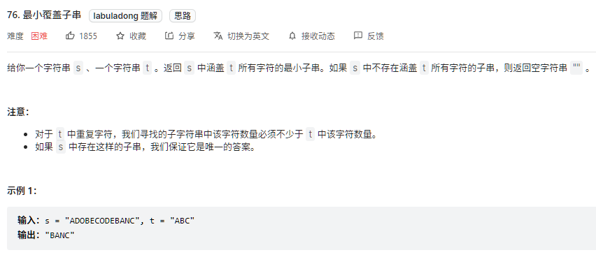
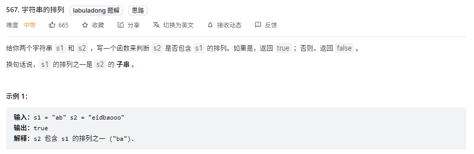
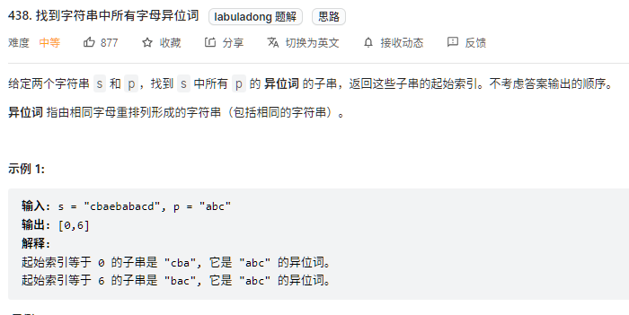
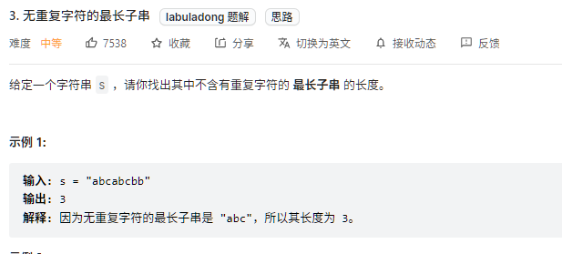

# 滑动窗口模板

滑动窗口算法的思路，就是维护一个窗口，不断滑动，然后更新答案。大致逻辑如下：

```java
int left = 0;
int right = 0;

while(right < s.length()) {
    // 增大窗口
    window.add(s.charAt(right));
    right++;
    
    while(window needs shrink) {
        // 缩小窗口
        window.remove(s.charAt(left));
        left++;
    }
}
```

这个算法的时间复杂度是 O(n)，优于字符串暴力算法。

**难点**

- 如何向窗口中添加新元素
- 如何缩小窗口
- 在窗口滑动的哪个阶段更新结果
- ...

下面就是滑动窗口算法的代码框架

```java
/*
 * 滑动窗口算法框架
 */
void slidingWindow(String s, String t) {
    Map<Character, Integer> need = new HashMap<>();
    Map<Character, Integer> window = new HashMap<>();
    
    // 左闭又开
    int left = 0, right = 0;
    // 计数
    int valid = 0;
    // 记录字符串 t
    for (int i = 0; i < t.length(); i++) {
        need.put(t.charAt(i), need.getOrDefault(t.charAt(i), 0) + 1);
    }
    
    while(right < s.length()) {
        // c 是将移入窗口的字符
        char c = s.charAt(right);
        // 增大窗口
        right++;
        // 进行窗口内数据的一系列更新
        ...
            
        /*** debug 输出的位置 ***/
        System.out.println("window: [%d, %d)\n", left, right);
        /********************/
        
        // 判断左侧窗口是否要收缩
        while(window needs shrink) {
            // d 是将移出窗口的字符
            char d = s.charAt(left);
            // 缩小窗口
            left++;
            // 进行窗口内数据的一系列更新
            ...
        }
    }
}
```

其中`...`表示更新窗口数据的地方，根据实际情况填入相应代码即可。而且，这两处的操作分别是扩大和缩小窗口的更新操作，它们操作是完全对称的。

# 具体应用

1. [LeetCode76题-最小覆盖子串](https://leetcode-cn.com/problems/minimum-window-substring/)
1. [LeetCode567题-字符串的排列](https://leetcode-cn.com/problems/permutation-in-string/)
1. [LeetCode438题-找到字符串中所有字母异位词](https://leetcode-cn.com/problems/find-all-anagrams-in-a-string/)
1. [LeetCode3题-无重复字符的最长子串](https://leetcode-cn.com/problems/longest-substring-without-repeating-characters/)


## 1. 最小覆盖子串



这一题暴力解法的思路如下：

```java
for (int i = 0; i < s.length(); i++) {
    for (int j = i + 1; j < s.length(); j++) {
        if s[i:j] 包含t的字母
            更新答案
    }
}
```

显然，这个思路的时间复杂度是大于 O(n^2) 的。下面描述一下滑动窗口的思路：

1. 在字符串 s 中使用双指针，初始化`left = right = 0`，且左闭右开区间`[left, right)`称为一个窗口；
2. 不断增大`right`指针扩大窗口，直到窗口中的所有字符串都符合要求。
3. 此时，停止增加`right`，开始增加`left`指针缩小窗口，直到窗口中的字符串不再符合要求。同时，每增加一次`left`，都要更新一轮结果。
4. 重复第2步和第3步，直到`right`到达字符串 s 的尾部。

下面是具体代码：

```java
public String minWindow(String s, String t) {
    // 计数，记录t
    Map<Character, Integer> need = new HashMap<>();
    // 计数，记录s
    Map<Character, Integer> window = new HashMap<>();
    
    // 左闭又开
    int left = 0; int right = 0;
    // 计数
    int valid = 0;
    // 记录最小子串的起始位置和长度
    int start = 0; int len = Integer.MAX_VALUE;
    // 记录字符串 t
    for (int i = 0; i < t.length(); i++) {
        need.put(t.charAt(i), need.getOrDefault(t.charAt(i), 0) + 1);
    }
    
    while (right < s.length()) {
        char c = s.charAt(right);
        // 扩大窗口
        right++;
        // 窗口内数据更新
        if (need.containsKey(c)) {
            window.put(c, window.getOrDefault(c, 0) + 1);
            if (window.get(c).equals(need.get(c))) {
                valid++;
            }
        }
        // 判断左侧窗口是否收缩
        while (valid == need.size()) {
            // 更新最小覆盖子串
            if (right - left < len) {
                // 更新起始位置和长度
                start = left;
                len = right - left;
            }
            // d 是移除窗口的元素
            char d = s.charAt(left);
            left++;
            // 更新
            if (need.containsKey(d)) {
                if (window.get(d).equals(need.get(d))) {
                    valid--;
                }
                window.put(d, window.get(d) - 1);
            }
        }
    }
    return len == Integer.MAX_VALUE ? "" : s.substring(start, start + len);
}
```

## 2. 字符串排列



这个题目是明显的滑动窗口算法，问题可以转换为：给你字符串 s 和 t，请问 s 中是否存在一个子串，包含 t 中所有字符且不包含其他字符（排列）。

对于本题的解法代码，与最小覆盖子串相比只需要改变两个地方。

1. 本题`left`指针右移时应该是窗口大小大于`t.length()`
2. 当发现`valid == need.size()`时，立即返回`true`

具体代码如下：

```java
public boolean checkInclusion(String s1, String s2) {
    Map<Character, Integer> need = new HashMap<>();
    Map<Character, Integer> window = new HashMap<>();

    int left = 0, right = 0;
    int valid = 0;

    for (int i = 0; i < s1.length(); i++) {
        need.put(s1.charAt(i), need.getOrDefault(s1.charAt(i), 0) + 1);
    }
    // 前面与最小覆盖子串相同
    
    while(right < s2.length()) {
        char c = s2.charAt(right);
        right++;
        
        // 更新数据
        if (need.containsKey(c)) {
            window.put(c, window.getOrDefault(c, 0) + 1);
            if (need.get(c).equals(window.get(c))) {
                valid++;
            }
        }
        
        // 收缩 注意
        while(right - left >= s1.length()) {
            if (valid == need.size()) {
                return true;
            }
            char d = s2.charAt(left);
            left++;
            // 更新
            if (need.containsKey(d)) {
                if (window.get(d).equals(need.get(d))) {
                    valid--;
                }
                window.put(d, window.get(d) - 1);
            }
        }
    }
    return false;
}
```

## 3. 找出所有字母异位词



这个问题同样可以转化为：给你字符串 s 和 t，找到 s 中所有 t 的排列，并返回其起始索引。

与字符串排列的区别就是找到排列后，将起始索引存入集合。

直接上具体代码：

```java
 public List<Integer> findAnagrams(String s, String p) {
     Map<Character, Integer> need = new HashMap<>();
     Map<Character, Integer> window = new HashMap<>();

     for (int i = 0; i < p.length(); i++) {
        need.put(p.charAt(i), need.getOrDefault(p.charAt(i), 0) + 1);
     }

     int left = 0, right = 0;
     int valid = 0;
     // 存结果
     List<Integer> res = new ArrayList<>();
     
     while (right < s.length()) {
         char c = s.charAt(right);
         right++;
         
         // 更新数据
         if (need.containsKey(c)) {
             window.put(c, window.getOrDefault(c, 0) + 1);
             if	(window.get(c).equals(need.get(c))) {
                 valid++;
             }
         }
         
         // 收缩
         while (right - left >= p.length()) {
             if (valid == need.size()) {
                 res.add(left);
             }
             char d = s.charAt(left);
             left++;
             // 更新
             if (need.containsKey(d)) {
                 if(window.get(d).equals(need.get(d))) {
                     valid--;
                 }
                 window.put(d, window.get(d) - 1);
             }
         }
     }
     return res;
 }
```

## 4. 最长无重复子串



这一题连`need`和`valid`都不需要了，只需要一个更新计数器`window`即可。`window.get(c) > 1`时，说明窗口中有重复字符，不符合条件，此时开始移动`left`。

需要注意的是，本题需要在收缩窗口完成后更新`res`，因为窗口收缩的`while`条件是存在重复元素，收缩完成后窗口中才一定没有重复。

具体代码如下：

```java
public int lengthOfLongestSubstring(String s) {
    Map<Character, Integer> window = new HashMap<>();

    int left = 0, right = 0;
    // 记录结果
    int res = 0;
    
    while (right < s.length()) {
        char c = s.charAt(right);
        right++;
        // 更新
        window.put(c, window.getOrDefault(c, 0) + 1);
        
        // 收缩
        while(window.get(c) > 1) {
            char d = s.charAt(left);
            left++;
            // 更新
            window.put(d, window.get(d) - 1);
        }
        // 注意 res 的更新位置
        res = Math.max(res, right - left);
    }
    return res;
}
```

# 参考

1. [labuladong 的算法小抄-我写了首诗，把滑动窗口算法算法变成了默写题](https://labuladong.github.io/algo/2/18/25/)
