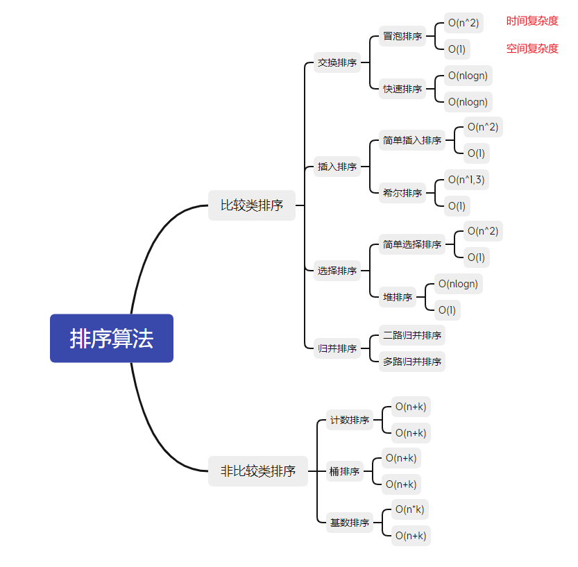
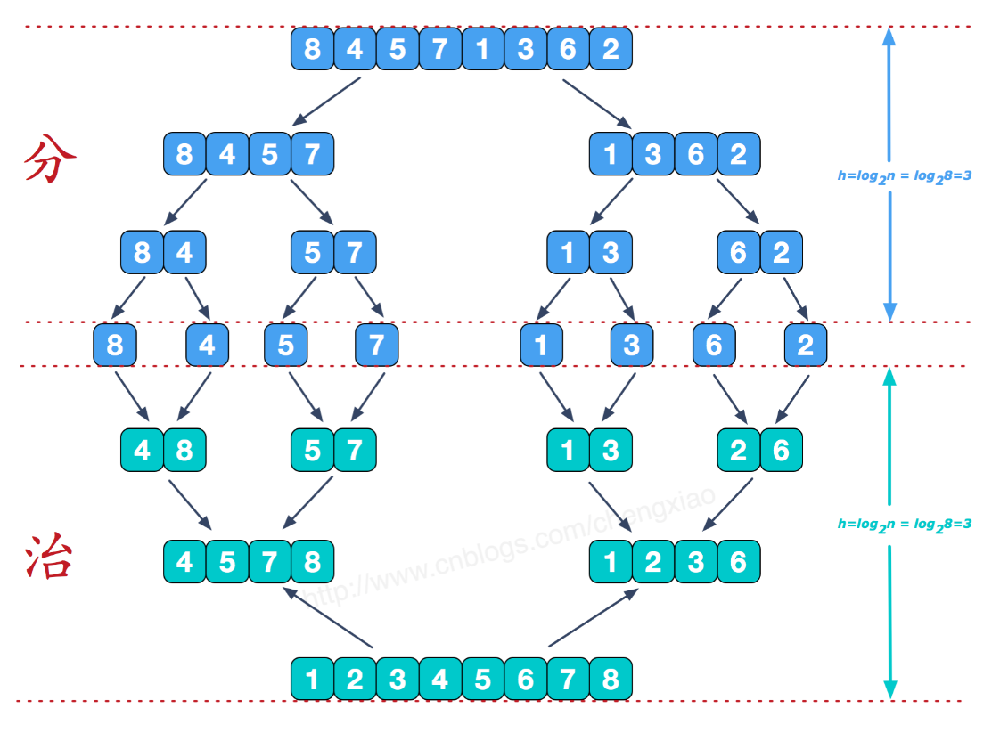
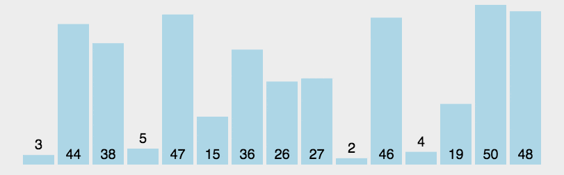
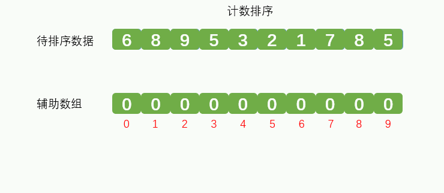
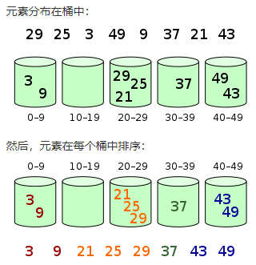

# 算法概述

## 算法分类

十种常见的排序算法可以分为两大类：

* 比较类排序：通过比较来决定元素间的相对次序，由于其时间复杂度不能突破O(nlogn)，因此也称为非线性时间比较类排序
* 非比较类排序：不通过比较来决定元素间的相对次序，它可以突破基于比较排序的时间下界，以线性时间运行，因此也称为线性时间非比较类排序



| 排序算法 | 平均时间复杂度 | 空间复杂度 | 稳定性 |
| :------: | :------------: | :--------: | :----: |
| 冒泡排序 |     O(n^2)     |    O(1)    |  稳定  |
| 选择排序 |     O(n^2)     |    O(1)    | 不稳定 |
| 插入排序 |     O(n^2)     |    O(1)    |  稳定  |
| 希尔排序 |    O(nlogn)    |    O(1)    | 不稳定 |
| 归并排序 |    O(nlogn)    |    O(n)    |  稳定  |
| 快速排序 |    O(nlogn)    |  O(logn)   | 不稳定 |
|  堆排序  |    O(nlogn)    |    O(1)    | 不稳定 |
| 计数排序 |    O(nlogn)    |    O(k)    |  稳定  |
|  桶排序  |     O(n+k)     |   O(n+k)   |  稳定  |
| 基数排序 |     O(n*k)     |   O(n+k)   |  稳定  |

注：

* 稳定：如果a原本在b的前面，而a = b，排序之后a仍然在b的前面。不稳定则表示a也可能出现在b的后面


# 1. 冒泡排序

比较相邻的元素，若前者大于后者则交换位置，从头到尾遍历整个数组。

> 特点：**当输入的数据已经是正序时最快O(n)，当输入的数据是反序时最慢**

当数据较大时，冒泡排序算法的时间代价最高。

动图演示：


代码：

```java
public int[] bubbleSort(int[] arr){
    if (arr == null || arr.length < 2){
        return arr;
    }
    for (int i = 0; i < arr.length - 1; i++) {
        for (int j = 0; j < arr.length - 1 - i; j++) {
            if (arr[j + 1] < arr[j]){
                //交换元素位置
                swap(arr, j + 1, j);
            }
        }
    }
    return arr;
}
```


# 2. 选择排序

在未排序序列中找到最小元素，存放到排序序列的起始位置，再从剩余的未排序元素中继续寻找最小元素，存放到已排序序列的末尾。直到所有元素排序完毕。

> 特点：表现稳定，无论什么数据进去都是O(n)的时间复杂度，所以适合小规模数据排序

动图演示：


代码：

```java
public int[] selectionSort(int[] arr){
    if (arr == null || arr.length < 2){
        return arr;
    }
    int minIndex;
    for (int i = 0; i < arr.length - 1; i++) {
        minIndex = i;
        for (int j = i + 1; j < arr.length; j++) {
            if (arr[j] < arr[minIndex]){
                //将最小的数的索引保存
                minIndex = j;
            }
        }
        //交换元素位置
        swap(arr, i, minIndex);
    }
    return arr;
}
```


# 3. 插入排序

对于未排序数据，在已排序序列中从后向前扫描，找到相应位置插入。将第一待排序序列第一个元素看做一个有序序列，把第二个元素到最后一个元素当成是未排序序列。

> **插入排序和冒泡排序一样，也有一种优化算法，叫做拆半插入**

动图演示：


代码：

```java
public int[] insertionSort(int[] arr){
    if (arr == null || arr.length < 2){
        return arr;
    }
    int preIndex, cur;
    for (int i = 1; i < arr.length; i++) {
        //已排序序列的末尾索引
        preIndex = i - 1;
        //当前索引
        cur = arr[i];
        while (preIndex >= 0 && arr[preIndex] > cur) {
            arr[preIndex + 1] = arr[preIndex];
            preIndex--;
        }
        arr[preIndex + 1] = cur;
    }
    return arr;
}
```


# 4. 希尔排序

先将整个待排序的记录序列分割成为若干子序列分别进行直接插入排序，待整个序列中的记录"基本有序"时，再对全体记录进行依次直接插入排序。一般最初步长选择为数组长度的一半，直到最终的步长为1。

>  简单插入排序的改进版，非稳定排序算法，优先比较距离较远的元素。又叫**递减增量排序**。

图解：


代码：

```java
public int[] shellSort(int[] arr){
    if (arr == null || arr.length < 2){
        return arr;
    }
    for (int step = arr.length / 2; step >= 1; step /= 2) {
        for (int i = step; i < arr.length; i++) {
            int cur = arr[i];
            int j = i - step;
            //比较同一组内的元素
            while (j >= 0 && arr[j] > cur){
                arr[j + step] = arr[j];
                j -= step;
            }
            arr[j + step] = cur;
        }
    }
    return arr;
}
```


# 5. 归并排序

将一个无序数组分成两个，然后对这两个数组分别进行排序，之后在把这两个数组合并成一个有序的数组。通过递归的方式将大的数组一直分割，直到数组的大小为 1，此时只有一个元素，那么该数组就是有序的了，之后再把两个数组大小为1的合并成一个大小为2的，再把两个大小为2的合并成4的 ….. 直到全部小的数组合并起来。

> 归并排序是采用分治法的一个非常典型的应用。和选择排序一样，归并排序的性能不受输入数据的影响，但表现比选择排序好的多，因为始终都是 O(nlogn) 的时间复杂度。代价是需要额外的内存空间。

图解：



动图演示：


代码：

```java
/**
* 归并排序
*/
public static int[] mergeSort(int[] arr){
    if (arr == null || arr.length < 2){
        return arr;
    }
    int middle = (int) Math.floor(arr.length / 2);

    int[] left = Arrays.copyOfRange(arr, 0, middle);
    int[] right = Arrays.copyOfRange(arr, middle, arr.length);
    return merge(mergeSort(left), mergeSort(right));
}

/**
 * 合并函数，把两个有序的数组合并起来
 */
private static int[] merge(int[] left, int[] right){
    int[] res = new int[left.length + right.length];
    int i = 0;
    while (left.length > 0 && right.length > 0){
        if (left[0] < right[0]){
            res[i++] = left[0];
            left = Arrays.copyOfRange(left, 1, left.length);
        } else {
            res[i++] = right[0];
            right = Arrays.copyOfRange(right, 1, right.length);
        }
    }
    while (left.length > 0){
        res[i++] = left[0];
        left = Arrays.copyOfRange(left, 1, left.length);
    }
    while (right.length > 0){
        res[i++] = right[0];
        right = Arrays.copyOfRange(right, 1, right.length);
    }
    return res;
}
```


# 6. 快速排序

从数组中跳出一个基准元素pivot，所有元素比基准值小的摆放在基准前面，所有元素比基准值大的摆在基准的后面（相同的数可以到任一边），再把小于基准值元素的子数列和大于基准值元素的子数列排序。

> 快速排序又是一种分而治之思想在排序算法上的典型应用。本质上来看，快速排序应该算是在冒泡排序基础上的递归分治法。

> *快速排序的最坏运行情况是 O(n²)，比如说顺序数列的快排。但它的平摊期望时间是 O(nlogn)，且 O(nlogn) 记号中隐含的常数因子很小，比复杂度稳定等于 O(nlogn) 的归并排序要小很多。所以，对绝大多数顺序性较弱的随机数列而言，快速排序总是优于归并排序。*

动图演示：



代码：

```java
public static int[] quickSort(int[] arr){
    if (arr == null || arr.length < 2){
        return arr;
    }
    return quickSort(arr, 0, arr.length - 1);
}

public static int[] quickSort(int[] arr, int left, int right){
    if (left < right) {
        int partitionIndex = partition(arr, left, right);
        quickSort(arr, left, partitionIndex - 1);
        quickSort(arr, partitionIndex + 1, right);
    }
    return arr;
}
    
/**
 * 分区操作
 */
private static int partition(int[] arr, int left, int right){
    // 设定基准值（pivot）
    int pivot = left;
    int index = pivot + 1;
    for (int i = index; i <= right; i++) {
        if (arr[i] < arr[pivot]) {
            swap(arr, i, index);
            index++;
        }
    }
    swap(arr, pivot, index - 1);
    return index - 1;
}
```


# 7. 堆排序

利用堆的概念来排序的选择排序。创建堆，把堆首和堆尾的元素互换，然后把堆的长度减1，再进行调整，直到长度为1。

>  可以分为两种：
>
>  * 大顶堆：每个节点的值都大于或等于其子节点的值，在堆排序算法中用于升序排列
>  * 小顶堆：每个节点的值都小于或等于其子节点的值，在堆排序算法中用于降序排列

堆排序在数据量很大时效果明显（堆排序适合处理大数据）

动画演示：


代码：

```java
public static int[] heapSort(int[] arr){
    if (arr == null || arr.length < 2){
        return arr;
    }
    //创建大根堆
    for (int i = 0; i < arr.length; i++) {
        heapInsert(arr, i);
    }
    int size = arr.length;
    //交换堆顶和堆的最后一个元素，并把堆的长度减1
    swap(arr, 0, --size);
    while (size > 0){
        //调整堆
        heapAdjust(arr, 0, size);
        //交换堆顶和堆的最后一个元素，并把堆的长度减1
        swap(arr, 0, --size);
    }
    return arr;
}
```


# 8. 计数排序

使用一个辅助数组，遍历待排序的数据，**待排序数据的值**就是**辅助数组的索引**，辅助数组索引对应的位置保存这个待排序数据出现的次数。最后从辅助数组中取出待排序的数据，放到排序后的数组中。

动画演示：



> 计数排序的核心在于将输入的数据值转化为键存储在额外开辟的数组空间中。作为一种线性时间复杂度的排序，计数排序要求输入的数据必须是**有确定范围的整数**。计数排序**不是比较排序**，排序的速度快于任何比较排序算法。

**计数排序适用于数据量很大，但是数据的范围比较小的情况，且只能用于非负整数**

代码：

```java
public static int[] countSort(int[] arr){
    if (arr == null || arr.length < 2){
        return arr;
    }
    int max = arr[0];
    //寻找最大值
    for (int num : arr) {
        if (max < num) {
            max = num;
        }
    }
    //创建大小为max的辅助数组
    int[] temp = new int[max + 1];
    //统计元素i出现的次数
    for (int num : arr) {
        temp[num]++;
    }
    int index = 0;
    //把辅助数组统计好的数据汇总到原数组
    for (int i = 0; i <= max; i++) {
        for (int j = temp[i]; j > 0; j--) {
            arr[index++] = i;
        }
    }
    return arr;
}
```

上面的代码是可以进行优化的

**优化：对任意指定范围内的数字进行排序，创建的临时数组大小 (max - min + 1)就可以了。

```java
/**
 * 计数排序优化1
 */
public static int[] countSort2(int[] arr){
    if (arr == null || arr.length < 2){
        return arr;
    }
    int max = arr[0];
    int min = arr[0];
    //寻找最值
    for (int num : arr) {
        if (max < num) {
            max = num;
        }
        if (min > num) {
            min = num;
        }
    }
    //创建大小为max - min + 1的辅助数组
    int[] temp = new int[max - min + 1];
    //统计元素i出现的次数
    for (int num : arr) {
        temp[num - min]++;
    }
    int index = 0;
    //把辅助数组统计好的数据汇总到原数组
    for (int i = 0; i <= max - min; i++) {
        for (int j = temp[i]; j > 0; j--) {
            arr[index++] = i + min;
        }
    }
    return arr;
}
```


# 9. 桶排序

> 桶排序是计数排序的升级版

桶排序就是把最大值和最小值之间的数进行瓜分，例如分成  10 个区间，10个区间对应10个桶，我们把各元素放到对应区间的桶中去，再对每个桶中的数进行排序，可以采用归并排序，也可以采用快速排序之类的。

当输入的数据可以均匀分配到每一个桶中是最快，时间复杂度为O(n)，输入的数据被分配到了同一个桶中时最慢，时间复杂度为O(n^2)。

图解：



代码：

```java
public static int[] BucketSort(int[] arr){
    if (arr == null || arr.length < 2){
        return arr;
    }
    int max = arr[0];
    int min = arr[0];
    //寻找数组的最值
    for (int num : arr) {
        if (max < num) {
            max = num;
        }
        if (min > num) {
            min = num;
        }
    }
    //和优化版本的计数排序一样，弄一个大小为 min 的偏移值
    int offset = max - min;
    //设桶的默认大小为5
    int bucketSize = 5;
    //创建 d / 5 + 1 个桶，第 i 桶存放  5*i ~ 5*i+5-1范围的数
    int bucketNum = offset / 5 + 1;
    ArrayList<LinkedList<Integer>> bucketList = new ArrayList<>(bucketNum);
    //初始化桶
    for (int i = 0; i < bucketNum; i++) {
        bucketList.add(new LinkedList<Integer>());
    }
    //遍历原数组，将每个元素放入桶中
    for (int num : arr) {
        bucketList.get((num - min) / offset).add(num - min);
    }
    //对桶内元素进行排序
    for (int i = 0; i < bucketNum; i++) {
        Collections.sort(bucketList.get(i));
    }
    //把每个桶排序好的数据进行合并汇总放回原数组
    int index = 0;
    for (int i = 0; i < bucketNum; i++) {
        for (Integer val : bucketList.get(i)) {
            arr[index++] = val + min;
        }
    }
    return arr;
}
```


# 10. 基数排序

先以个位数的大小来对数据进行排序，接着以十位数的大小来多数进行排序，接着以百位数的大小……，对某位数排序时是用桶来排序的。

> 基数排序与基数排序与桶排序都利用了桶的概念，但对桶的使用方法上有明显差异：
>
> * 基数排序：根据键值的每位数字来分配桶
> * 计数排序：每个桶只存储单一键值
> * 桶排序：每个桶存储一定范围的数值


代码：

```java
public static int[] radixSort(int[] arr){
    if (arr == null || arr.length < 2){
        return arr;
    }
    int max = arr[0];
    //找出最大值
    for (int val : arr){
        if (max < val){
            max = val;
        }
    }
    //计算最大值是几位数
    int num = 1;
    while (max / 10 > 0){
        num++;
        max /= 10;
    }
    //创建10个桶
    ArrayList<LinkedList<Integer>> bucketList = new ArrayList<>(10);
    //初始化桶
    for (int i = 0; i < 10; i++) {
        bucketList.add(new LinkedList<Integer>());
    }
    //进行每一趟的排序，从个位数开始
    for (int i = 1; i <= num; i++) {
        for (int j = 0; j < arr.length; j++) {
            //数组中元素的每一位
            int radix = (arr[j] / (int)Math.pow(10, i - 1)) % 10;
            //放进对应的桶里
            bucketList.get(radix).add(arr[j]);
        }
        //合并放回原数组
        int index = 0;
        for (int j = 0; j < 10; j++) {
            for (Integer val : bucketList.get(j)) {
                arr[index++] = val;
            }
            //取出合并后清空桶的数据
            bucketList.get(j).clear();
        }
    }
    return arr;
}
```


# 应用场景

* 适合顺序结构的是：插入排序、希尔排序、快速排序、堆排序
* 适合链式结构的是：直接插入排序、归并排序
* 不稳定：快速排序、希尔排序、堆排序/选择排序
* 稳定：冒泡排序、插入排序、归并排序、基数排序


* n较大时：
  1. 分布随机，稳定性不做要求，则采用**快速排序**
  2. 内存允许，要求排序稳定，则采用**归并排序**
  3. 可能出现正序或倒序，稳定性不做要求，则采用**堆排序**或**归并排序**
* n较小时：
  1. 基本有序，要求稳定，则采用**插入排序**
  2. 分布随机，稳定性不做要求，则采用**选择排序**


# 参考：

1. [十大经典排序算法（动图演示）- 博客园](https://www.cnblogs.com/onepixel/p/7674659.html)
2. [十大经典排序算法 - 菜鸟教程](https://www.runoob.com/w3cnote/ten-sorting-algorithm.html)
3. [图解排序算法(二)之希尔排序 - dreamcatcher-cx - 博客园](https://www.cnblogs.com/chengxiao/p/6104371.html)
4. [十大经典排序算法 - 冰狼爱魔 - 博客园](https://www.cnblogs.com/itsharehome/p/11058010.html)
5. [图解排序算法(四)之归并排序 - dreamcatcher-cx - 博客园](https://www.cnblogs.com/chengxiao/p/6194356.html)
6. [动画：一篇文章快速学会计数排序_donghuabianc的博客 - CSDN](https://blog.csdn.net/donghuabianc/article/details/105252344)


# 参考：

1. [十大经典排序算法（动图演示）- 博客园](https://www.cnblogs.com/onepixel/p/7674659.html)
2. [十大经典排序算法 - 菜鸟教程](https://www.runoob.com/w3cnote/ten-sorting-algorithm.html)
3. [图解排序算法(二)之希尔排序 - dreamcatcher-cx - 博客园](https://www.cnblogs.com/chengxiao/p/6104371.html)
4. [十大经典排序算法 - 冰狼爱魔 - 博客园](https://www.cnblogs.com/itsharehome/p/11058010.html)
5. [图解排序算法(四)之归并排序 - dreamcatcher-cx - 博客园](https://www.cnblogs.com/chengxiao/p/6194356.html)
6. [动画：一篇文章快速学会计数排序_donghuabianc的博客 - CSDN](https://blog.csdn.net/donghuabianc/article/details/105252344)

