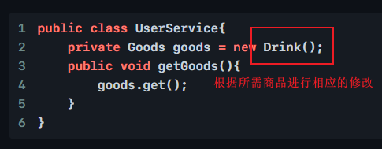
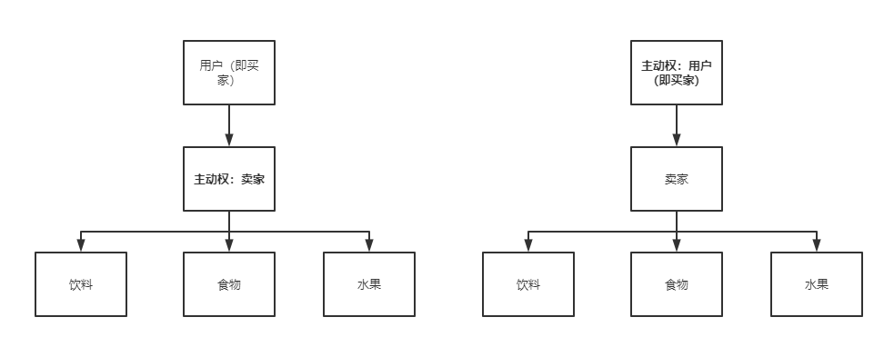

# IOC 是什么

`IOC(Inversion Of Control)`，即控制反转

> 什么是控制反转？
>
> 控制反转是一种将组件依赖关系的创建和管理置于程序外部的技术。
>
> 由容器控制程序之间的关系，而不是由代码直接控制。
>
> 由于控制权由代码转向了容器，所以称为反转。

# 对 IOC 的理解

IOC 是面向对象中的一种编程思想或原则。在传统方式中，当依赖一个对象时，需要主动去创建它并进行属性赋值，然后才能去使用这个对象。对于 IOC 来说，它使得对象或者组件的创建更为透明，你不需要过多地关注细节，如创建对象、属性赋值，这些工作交都由 IOC 容器来完成，已达到解耦的目的。

# 举例说明 IOC

通过借鉴知乎博主 `Jackpop` 的回答，假设目前有3个角色，卖家，买家，商品。

1. 写一个商品接口

   ```java
   public interface Goods{
       public void get();
   }
   ```

2. 写实现3种商品的类

   ```java
   public class Drink implements Goods{
       public void get(){
           System.out.println("get an drink");
       }
   }
   ```

   ````java
   public class Food implements Goods{
       public void get(){
           System.out.println("get an food");
       }
   }
   ````

   ```java
   public class Fruit implements Goods{
       public void get(){
           System.out.println("get an fruit");
       }
   }
   ```

3. 实现一个业务层

   ```java
   public class UserService{
       private Goods goods = new Drink();
       public void getGoods(){
           goods.get();
       }
   }
   ```

4. 再实现一个用户类

   ```java
   public class User{
       public static void main(String[] args){
           UserService userService = new Userservice();
           user.getGoods();
       }
   }
   ```

上面为实现一个程序惯用的方式，如果需要修改获取的商品，则需要改动业务层代码



通过思考发现，目前的**控制权**在业务层，因此每次用户的需求发生变化时，业务层也需要跟着发生变化，所以便有了把控制权交给用户的做法，也就是控制权的反转。

可以通过在业务层的代码中增加一个 **set **方法，使得用户层可以**注入**不同的对象（传入哪个便获取哪个），来实现控制权的转换

```java
public class UserService{
    private Goods goods = new Drink();
    public void setGoods(Goods goods){
        this.goods = goods;
    }
    public void getGoods(){
        this.goods.get();
    }
}
```

下面实现用户类

```java
public class User{
    public static void main(String[] args){
        UserService userService = new Userservice();
        user.setGoods(new Food());
        user.getGoods();
    }
}
```

```java
public class User{
    public static void main(String[] args){
        UserService userService = new Userservice();
        user.setGoods(new Fruit());
        user.getGoods();
    }
}
```

**总结：**可以通过下面的图解来直观看到业务层加入 **set** 方法前后的变化，这就是 IOC 控制反转的核心思想。



因此可以得出一些 IOC 的优点：

1. 降低组件之间的耦合度
2. 实现软件各层之间的解耦
3. 在不改变源码的情况下，实现外部对象动态注入到组件中
4. ...


> ioc的思想最核心的地方在于，资源不由使用资源的双方管理，而由不使用资源的第三方管理，这可以带来很多好处。第一，资源集中管理，实现资源的可配置和易管理。第二，降低了使用资源双方的依赖程度，也就是我们说的耦合度。

# IOC 与 DI 的关系与区别

`DI(Dependency Injection)`，即依赖注入。DI 不完全等同于 IOC ，更应该说 DI 是 IOC 的一种实现方式或策略。

关系：依赖注入不能单独存在，需要在 IOC 基础之上完成操作

> **依赖查找DL(Dependency Lookup)**和**依赖注入**都是 IOC 的实现策略。
>
> **依赖查找**就是在应用程序里面主动调用 IOC 容器提供的接口去获取对应的 Bean 对象，而**依赖注入**是在 IOC 容器启动或者初始化的时候，通过构造器、字段、setter 方法或者接口等方式注入依赖。**依赖查找**相比于**依赖注入**对于开发者而言更加繁琐，具有一定的代码入侵性，需要借助 IOC 容器提供的接口，所以我们总是强调后者。**依赖注入**在 IOC 容器中的实现也是调用相关的接口获取 Bean 对象，只不过这些工作都是在 IOC 容器启动时由容器帮你实现了，在应用程序中我们通常很少主动去调用接口获取 Bean 对象。

# BeanFactory 和 ApplicationContext 谁才是 SpringIOC 容器？

> BeanFactory 是 Spring 底层 IoC 容器，ApplicationContext 是 BeanFactory 的子接口，是 BeanFactory 的一个超集，提供 IoC 容器以外更多的功能。ApplicationContext 除了扮演 IoC 容器角色，还提供了这些企业特性：面向切面（AOP）、配置元信息、资源管理、事件机制、国际化、注解、Environment 抽象等。我们一般称 ApplicationContext 是 Spring 应用上下文，BeanFactory 为 Spring 底层 IoC 容器。


# 参考

1. [Spring IoC有什么好处呢？- 知乎](https://www.zhihu.com/question/23277575/answer/1073420019)
2. [死磕Spring之IoC篇 - 深入了解Spring IoC（面试题）- 博客园](http://www.manongjc.com/detail/22-intjsrbawbubggz.html)
