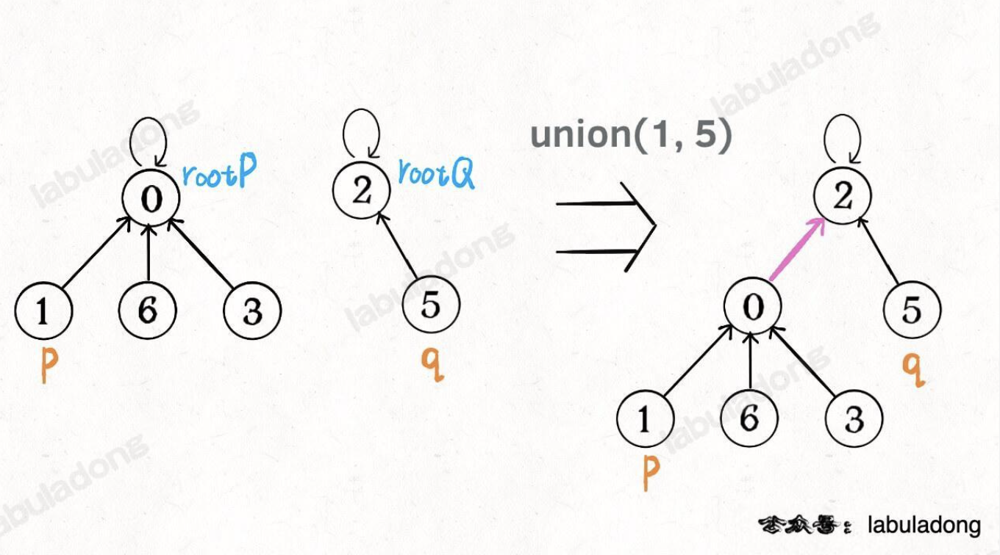
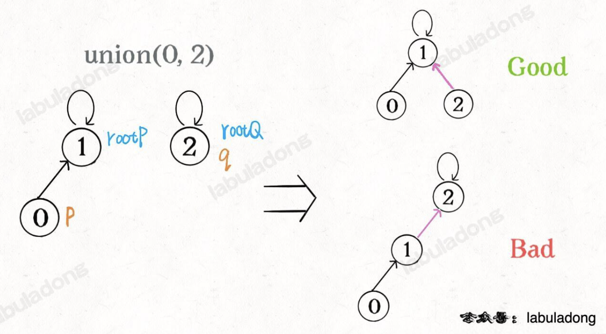
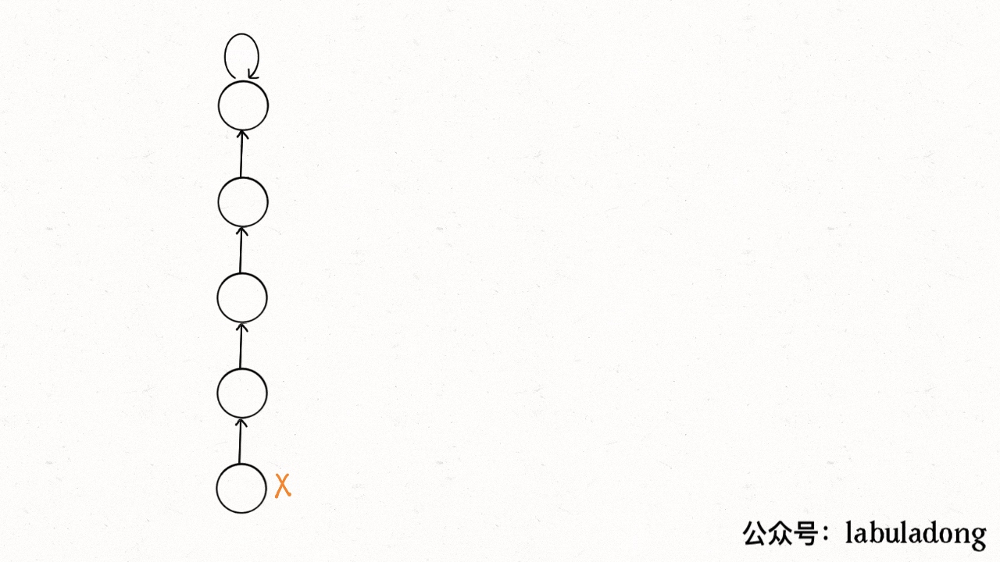
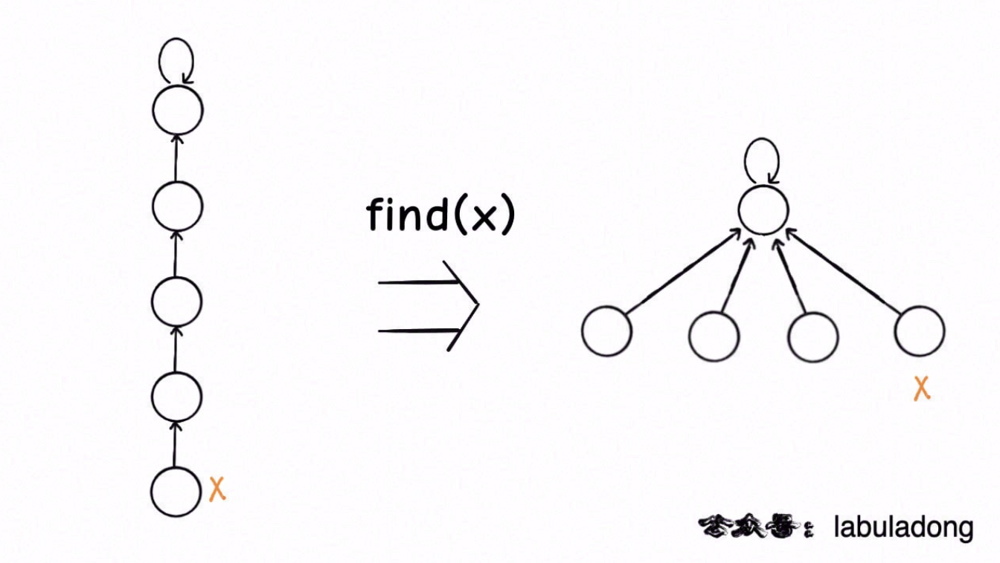
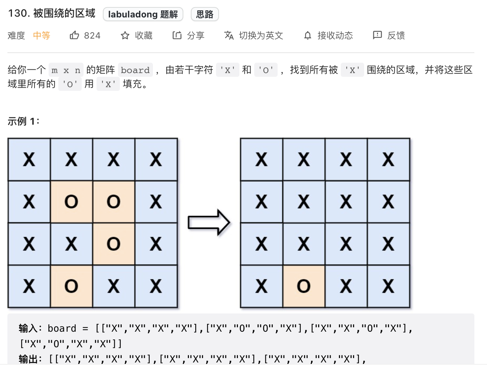
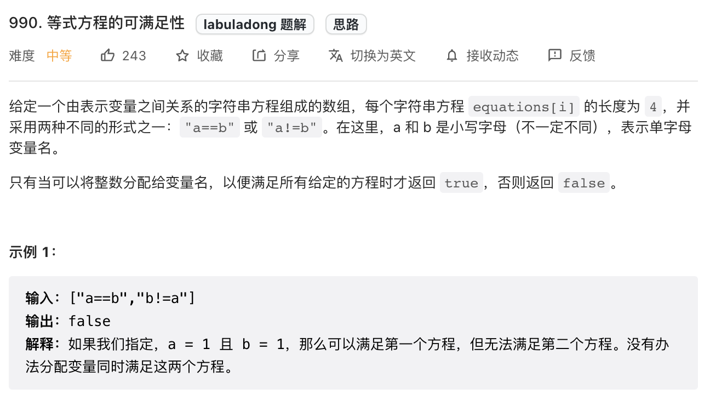

# 算法简介

并查集算法也就是常说的并查集结构，主要是解决图论中的「动态连通性」问题的。

```java
class UF {
    /*
     * 将 p 和 q 连接
     */
    public void union(int p, int q);
    /*
     * 判断 p 和 q 是否连通
     */
    public boolean connected(int p, int q);
    /*
     * 返回图中有多少个连通分量
     */
    public int count();
}
```

这里说的「连通」是一种等价关系，也就是说具有如下三个性质：

1. 自反性：节点 p 和 q 是连通的。
  
2. 对称性：如果节点 p 和 q 连通，那么 q 和 p 也连通。
  
3. 传递性：如果节点 p 和 q 连通，q 和 r 连通，那么 p 和 r 也连通。
  

# 基本思路

假设树的每个节点有一个指针指向其父节点，如果是根节点的话，这个指针指向自己。

```java
class UF {
    // 记录连通分量
    private int count;
    // 节点 x 的父节点是 parent[x]
    private int[] parent;

    /*
     * 构造函数，n 为图的节点总数
     */
    public UF(int n) {
        // 一开始互不连通
        this.count = n;
        // 父节点指针初始指向自己
        parent = new int[n];
        for (int i = 0; i < n; i++) {
            parent[i] = i;
        }
    }

    // 其他函数
}
```

如果两个节点被连通，则让其中的（任意）一个节点的根节点接到另一个节点的根节点上；也就是说如果节点 p 和 q 连通的话，它们一定拥有相同的根节点。



```java
public void union(int p, int q) {
    int rootP = find(p);
    int rootQ = find(q);
    if(rootP == rootQ) {
        return;
    }
    // 将两棵树合并为一颗
    parent[rootP] = rootQ;
    // parent[rootQ] = rootP 也一样
    count--; // 两个分量合二为一
}

/*
 * 返回某个节点 x 的根节点
 */
private int find(int x) {
    // 根节点的 parent[x] == x
    while(parent[x] != x) {
        x = parent[x];
    }
    return x;
}

/*
 * 返回当前的连通分量个数
 */
public int count() {
    return count;
}

public boolean connected(int p, int q) {
    int rootP = find(p);
    int rootQ = find(q);
    return rootP == rootQ;
}
```

**算法复杂度**

`connected`和`union`中的复杂度都是`find`函数造成的，它们的复杂度和`find`一样。`find`主要功能就是从某个节点向上遍历到树根，其时间复杂度就是树的高度。树的高度不一定就是 logN，logN 的高度只存在于平衡二叉树，对于一般的树可能会出现极端不平衡的情况，使得「树」几乎退化成「链表」，最坏情况下可能变成 N。

# 平衡性优化

由上面的代码可以知道，`union`过程是直接把`p`所在的树接到q所在的树的根节点下面，那么就很有可能会出现不平衡的现象。比如下图所示：



为了解决这个问题，提出了「重量」的概念，额外使用一个`size`数组，记录每棵树包含的节点数。

```java
class UF {
    private int count;
    private int[] parent;
    // 新增一个数组记录树的“重量”
    private int[] size;

    public UF(int n) {
        this.count = n;
        parent = new int[n];
        // 最初每棵树只有一个节点
        // 重量应该初始化 1
        size = new int[n];
        for (int i = 0; i < n; i++) {
            parent[i] = i;
            size[i] = 1;
        }
    }

    // 修改后的 union 函数
    public void union(int p, int q) {
        int rootP = find(p);
        int rootQ = find(q);
        if (rootP == rootQ)
            return;

        // 小树接到大树下面，较平衡
        if (size[rootP] > size[rootQ]) {
            parent[rootQ] = rootP;
            size[rootP] += size[rootQ];
        } else {
            parent[rootP] = rootQ;
            size[rootQ] += size[rootP];
        }
        count--;
    }
    /* 其他函数 */
}
```

此时，`find`，`union`，`connnected`的时间复杂度都下降为O(logN)，因为可以保证树的生长相对平衡，树的高度大致在logN的数量级。

# 路径压缩

由于并查集算法实际上关注的是根节点，并不在乎树是怎么样的，所以可以考虑进一步来压缩树的高度，让树高保持为常数。

下面是修改`find`函数的两种方法。

```java
private int find(int x) {
    while (parent[x] != x) {
        // 这行代码进行路径压缩
        // 每次while循环都把一对父子节点改到同一层
        parent[x] = parent[parent[x]];
        x = parent[x];
    }
    return x;
}
```



第二种写法：

```java
public int find(int x) {
    if (parent[x] != x) {
        parent[x] = find(parent[x]);
    }
    return parent[x];
}
```

第二种递归写法的压缩效率是比第一种迭代写法高的，但较难理解。压缩效果如下：



可以看出第二种方法能够直接把树降低到最小高度，因此推荐使用这种路径压缩算法。而且使用路径压缩算法以后，`size`数组的平衡优化就基本不需要了。

下面就是`Union Find`算法实现：

```java
class UF {
    // 连通分量个数
    private int count;
    // 存储每个节点的父节点
    private int[] parent;

    // n 为图中节点的个数
    public UF(int n) {
        this.count = n;
        parent = new int[n];
        for (int i = 0; i < n; i++) {
            parent[i] = i;
        }
    }

    // 将节点 p 和节点 q 连通
    public void union(int p, int q) {
        int rootP = find(p);
        int rootQ = find(q);

        if (rootP == rootQ)
            return;

        parent[rootQ] = rootP;
        // 两个连通分量合并成一个连通分量
        count--;
    }

    // 判断节点 p 和节点 q 是否连通
    public boolean connected(int p, int q) {
        int rootP = find(p);
        int rootQ = find(q);
        return rootP == rootQ;
    }

    public int find(int x) {
        if (parent[x] != x) {
            parent[x] = find(parent[x]);
        }
        return parent[x];
    }

    // 返回图中的连通分量个数
    public int count() {
        return count;
    }
}
```

# 总结

对于`Union Find`复杂度，构造初始化数据结构需要 O(N) 的时间和空间复杂度，`union`，`connected`和`count`方法所需时间复杂度为O(1)。

主要应用：解决动态连通性问题。

# 算法题

## 无向图中连通分量的数目

[leetcode-323. 无向图中连通分量的数目](https://leetcode.cn/problems/number-of-connected-components-in-an-undirected-graph/)

> 给你输入一个包含 `n` 个节点的图，用一个整数 `n` 和一个数组 `edges` 表示，其中 `edges[i] = [ai, bi]` 表示图中节点 `ai` 和 `bi` 之间有一条边。请你计算这幅图的连通分量个数。

这道题可以直接套用并查集算法解决，代码如下：

```java
public int countComponents(int n, int[][] edges) {
    UF uf = new UF(n);
    // 将每个节点进行连通
    for(int[] e: edges) {
        uf.union(e[0], e[1])
    }
    // 返回连通分量的个数
    return uf.count();
}
class UF {
    ...
}
```

## 被围绕的区域

[leetcode-130. 被围绕的区域](https://leetcode.cn/problems/surrounded-regions/)



其实这一题应该归于dfs问题，由题意可知边界上的`O`是不会被填充的，遍历棋盘的四边，用dfs算法找到与边界相连的`O`，并换成一个特殊字符；然后便遍历整个棋盘，把剩下的`O`换成`X`，再把特殊符号还原为`0`。

当然也可以使用并查集算法来解决，虽然效率更低。

思想：把不需要替换的 `O`看成是特殊的一类，他们有一个共同的祖先 `dummy`，这些`O`与`dummy`互通，那些需要被替换的`O`与`dummy`不互通。

并查集算法底层使用的是一维数组，而题目给出的是二维数组，因此这里需要有一个降维的过程，将二维坐标`(x, y)`转换成`x * n + y`。注意还需要给`dummy`留一个位置。

```java
void solve(char[][] board) {
    if (board.length == 0) {
        return;
    }
    int m = board.length;
    int n = board[0].length;
    // 给 dummy 留一个额外位置
    UF uf = new UF(m * n + 1);
    int dummy = m * n;
    // 将首列和末列的 O 与 dummy 连通
    for (int i = 0; i < m; i++) {
        if (board[i][0] == 'O')
            uf.union(i * n, dummy);
        if (board[i][n - 1] == 'O')
            uf.union(i * n + n - 1, dummy);
    }
    // 将首行和末行的 O 与 dummy 连通
    for (int j = 0; j < n; j++) {
        if (board[0][j] == 'O')
            uf.union(j, dummy);
        if (board[m - 1][j] == 'O')
            uf.union(n * (m - 1) + j, dummy);
    }
    // 方向数组 d 是上下左右搜索的常用手法
    int[][] d = new int[][]{{1, 0}, {0, 1}, {0, -1}, {-1, 0}};
    for (int i = 1; i < m - 1; i++) 
        for (int j = 1; j < n - 1; j++) 
            if (board[i][j] == 'O')
                // 将此 O 与上下左右的 O 连通
                for (int k = 0; k < 4; k++) {
                    int x = i + d[k][0];
                    int y = j + d[k][1];
                    if (board[x][y] == 'O')
                        uf.union(x * n + y, i * n + j);
                }
    // 所有不和 dummy 连通的 O，都要被替换
    for (int i = 1; i < m - 1; i++) 
        for (int j = 1; j < n - 1; j++) 
            if (!uf.connected(dummy, i * n + j))
                board[i][j] = 'X';
}

class UF {
    // 见上文
}
```

## 等式方程的可满足性

[leetcode-990. 等式方程的可满足性](https://leetcode.cn/problems/satisfiability-of-equality-equations/)



```java
boolean equationsPossible(String[] equations) {
    // 26 个英文字母
    UF uf = new UF(26);
    // 先让相等的字母形成连通分量
    for (String eq : equations) {
        if (eq.charAt(1) == '=') {
            char x = eq.charAt(0);
            char y = eq.charAt(3);
            uf.union(x - 'a', y - 'a');
        }
    }
    // 检查不等关系是否打破相等关系的连通性
    for (String eq : equations) {
        if (eq.charAt(1) == '!') {
            char x = eq.charAt(0);
            char y = eq.charAt(3);
            // 如果相等关系成立，就是逻辑冲突
            if (uf.connected(x - 'a', y - 'a'))
                return false;
        }
    }
    return true;
}

class UF {
    ...
}
```

# 参考

1. [并查集（Union-Find）算法详解 :: labuladong的算法小抄](https://labuladong.github.io/algo/2/21/52/)