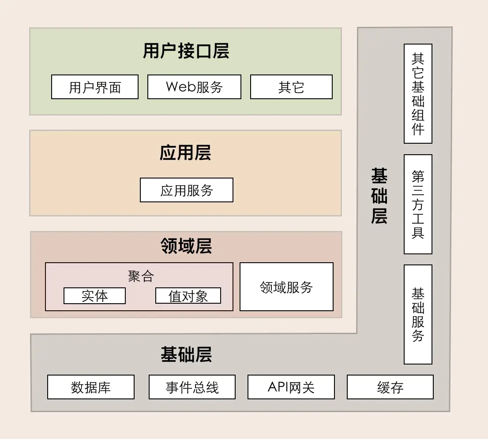
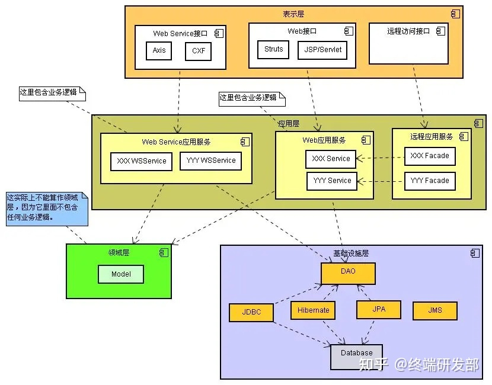
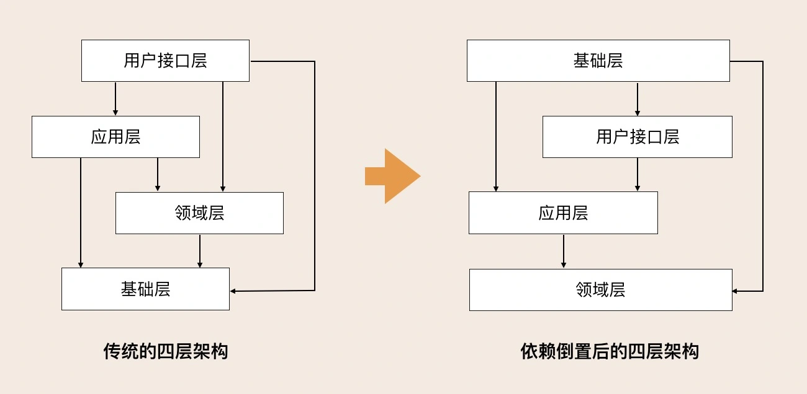
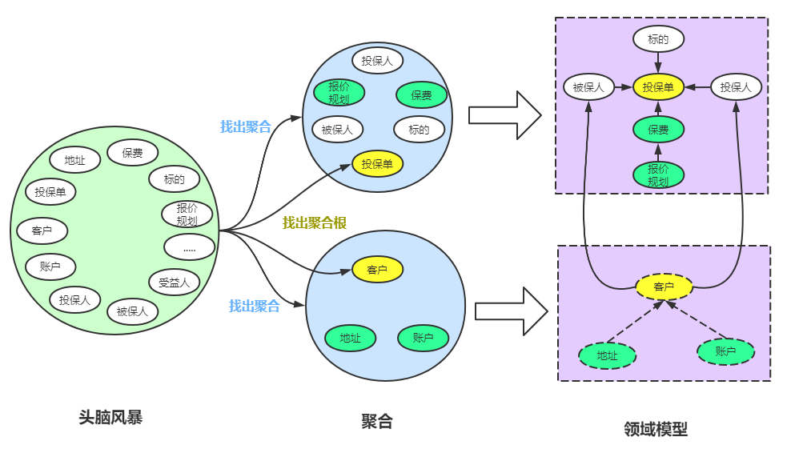

# 什么是 DDD？

DDD 全称是（Domain-Driven Desgin，简称 DDD），领域驱动设计。是一种应对软件复杂的设计方法论，提倡聚焦业务领域而非技术，合理规划业务和技术的依赖，从而达到一种稳定的领域模型应对多变的业务需求。

## 相关概念

在 DDD 中有很多基本概念，比如说通用语言，领域，限界上下文，聚合，实体，值对象，领域服务，领域事件，应用服务等等。

### 通用语言

领域驱动设计的核心原则是使用一种基于模型的语言。因为模型是软件满足领域的共同点，它很适合作为这种通用语言的构造基础。

使用模型作为语言的核心骨架。要求团队在进行所有的交流时都使用一致的语言，在代码中也是这样。业务人员和开发人员需要使用无歧义的统一语言来对话。这种语言被称为通用语言。通用语言包含术语和用例场景，并且能够直接反应在代码中。通用语言中的名词可以给领域对象命名，如商品、订单等对应实体对象；而动词则表示一个动作或事件，如商品已下单、订单已付款等，对应领域事件或命令。

### 领域和领域模型

领域是指软件需要解决的业务问题和诉求。通俗来说，领域就是业务需求。领域模型是业务概念在程序中的一种表达方式。模型是用来设计和理解整个软件结构的，在模型思维中，模型是简单的，能反应业务概念的。

### 限界上下文

限界上下文可以理解为上下文边界。同一概念在不同的上下文环境下会有不同的语义，比如说商品在不同的阶段会有不同的术语，在销售阶段是商品，在运输阶段则变成了货物。同一个东西由于上下文环境的不同，有了不同的含义。

同样同于哦那个语言也有上下文环境，为了避免同样的概念或者语义在不同的上下文环境中产生歧义，DDD 在战略设计上提出了“限界上下文”的概念，用来确定语义所在的领域边界。

#### 限界上下文与微服务的关系

领域可以拆分为多个子领域，一个领域相当于一个问题域。子域可能会包含多个限界上下文，也有可能子域本身就是限界上下文的边界。但是最理想的建模结果是限界上下文与子域一一对应。

理论上限界上下文就是微服务的边界。**我们将限界上下文内的领域模型映射到微服务，就完成了从问题域到软件的解决方案**。限界上下文是微服务设计和拆分的主要依据。在领域模型中，如果不考虑技术异构、团队沟通等其它外部因素，一个限界上下文理论上就可以设计为一个微服务。

### 实体与值对象

在 DDD 中，**拥有唯一标识符**，且标识符在历经各种状态变化后仍能保持一致。这样的对象称为实体，通常是一个类。实体有**生命周期**，实体从被创建后可能会被持久化到数据库，然后某个时候又会被取出来。

**通过对象属性值来识别的对象，它将多个相关属性组合为一个概念整体**。在 DDD 中用来描述领域的特定方面，并且是一个没有标识符的对象，叫做值对象。值对象描述了领域中的一件东西，这个东西是不可变的，它将不同的相关属性组合成了一个概念整体。**简单来说，值对象本质上就是一个集。**

实体和值对象是微服务底层的最基础的对象，一起实现实体最基本的核心领域逻辑。它们最大的区别就是有没有唯一标识。

同样的对象在不同的场景下，可能会设计出不同的结果。有些场景中，地址会被某一实体引用，它只承担描述实体的作用，并且它的值只能整体替换，这时候你就可以将地址设计为值对象，比如收货地址。而在某些业务场景中，地址会被经常修改，地址是作为一个独立对象存在的，这时候它应该设计为实体，比如行政区划中的地址信息维护。

### 聚合和聚合根

在 DDD 中，实体和值对象是很基础的领域对象。实体一般对应业务对象，它具有业务属性和业务行为；而值对象主要是属性集合，对实体的状态和特征进行描述。

**领域模型内的实体和值对象就好比个体，而能让实体和值对象协同工作的组织就是聚合，它用来确保这些领域对象在实现共同的业务逻辑时，能保证数据的一致性。**

聚合就是由业务和逻辑紧密关联的实体和值对象组合而成的，聚合是数据修改和持久化的基本单元，每一个聚合对应一个仓储即资源库，实现数据的持久化。

这里又提到资源库的概念，是指一种可以提供类似集合的接口来帮助我们管理对象的机制。里面存放的对象一定是聚合，原因是之前提到的领域模型中是以聚合的概念去划分边界的。

聚合在 DDD 分层架构里属于领域层，领域层包含了多个聚合，共同实现核心业务逻辑。聚合内实体以充血模型实现个体业务能力，以及业务逻辑的高内聚。**跨多个实体的业务逻辑通过领域服务来实现，跨多个聚合的业务逻辑通过应用服务来实现。**

### 应用服务与领域服务与领域事件

**应用服务**

应用服务负责组织业务场景，编排业务。它将要实现的功能委托给一个或多个领域对象来实现，它本身只负责处理业务用例的执行顺序以及结果的拼装，不负责具体业务逻辑，业务逻辑都落在领域服务中。

**领域服务**

领域服务是用来协调领域对象完成某个操作，用来处理业务逻辑的，它本身是一个行为，所以是无状态的。状态由领域对象（具有状态和行为）保存。同一聚合内的设计到多个实体的业务逻辑可用领域服务实现。

**领域事件**

除了命令和操作等业务行为以外，还有一种非常重要的事件，这种事件发生后通常会导致进一步的业务操作，在 DDD 中这种事件被称为**领域事件**。比如付款成功后触发的动作。

领域事件是领域模型中非常重要的一部分，用来表示领域中发生的事件。一个领域事件将导致进一步的业务操作，在实现业务以及不同聚合之间的解耦的同时，还有助于形成完整的业务闭环。

对于微服务内大部分事件的集成，都发生在同一个进程内，进程自身可以很好地控制事务，因此不一定需要引入消息中间件；

对于跨微服务的领域事件，我们可以采用消息中间件，比如rocket mq，kafka进行消息的订阅与发布。跨微服务的事件机制要总体考虑事件构建、发布和订阅、事件数据持久化、消息中间件，甚至事件数据持久化时还可能需要考虑引入分布式事务机制等。


# 为什么要学习 DDD 领域驱动设计？

在早期软件开发，对于一些简单业务，只需要使用一个模块，编写多个业务逻辑就可以搞定。但是随着业务增长，当需要修改其中某一项功能，则修改困难，原因是该功能可能会侵蚀其他代码模块。修改需要谨慎，投入时间成本，人力成本过高。DDD 模型可以很好的解决这个问题。

# DDD 模型解决了什么问题？

粒度更小，架构更加清晰，业务需求变化的时候，系统架构也能随之变化。DDD 所呈现的系统必然是高内聚，低耦合的，在业务系统中，不会因为修改 A 模块影响到了 B 模块的使用。

## 过度耦合

在系统创建初期，业务初期，功能对于基础设计都非常简单，普通的 CRUD 就可以满足业务需要，但是随着系统的迭代，业务逻辑变得复杂，此时系统的冗余程度也会随之增加。此时需要修改其中的某个节点的逻辑，可能伴随着影响到其他模块的业务逻辑。此问题的根源出现在系统架构不清晰，划分出来的模块内聚度低，高耦合。

有一种解决方案，按照演进式设计的理论，让系统的设计随着系统的实现增长而增长。不需要提前设计，就让系统伴随业务成长而演进。敏捷实践中的重构、测试驱动设计及持续集成可以对付各种混乱问题。

事实上，在解决现实问题的时候，我们会将问题映射到脑海中的概念模型，在模型中解决问题，再将解决方案转换为实际的代码。上述问题在于我们解决了设计到代码之间的重构，但提炼出来的设计模型，并不具有实际的业务含义，这就导致在开发需求的时候，其他同学不能自然的将业务问题映射到该设计模型。并不具有实际的业务含义。

用 DDD 则可以很好的解决领域驱动模型到设计模型的同步、演化，最后再将反映了领域的设计模型转为实际的代码。

## 贫血症和失忆症

贫血领域对象：贫血领域对象（Academic Domain Object）是指仅用做数据载体，而没有行为和动作的领域对象。

- 场景需求

奖池中配置了很多奖项，我们需要按运营预先配置的概率抽中一个奖项。实现非常简单，生成一个随机数，匹配符合该随机数生成概率的奖项即可。

- 贫血模型实现方案

先设计奖池和奖项的库 2张数据库表

```java
class AwardPool {
    int awardPoolId;
    List<Award> awards;
    public List<Award> getAwards() {
        return awards;
    }

    public void setAwards(List<Award> awards) {
        this.awards = awards;
    }
    ......
}
class Award {
   int awardId;
   int probability;//概率

   ......
}

// Service的实现
AwardPool awardPool = awardPoolDao.getAwardPool(poolId);//sql查询，将数据映射到AwardPool对象
for (Award award : awardPool.getAwards()) {
   //寻找到符合award.getProbability()概率的award
}
```

按照传统开发思想可以发现，我们的业务逻辑都是在 Service 中去编写的，Award 只是一个数据载体，没有任何行为。简单的业务系统采用这种贫血模型和过程化设计是没有问题的，但是业务逻辑一旦复杂了，业务逻辑状态会散落在大量的方法中，原本的代码意图会渐渐不明确，我们将这种情况称为由贫血引起的**失忆症**。

更好的是采用领域模型的开发方式，将数据和行为封装在一起，并与现实世界中的业务对象映射。各类具备明确的职责划分，将领域逻辑分散到领域对象中。按照这种思想，上述的例子就应该把概率放在 AwardPool 中。

# DDD 相比 MVC



1. **用户接口层** 用户接口层负责向用户显示信息和解释用户指令。

2. **应用层** 应用层是很薄的一层，理论上不应该由业务规则或逻辑，主要面向用例和流程相关的操作。也可以完成编排多个聚合服务和领域对象完成业务操作；调用其他微服务的应用服务，完成微服务之间服务的组合和编排。
   应用服务是在应用层的，它负责服务的组合、编排和转发，负责处理业务用例的执行顺序以及结果的拼装，以粗粒度的服务通过 API 网关向前端发布。还有，应用服务还可以进行安全认证、权限校验、事务控制、发送或订阅领域事件等。

3. **领域层（domain层）** 领域层的作用是**实现企业核心业务逻辑**，通过各种校验手段保证业务的正确性。领域层主要体现领域模型的业务能力，它用来表达业务概念，业务状态和业务规则；领域层包含聚合根，实体，值对象。领域服务等领域模型中的领域对象；领域模型的业务逻辑主要是由实体和领域服务来实现的。
   
   **实体会采用充血模型来实现所有与之相关的业务功能。** 实体和领域对象在实现业务逻辑上是同级的，当领域中的某些功能，单一实体（或者值对象）不能实现时，领域服务就会出马他可以组合聚合内的多个实体（或者值对象），实现复杂的业务逻辑。

4. **基础层（Repository）** 基础层是贯穿所有层的，它的作用就是为其它各层提供通用的技术和基础服务，包括第三方工具、驱动、消息中间件、网关、文件、缓存以及数据库等。比较常见的功能还是提供数据库持久化。
   
   基础层包含基础服务，它采用依赖倒置设计，封装基础资源服务，实现应用层、领域层与基础层的解耦，降低外部资源变化对应用的影响。
   
   比如说，在传统架构设计中，由于上层应用对数据库的强耦合，很多公司在架构演进中最担忧的可能就是换数据库了，因为一旦更换数据库，就可能需要重写大部分的代码，这对应用来说是致命的。那采用依赖倒置的设计以后，应用层就可以通过解耦来保持独立的核心业务逻辑。当数据库变更时，我们只需要更换数据库基础服务就可以了，这样就将资源变更对应用的影响降到了最低。

# 设计领域模型的一般步骤

1. 根据需求划分出初步的领域和限界上下文，以及上下文之间的关系；
2. 进一步分析每个上下文内部，识别出哪些是实体，哪些是值对象
3. 对实体、值对象进行关联聚合，划分出聚合的范畴和聚合根
4. 为聚合根设计仓储，并思考实体或值对象的创建方式
5. 在工程中实践领域模型，并且在实践中检验模型的合理性，倒推模型中的不足的地方并重构

# 贫血模型

贫血模型定义对象的简单的属性值，没有业务逻辑上的方法。将“行为”和“状态”分离到不用的对象中。

- “行为”：逻辑、过程

- “状态”：数据，对应到语言就是对象成员变量

- 只有状态的对象就是所谓的“贫血对象”（常称为 VO）

- 只有行为的对象就是，我们常见的N层结构中的 Logic/Service/Manager 层

贫血领域模型是一个存在已久的反模式。



贫血领域模型的基本特征是第一眼看起来还真像这么回事。项目中有许多对象，他们的命名都是根据领域来的。对象之间有着丰富的连接方式，和真正的领域模型非常相似。而且这些对象基本没有任何行为，仅仅是一堆 getter/setter。

其实这些对象在设计之初就被定义为只能包含数据，不能加入领域逻辑；逻辑要全部写入 Service 的对象中，而 Service 则构建在领域模型上，需要使用这些模型来传递数据。

面向对象设计主张将数据和行为绑定在一起，而贫血领域模型则更像是一种面向过程设计，如今，面向对象的概念已经传播的很广泛了，而要反对这种贫血领域模型的做法，还需要更多论据。贫血领域模型的根本问题是，它引入了领域模型设计的所有成本，却没有带来任何好处。最主要的成本是将对象映射到数据库中，从而产生了一个 O/R（对象关系）映射层。

只有当充分使用了面向对象设计来组织复杂的业务逻辑后，这一成本才能够被抵消。如果将所有行为都写入到 Service 对象，那最终就会得到一组事务脚本，从而错过了领域模型带来的好处。

将行为放入领域模型，这点和分层设计（领域层、持久层、展现层等）并不冲突。因为领域模型中放入的是和领域相关的逻辑--验证、计算、业务规则等。一些面向对象专家的观点有时会让人产生疑惑，他们认为的确应该有一个面向过程的服务层。但是这并不意味着领域模型就不应该包含行为。事实上，service 层需要和一组富含行为的领域模型结合使用。

## 应用层（即 Service 层）

描述应用程序所要做的工作，并调度丰富的领域模型来完成它。这个层次的任务是描述业务逻辑，或和其它项目的应用层做交互。这层很薄，不包含任何业务规则或知识，仅用于调度和派发任务给下一层的领域模型。这层没有业务状态，但可以为用户或程序提供任务状态。

## 领域层（或者叫模型层）

表示业务逻辑、业务场景和规则。该层次会控制和使用业务状态，即使这些状态最终会交由持久层来存储。总之，该层是软件核心。

服务层很薄--所有重要的业务逻辑都写在领域层。他在服务模式中复述了这一观点：如今人们常犯的错误是不愿花时间将业务逻辑放到合适的领域模型中，从而逐渐形成面向过程的程序设计。

# 充血模型

面向对象设计的本质是：“一个对象是拥有状态和行为的”。

比如一个人：

- 他眼睛什么样鼻子怎么样这就是状态

- 人可以去打游戏或是写程序，这就是行为

为什么需要由一个“人 Manager”这样的东西存在去帮人“打游戏”呢？举个简单的 J2EE 案例，设计一个用户（User）相关功能。

传统设计一般是：

- 类：User + UserManager

- 保存用户调用：`userManager.save(User user)`

充血的设计则可能会是：

- 类：User

- 保存用户调用：`user.save()`

- User 有一个行为是：保存它自己

OOP 总是比面向过程的编程有更丰富的语义、更合理的组织、更强的可维护性，当然也更难掌握。

在实际工程场景中使用充血模型还有很多细节问题，其中最大的难关就是”如何设计充血模型“或者说”如何从复杂的业务中分离出恰到好处且包含予以的逻辑放到 VO 的行为中“。如果一个对象包含其他对象，那就将职责继续委托下去，由具体的 POJO 执行业务逻辑，将策略模式更加细粒度，而不是写 `ifelse`。

# DDD 与充血模型的关系

我们在平时进行web开发的时候，就是定义DTO，定义数据库Model，BO等，对其进行get set方法，然后通过service 对Bo对象进行操作，最后通过copy属性持久化数据库和DTO传输。但是如果是充血模型的话，就不用在service进行属性赋值，而是在创建这个对象的时候，进行业务操作，赋予其属性值。这里也就是DDD的思想，这个对象也就是DDD所定义的Entity 或者 value 。Service也就是domainService，由多个Entity 和value 组成，构造最终的领域模型。

# 传统架构对比 DDD

软件架构模式发展到现在可以主要经历了三个阶段：UI + DataBase的两层架构、UI + Service + DataBase的多层SOA架构、分布式微服务架构。

## 传统架构的缺点

在前两种架构中，系统分析、设计和开发往往是独立、分阶段割裂进行的。

1. 两层架构是面向发数据库的架构，根本没有灵活性。

2. 微服务盛行的今天，多层 SOA 架构已经完全不能满足微服务架构应用的需求，它存在一些问题
- 臃肿的 Service

- 三层分层后文件的随意组装方式

- 技术导向分层，导致业务分离，不能快速定位

# DDD 领域驱动

虽说分布式微服务有这么好的优点，但也不是适合所有的系统，而且也会有许多问题。

微服务的粒度应该多大呀？微服务到底应该如何拆分和设计呢？微服务的边界应该在哪里？这些都是微服务设计要解决的问题，但是很久以来都没有一套系统的理论和方法可以指导微服务的拆分，综合来看，我认为微服务拆分困境产生的根本原因就是不知道业务或者微服务的边界到底在什么地方。换句话说，确定了业务边界和应用边界，这个困境也就迎刃而解了。

**DDD 核心思想是通过领域驱动设计方法定义领域模型，从而确定业务和应用边界，保证业务模型与代码模型的一致性。**

领域驱动设计是一种以**业务**为导向的软件设计方法和思路。我们在开发前，通常需要进行大量的业务知识梳理，而后到达软件设计的层面，最后才是开发。而在业务知识梳理的过程中，我们必然会形成某个领域知识，根据领域知识来一步步驱动软件设计，就是领域驱动设计的基本概念。而领域驱动设计的核心就在于建立正确的领域驱动模型。

## DDD 包括战略设计和战术设计两部分

**战略设计**主要从业务视角出发，建立业务领域模型，划分领域边界，建立通用语言的限界上下文，限界上下文可以作为微服务设计的参考边界。

**战术设计**则从技术视角出发，侧重于领域模型的技术实现，完成软件开发和落地，包括：聚合根、实体、值对象、领域服务、应用服务和资源库等代码扩及的设计和实现。

战略设计时构建的领域模型，是微服务设计和开发的输入，它确定了微服务的边界、聚合、代码对象以及服务等关键领域对象。领域模型边界划分得请不清晰，领域对象定义得名不明确，会决定微服务的设计和开发质量。没有领域模型的输入，基于 DDD 的微服务的设计和开发将无从谈起。因此我们不仅需要重视战术设计，更要重视战略设计。

# DDD 的优势

1. 接触到需求第一步就是考虑领域模型，而不是将其切割成数据和行为，然后数据用数据库实现，行为使用服务实现，最后造成需求的首肢分离。DDD让你首先考虑的是业务语言，而不是数据。重点不同导致编程世界观不同。
2. DDD可以更加领域模型界限上下文边界快速拆分微服务，实现系统架构适应业务的快速变化，例如：系统的用户量并发量增长得很快，单体应用很快就支持不了，如果我们一开始就采用DDD领域驱动设计，那我们就能很快的把服务拆分成多个微服务，以适应快速增长的用户量。
3. DDD 是一套完整而系统的设计方法，它能带给你从战略设计到战术设计的标准设计过程，使得你的设计思路能够更加清晰，设计过程更加规范。
4. 使用DDD可以降低服务的耦合性，让系统设计更加规范，即使是刚加入团队的新人也可以根据业务快速找到对应的代码模块，降低维护成本。
5. DDD 善于处理与领域相关的拥有高复杂度业务的产品开发，通过它可以建立一个核心而稳定的领域模型，有利于领域知识的传递与传承。
6. DDD 强调团队与领域专家的合作，能够帮助你的团队建立一个沟通良好的氛围，构建一致的架构体系。
7. DDD 的设计思想、原则与模式有助于提高你的架构设计能力。
8. 无论是在新项目中设计微服务，还是将系统从单体架构演进到微服务，都可以遵循 DDD 的架构原则。

# DDD 设计原则

1. 要领域驱动设计，而不是数据驱动设计，也不是界面驱动设计。
2. 要边界清晰的微服务，而不是泥球小单体。
3. 要职能清晰的分层，而不是什么都放的大箩筐。
4. 要做自己能 hold 住的微服务，而不是过度拆分的微服务。

# 微服务拆分需要考虑哪些元素？

理论上一个限界上下文内的领域模型可以被设计为微服务，但是由于领域建模主要从业务视角出发，没有考虑非业务因素，比如需求变更频率、高性能、安全、团队以及技术异构等因素，而这些非业务因素对于领域模型的系统落地也会起到决定性作用，因此在微服务拆分时我们需要重点考虑它们。

**基于领域模型**

- 基于领域模型进行拆分，围绕业务领域按职责单一性、功能完整性拆分。

**基于业务需求变化频率**

- 识别领域模型中的业务需求变动频繁的功能，考虑业务变更频率与相关度，将业务需求变动较高和功能相对稳定的业务进行分离。这是因为需求的经常性变动必然会导致代码的频繁修改和版本发布，这种分离可以有效降低频繁变动的敏态业务对稳态业务的影响。

**基于应用性能**

- 识别领域模型中性能压力较大的功能。因为性能要求高的功能可能会拖累其它功能，在资源要求上也会有区别，为了避免对整体性能和资源的影响，我们可以把在性能方面有较高要求的功能拆分出去。

**基于组织架构和团队规模**

- 除非有意识地优化组织架构，否则微服务的拆分应尽量避免带来团队和组织架构的调整，避免由于功能的重新划分，而增加大量且不必要的团队之间的沟通成本。拆分后的微服务项目团队规模保持在 10～12 人左右为宜。

**基于安全边界**

- 有特殊安全要求的功能，应从领域模型中拆分独立，避免相互影响。

**基于技术异构**

- 领域模型中有些功能虽然在同一个业务域内，但在技术实现时可能会存在较大的差异，也就是说领域模型内部不同的功能存在技术异构的问题。由于业务场景或者技术条件的限制，有的可能用.NET，有的则是 Java，有的甚至大数据架构。对于这些存在技术异构的功能，可以考虑按照技术边界进行拆分。

# CQRS 架构

核心思想是将应用程序的**查询**部分和**命令**部分完全隔离，这两部分可以用完全不同的模型和技术去实现。比如命令部分可以通过领域驱动设计来实现；查询部分可以直接用最快的非面向对象的方式去实现，比如用 SQL。这样的思想有很多好处：

1. 实现命令部分的领域模型不用经常为了领域对象可能会被如何查询而做一些折中处理；

2. 由于命令和查询是隔离开的，所以这两部分可以用不同的技术架构实现，包括数据库设计都可以分开设计，每一部分可以充分发挥其长处；

3. 高性能，命令端因为没有返回值，可以像消息队列一样接受命令，放在队列中，慢慢处理；处理完后，可以通过异步的方式通知查询端，这样查询端可以做数据同步的处理。

# Event Sourcing（事件溯源）

对于 ddd 中的聚合，不保存聚合的当前状态，而是保存对象上发生的每个事件。当要重建一个聚合对象时，可以通过这些事件（即让这些事件重新发生）来让对象恢复到某个特定的状态；因为有时一个聚合可能会发生很多事件，所以每次要在重建对象时都从头回溯事件，会导致性能低下，所以我们会在一定的时候为聚合创建一个快照。

# 四色模型

- 时刻-时间段原型（Moment-Interval Archetype）
  
  表示在某个时刻或某一段时间内发生的某个活动。使用粉色表示，简写为 MI。

- 参与方-地点-物品原型（Part-Place-Thing Archetype）
  
  表示参与某个活动的人或物，地点则是活动的发生地。使用绿色表示。简写为 PPT。

- 描述原型（Description Archetype）
  
  表示对 PPT 的本质描述，不是 PPT 的分类。使用蓝色表示，简写为 DESC。

- 角色原型（Role Archetype）
  
  角色就是我们平时所理解的“身份”。使用黄色表示，简写为 Role。

# 问题

## 1. 应用服务和领域服务的区别？为什么需要应用层来连接领域层和接口层？

**应用服务**

应用服务负责组织业务场景，编排业务。它将要实现的功能委托给一个或多个领域对象来实现，它本身只负责处理业务用例的执行顺序以及结果的拼装。通过这样一种方式，它隐藏了领域层的复杂性及其内部实现机制，隔离场景对领域层的差异。

应用层相对来说是较“薄”的一层，除了定义应用服务之外，在该层我们可以进行安全认证，权限校验，持久化事务控制，或者向其他系统发生基于事件的消息通知，另外还可以用于创建邮件以发送给客户等。

**领域服务**

领域服务是用来协调领域对象完成某个操作，用来处理业务逻辑的，它本身是一个行为，所以是无状态的。状态由领域对象（具有状态和行为）保存。

一般来说，在下面的几种情况下，我们可以使用领域服务：

- 执行一个显著的业务操作过程
- 对领域对象进行转换
- 以多个领域对象为输入，返回一个值对象。

**为什么需要应用层？**

应用层作为用户接口层与领域层的桥梁。用户接口层与应用层通过DTO（数据传输对象）进行数据交互，从而达到展现层与DO（领域对象）解耦的目的。

如果没有应用层，导致领域服务和场景绑定，复用性大大降低。例如系统接受用户自己注册，也可以使用微信登录完成一个隐藏的用户注册。另外一个例子，对于新用户，系统会为他赠送一些积分，在没有应用层的情况下，服务被前端直接调用，于是服务不得不定义来自不同渠道的 API。随着对接的业务越来越多，微服务中的代码的分支条件越来越多。所以需要你添加一层来隔离差异。

应用层和领域层的定位：

> 领域层，实现具体的业务逻辑、规则，为应用层提供无差别的服务能力。  
> 应用层，组织业务场景，编排业务，隔离场景对领域层的差异。

## 2. 基础设施层能直接调用领域层的对象吗？

基础设施层能直接调用领域层的对象，因为依赖倒置了，基础设施层与领域层依赖于相同的抽象接口，但领域层不能使用基础设施层的对象。

## 3. dao和Repository（资源库）有什么区别？

dao 是 Data Access Object 的缩写，是一种结构型设计模式，用于分离业务层（应用）和持久化层（数据库）。dao 模式是一种分层的思想，这层就是用于处理和数据库交互（CRUD），而业务层不需要知道 dao 层的实现细节。**dao 模式可以理解为数据库操作的简单封装。**

**资源库的定义类似 dao，位于 dao 之上的更高一层，更接近于业务层。** 资源库位于领域模型和数据映射层之间，就像一个位于内存的领域对象集合，提供了一种管理领域对象的机制。资源库的工作流程是：业务层使用近乎自然语言构建查询条件提交给资源库，资源库执行对象增删改查操作（就像操作集合一样），最后资源库自动将操作转为 SQL 的 CRUD 并执行。资源库可以使用 dao 执行数据查询，将返回结果转为领域对象，或新建领域对象，戏院哭执行新增操作，它自动转为 dao 新增方法实现数据持久化。

**对比**

- dao 抽象数据持久化，资源库抽象领域对象集合；

- dao 是底层概念，更接近数据库，资源库是高层概念，更接近领域对象（业务逻辑）；

- dao 简单、通用，可以简单理解为 CRUD 的封装，操作对象是 SQL 语句，资源库复杂、抽象，可以理解为对领域模型的封装，操作对象是领域对象，不再关心数据库；

- dao 旨在隐藏数据库操作的复杂性，资源库旨在隐藏领域对象的复杂性，使领域业务逻辑更加清晰；

- dao 不能使用资源库，但资源库可以使用 dao，可以简单认为：资源库 = dao + 领域对象。

## 4. 依赖倒置有什么好处？

> 在面向对象编程领域中，依赖反转原则是指一种特定的解耦形式，使得高层次的模块不依赖于低层次的模块的实现细节，依赖关系被颠倒，从而使得低层次模块依赖于高层次模块的需求抽象。
> 
> 该原则规定：
> 
> 1. 高层次的模块不应该依赖于低层次的模块，两者都应该依赖于抽象接口。
> 
> 2. 抽象接口不应该依赖于具体实现。而具体实现则应该依赖于抽象接口
> 
> ----维基百科

依赖倒置原则的定义在DDD设计中可以改述为：领域层等其他层不应该依赖于基础实施层，两者都应该依赖于抽象，具体落地的时候，这些抽象的接口定义放在了领域层等下方层中。这也就是意味着一个重要的落地指导原则： **所有依赖基础实施实现的抽象接口，都应该定义在领域层或应用层中**。



依赖倒置原则 DIP 的好处是：

1. 通过依赖于接口，隔离了具体实现类
2. 低一层的变动并不会导致高一层的变动
3. 提高了代码的容错性、扩展性和易于维护

这种分层结构更加地高内聚低耦合。每一层只依赖于抽象，因为具体的实现在基础实施层，无需关心。只要抽象不变，就无需改动那一层，实现如果需要改变，只需要修改基础实施层就可以了。

## 5. 应该在哪一层处理多个聚合之间的关系？

应该在应用层编排多个聚合之间的关系。因为应用服务负责组织业务场景，编排业务。它将要实现的功能委托给一个或多个领域对象来实现，它本身只负责处理业务用例的执行顺序以及结果的拼装。

## 6. 除了vo和entity以外，还有哪些对象定义？

如下表：

|     | 领域元素                   | 英文                   | 命名规则                              | 举例                                    | 备注                                                                                                                                                                                |
| --- | ---------------------- | -------------------- | --------------------------------- | ------------------------------------- | --------------------------------------------------------------------------------------------------------------------------------------------------------------------------------- |
| 1   | 实体                     | Entity               | 类名以Entity结尾                       | OrderEntity                           | <br>                                                                                                                                                                              |
| 2   | 值对象                    | Value Object         | 类名以VO结尾                           | AddressVO                             | 现存有些UI/视图DTO对象也叫xxxVO，建议改为xxxUO                                                                                                                                                   |
| 3   | 领域服务                   | Domain Service       | 以动词命名领域服务类和方法，并以DomainService结尾   | ValidatingOrderDomainService          | <br>                                                                                                                                                                              |
| 4   | 工厂                     | Factory              | 类名以Factory结尾                      | OrderFactory                          | <br>                                                                                                                                                                              |
| 5   | 资源库                    | Repository           | 类名以Repository结尾                   | OrderRepository                       | <br>                                                                                                                                                                              |
| 6   | 领域事件                   | Domain Event         | 类名以名词+动词过去式+Event命名               | OrderCreatedEvent                     | <br>                                                                                                                                                                              |
| 7   | 应用服务                   | Application Service  | 类名以AppService结尾                   | PlaceOrderAppService                  | <br>                                                                                                                                                                              |
| 8   | DTO                    | data transfer object | 类名分别以Cmd、Qry、UO、DTO结尾             | OrderAddCmd、OrderQry、OrderUO、OrderDTO | sdk里暴露的DTO可细分为：<br><br>1. 入参xxxCmd：表示写数据接口的入参<br> <br>2. 入参xxxQry：表示读数据接口的入参<br> <br>3. 出参xxxUO，表示面向UI/视图组装的对象<br> <br>4. 出参xxxDTO，表示面向接口组装的对象<br> <br>5. 不符合上述场景的用xxxDTO<br><br> |
| 9   | 对应db表的数据对象             | PO                   | 类名以PO结尾                           | OrderPO                               | <br>                                                                                                                                                                              |
| 10  | 转换类                    | Convertor            | app层：在DTO和entity间相互转换             | OrderDTOConvertor                     | <br>                                                                                                                                                                              |
| 11  | infra层：在PO和entity间相互转换 | OrderPOConvertor     | <br>                              |                                       |                                                                                                                                                                                   |
| 12  | 领域层里的函数命名              | <br>                 | 尽量用有领域语义化的词语命名，尽量不要用getxxx，setxxx | <br>                                  | <br>                                                                                                                                                                              |
| 13  | 测试类                    | XXXTest              | 单元测试、集成测试类                        | OrderEntityTest                       | <br>                                                                                                                                                                              |

## 7. DDD 和 MVC 的区别是什么？

MVC 三层架构中的 M 表示 Model，V 表示 View，C 表示 Controller。它将整个项目分为三层：展示层、逻辑层、数据层。

MVC 的缺点就是虽然 M 和 V 是两份文件，但是数据和业务逻辑高度耦合的，也就是说，M 只负责了数据的定义，而数据的操作都在 V，一旦修改了 M，改 V 是真是苦不堪言，这种将数据与操作分离的特点，破坏了面向对象的封装特性，是一种典型的面向过程的编程风格。

导致了这么一些问题：

1. 臃肿的servcie
2. 三层分层后文件的随意组装方式
3. 技术导向分层，导致业务分离，不能快速定位。

DDD 核心思想是通过领域驱动设计方法定义领域模型，从而确定业务和应用边界，保证业务模型与代码模型的一致性。

领域驱动设计是一种以业务为导向的软件设计方法和思路。我们在开发前，通常需要进行大量的业务知识梳理，而后到达软件设计的层面，最后才是开发。而在业务知识梳理的过程中，我们必然会形成某个领域知识，根据领域知识来一步步驱动软件设计，就是领域驱动设计的基本概念。而领域驱动设计的核心就在于建立正确的领域驱动模型。

领域模型具有以下特点：

1. 领域模型是对具有某个边界的领域的一个抽象，反映了领域内用户业务需求的本质；领域模型是有边界的，只反应了我们在领域内所关注的部分；
2. **领域模型只反映业务，和任何技术实现无关**；领域模型不仅能反映领域中的一些实体概念，如货物，书本，应聘记录，地址，等；还能反映领域中的一些过程概念，如资金转账，等；
3. 领域模型确保了我们的软件的业务逻辑都在一个模型中，都在一个地方；这样对提高软件的可维护性，业务可理解性以及可重用性方面都有很好的帮助；
4. 领域模型能够帮助开发人员相对平滑地将领域知识转化为软件构造；
5. 领域模型贯穿软件分析、设计，以及开发的整个过程；领域专家、设计人员、开发人员通过领域模型进行交流，彼此共享知识与信息；因为大家面向的都是同一个模型，所以可以防止需求走样，可以让软件设计开发人员做出来的软件真正满足需求；
6. 要建立正确的领域模型并不简单，需要领域专家、设计、开发人员积极沟通共同努力，然后才能使大家对领域的认识不断深入，从而不断细化和完善领域模型；
7. 为了让领域模型看的见，我们需要用一些方法来表示它；图是表达领域模型最常用的方式，但不是唯一的表达方式，代码或文字描述也能表达领域模型；
8. 领域模型是整个软件的核心，是软件中最有价值和最具竞争力的部分；设计足够精良且符合业务需求的领域模型能够更快速的响应需求变化；

## 8. 聚合的意义是什么？

**聚合**: 聚合往往是一些实体为了某项业务而聚类在一起形成的集合 ，举个例子， 社会是由一个个的个体组成的，象征着我们每一个人。随着社会的发展，慢慢出现了社团、机构、部门等组织，我们开始从个人变成了组织的一员，大家可以协同一致的工作，朝着一个最大的目标前进，发挥出更大的力量。领域模型内的实体和值对象就好比个体，而能让实体和值对象协同工作的组织就是聚合，它用来确保这些领域对象在实现共同的业务逻辑时，能保证数据的一致性。可以这么理解，聚合就是由业务和逻辑紧密关联的实体和值对象组合而成的，聚合是数据修改和持久化的基本单元，每一个聚合对应一个仓储，实现数据的持久化。

**聚合划分的原则**

- 生命周期一致性
- 问题域一致性
- 场景频率一致性
- 聚合内的元素尽可能少

**如何设计聚合？**

DDD 领域建模通常采用事件风暴，它通常采用用例分析、场景分析和用户旅程分析等方法，通过头脑风暴列出所有可能的业务行为和事件，然后找出产生这些行为的领域对象，并梳理领域对象之间的关系，找出聚合根，找出与聚合根业务紧密关联的实体和值对象，再将聚合根、实体和值对象组合，构建聚合。

下面以保险的投保业务场景为例，看一下聚合的构建过程。



1. 采用事件风暴，根据业务行为，梳理出在投保过程中发生这些行为的所有的实体和值对象，比如投保单、标的、客户、被保人等等。

2. 从众多实体中选出适合作为对象管理者的根实体，也就是聚合根。判断一个实体是否是聚合根，你可以结合以下场景分析：是否有独立的生命周期？是否有全局唯一 ID？是否可以创建或修改其它对象？是否有专门的模块来管这个实体。图中的聚合根分别是投保单和客户实体。

3. 根据业务单一职责和高内聚原则，找出与聚合根关联的所有紧密依赖的实体和值对象。构建出 1 个包含聚合根（唯一）、多个实体和值对象的对象集合，这个集合就是聚合。在图中我们构建了客户和投保这两个聚合。

4. 在聚合内根据聚合根、实体和值对象的依赖关系，画出对象的引用和依赖模型。这里我需要说明一下：投保人和被保人的数据，是通过关联客户 ID 从客户聚合中获取的，在投保聚合里它们是投保单的值对象，这些值对象的数据是客户的冗余数据，即使未来客户聚合的数据发生了变更，也不会影响投保单的值对象数据。从图中我们还可以看出实体之间的引用关系，比如在投保聚合里投保单聚合根引用了报价单实体，报价单实体则引用了报价规则子实体。

5. 多个聚合根据业务语义和上下文一起划分到同一个限界上下文内。这就是一个聚合诞生的完整过程了。

# 参考

1. [什么是DDD（领域驱动设计）？ 这是我见过最容易理解的一篇关于DDD 的文章了 - 知乎](https://zhuanlan.zhihu.com/p/361427612?utm_source=com.baidu.hi&utm_medium=social&utm_oi=836364635941801984)
2. [什么是DDD领域驱动设计？ - 简书](https://www.jianshu.com/p/df2e3c5eccf2)
3. [都在聊DDD，哪里超越了MVC？ - 知乎](https://zhuanlan.zhihu.com/p/423892114)
4. [DDD（领域驱动设计）之你必须知道的贫血模型和充血模型 - 知乎](https://zhuanlan.zhihu.com/p/266635942)
5. [后端开发实践系列——领域驱动设计(DDD)编码实践 - 知乎](https://zhuanlan.zhihu.com/p/75931257)
6. [DDD 模式从天书到实践 - 知乎](https://zhuanlan.zhihu.com/p/91525839)
7. [深入理解领域驱动设计中的聚合 - 知乎](https://zhuanlan.zhihu.com/p/383229291)
