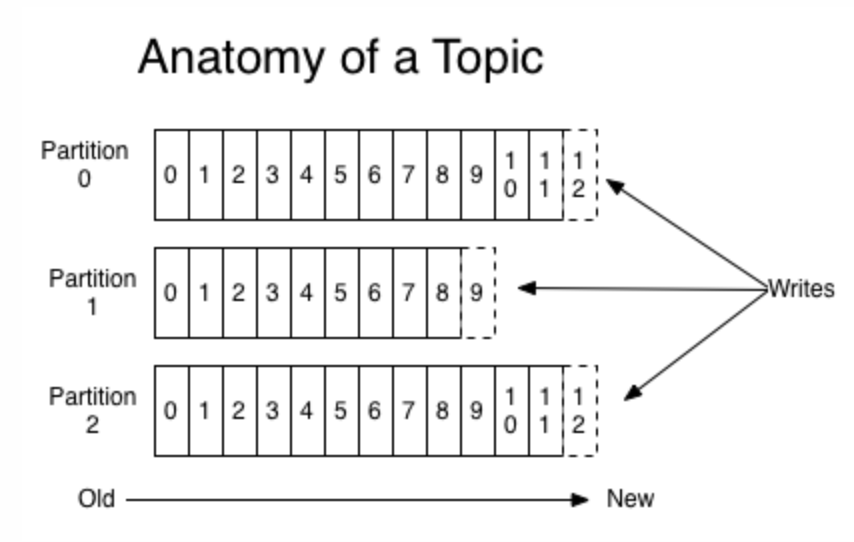
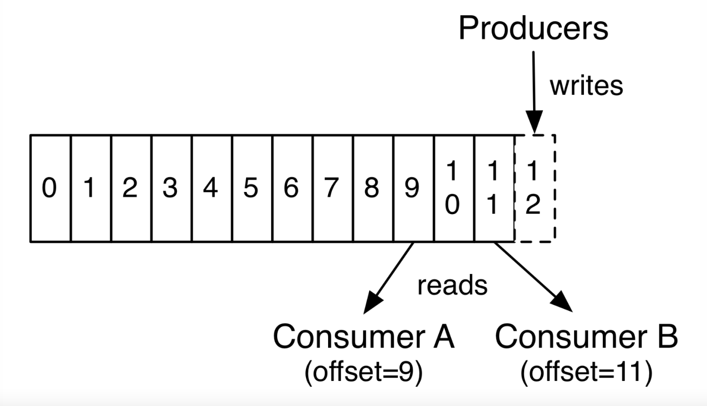
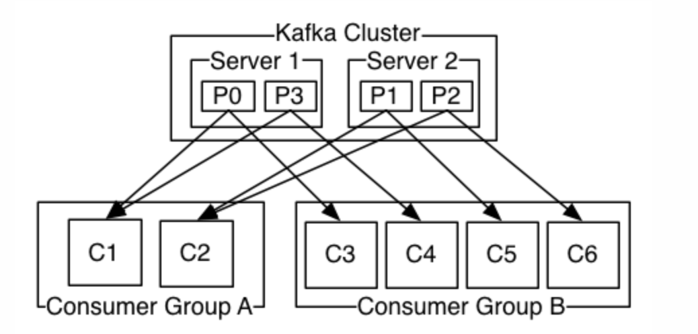

# 前言

Apache Kafka 是一个分布式消息发布订阅系统。它最初由LinkedIn公司基于独特的设计实现为一个分布式的提交日志系统( a distributed commit log)，，之后成为Apache项目的一部分。Kafka系统快速、可扩展并且可持久化。它的分区特性，可复制和可容错都是其不错的特性。

与传统消息系统相比
- 它被设计为一个分布式系统，易于向外扩展；
- 它同时为发布和订阅提供高吞吐量；
- 它支持多订阅者，当失败时能自动平衡消费者；
- 它将消息持久化到磁盘，因此可用于批量消费，例如ETL，以及实时应用程序。

# 基本组件

## Topics
Topics 是一些主题的集合，更通俗的说 Topic 就像一个消息队列，生产者可以向其写入消息，消费者可以从中读取消息，一个 Topic 支持多个生产者或消费者同时订阅它，所以扩展性很好。Topic 又可以由一个或多个 partition（分区）组成。

其中每个 partition 中消息是有序的，但相互之间的顺序就不能保证了，若 Topic 有多个 partition，生产者的消息可以指定或者由系统根据算法分配到指定分区，若你需要所有消息都是有序的，那么你最好只用一个分区。另外 partition 支持消息位移读取，消息位移由消费者自身管理，如下图：

由上图可以看出，不同消费者对同一分区的消息读取互不干扰，消费者可以通过设置消息位移（offset）来控制自己想要获取的数据，比如可以从头获取，最新数据读取，重读读取等功能。
**offset 是消息在分区中的唯一标识， Kafka通过它来保 证消息在分区内的顺序性。**
## Distribution
Kafka 是一个分布式的消息系统，所以当我们配置了多个 Kafka Server 节点后，它就拥有分布式的能力，比如容错等，partition 会被分布在各个 Server 节点上，同时它们中间又有一个 Leader，它会处理所有的读写请求，其他 followers 会复制 leader 上的数据信息，一旦当 leader 因为某些故障而无法提供服务后，就会有一个 follower 被推举出来成为新的 leader 来处理这些请求。
## Geo-Replication
异地备份是作为主流分布式系统的基础功能，用于集群中数据的备份和恢复，Kafka 利用 MiroorMaker 来实现这个功能，用户只需简单的进行相应配置即可。
## Producers
Producers 作为消息的生产者，可以自己指定将消息发布到订阅 Topic 中的指定分区，策略可以自己指定，比如语义或者结构类似的消息发布在同一区，当然也可以由系统循环发布在每一个分区上。
## Consumers
Consumers 是一群消费者的集合，可以称之为消费组组，是一种更高层次的抽象，向 Topic 订阅消息的单位是 Consumers，当然它其中也可以只有一个消费者。
通常来讲，消息模型可以分为两种，队列和发布-订阅式。队列的处理方式是一组消费者从服务器读取消息，一条消息只有其中一个消费者来处理。在发布-订阅模型中，消息被广播给所有的消费者，接收到消息的消费者都可以处理此消息。Kafka 为这两种模型提供了单一的消费者抽象模型：消费者组。

下面是关于消费者的两条原则：
- 假如所有消费者都在同一个消费者组中，那么它们将协同消费订阅 Topic 的部分消息（根据分区与消费者的数量分配），保持负载平衡。**queue 模型**
- 假如所有消费者都在不同的消费组中，并且订阅了同个 Topic，那么它们可以消费 Topic  的所有消息。 **发布-订阅模型**

下图中有两个Server节点，有一个Topic被分为四个分区（P0-P4)分别被分配在两个节点上，另外还有两个消费者组（GA，GB），其中GA有两个消费者实例，GB有四个消费者实例。

从图中我们可以看出，首先订阅Topic的单位是消费者组，另外我们发现Topic中的消息根据一定规则将消息推送给具体消费者，主要原则如下：
- 若消费者数小于partition数，且消费者数为一个，那么它就消费所有消息；
- 若消费者数小于partition数，假设消费者数为N，partition数为M，那么每个消费者能消费的分区数为M/N或M/N+1；
- 若消费者数等于partition数，那么每个消费者都会均等分配到一个分区的消息；
- 若消费者数大于partition数，则将会出现部分消费者得不到消息分区，出现空闲的情况；
总的来说，kafka 会根据消费者组的情况均衡分配消息。
## Broker
代理，可以看作是一个独立的 Kafka 实例。多个 Kafka Broker 组成一个 Kafka Cluster。
## Guarantees
kafka 作为一个高水平的系统，提供了以下保证：
- 消息的添加是有序的，生产者越早向订阅的 Topic 发送的消息，会更早的被添加到 Topic 中，当然它们可能被分配到不同的分区；
- 消费者在消费 Topic 分区中的消息时是有序的；
- 对于有 N 个复制节点的 Topic，系统可以最多容忍 N-1 个节点发生故障，而不丢失任何提交给该 Topic 的消息丢失。
# Kafka 三大特性
## 消息系统
1. 消息队列

| 特性       | 描述                                    |
| -------- | ------------------------------------- |
| 表现形式  | 一组消费者从消息队列中获取消息，消息会被推送给组中的某一个消费者   |
| 优势    | 水平扩展，可以将消息数据分开处理                   |
| 劣势    | 消息队列不是多用户的，当一条消息记录被一个进程读取后，消息便会丢失  |

2. 发布-订阅

| 特性       | 描述                                 |
| -------- | ---------------------------------- |
| 表现形式  | 消息会广播发送给所有消费者                   |
| 优势    | 可以多进程共享消息                       |
| 劣势    | 每个消费者都会获得所有消息，无法通过添加消费进程提高处理效率  |

Kafka 的优点主要体现在两方面：
- 通过 Topic 方式来达到消息队列的功能
- 通过消费者组这种方式来达到发布-订阅的功能
## 存储系统
存储消息也是消息系统的一大功能，Kafka 相对普通的消息队列存储来说，它的表现实在好的太多，首先 Kafka 支持写入确认，保证消息写入的正确性和连续性，同时 Kafka 还会对写入磁盘的数据进行复制备份，来实现容错，另外 Kafka 对磁盘的使用结构是一致的，就是说不管服务器目前磁盘存储的消息数据有多少，它添加消息数据的效率是相同的。
## 流式处理平台
Kafka 还提供了实时处理消息流的接口。很多时候我们需要的不是原始数据而是处理后的，比如通过一天的搜索数据得出当天的搜索热点等，可以利用 Streams API 来实现自己想要的功能。
Kafka 的流处理可以解决诸如处理无序数据、数据的复杂转换等问题。

# Kafka 存储策略
1. kafka 以 topic 来进行消息管理，每个 topic 包含多个 partition，每个 partition 对应一个逻辑 log，有多个 segment 组成。
2. 每个 segment 中存储多条消息，消息 id 由其逻辑位置决定，即从消息 id 可直接定位到消息的存储位置，避免 id 到位置的额外映射。
3. 每个 part 在内存中对应一个 index，记录每个 segment 中的第一条消息偏移。
4. 发布者发送到某个 topic 的消息会被均匀的分布到多个 partition 上（或根据用户指定的路由规则进行分布），broker 收到发布消息往对应 partition 的最后一个 segment 上添加该消息，当某个 segment 上的消息条数达到配置值或消息发布时间超过阈值时，segment 上的消息会被 flush 到磁盘，只有 flush 到磁盘上的消息订阅者才能订阅到，segment 达到一定的大小后将不会再往该 segment 写数据。

# 常见问题
## 1. Zookepper 在 Kafka 中的作用？
1. Broker 注册
Broker是分布式部署并且相互之间相互独立，但是需要有一个注册系统能够将整个集群中的Broker管理起来，此时就使用到了Zookeeper。在Zookeeper上会有一个专门用来进行Broker服务器列表记录的节点：`/brokers/ids`
每个Broker在启动时，都会到Zookeeper上进行注册，即到/brokers/ids下创建属于自己的节点，如/brokers/ids/[0...N]。
Kafka使用了全局唯一的数字来指代每个Broker服务器。
2. Topic 注册
在 Kafka 中，同一个 Topic 的消息会被分成多个分区并将其分布在多个 Broker 上，这些分区信息及与 Broker 的对应关系也都是由 Zookeeper 在维护，由专门的节点来记录，如：/brokers/topics。
3. 生产者负载均衡
由于同一个 Topic 消息会被分去并将其分布在多个 Broker 上，因此，生产者需要将消息合理地发送到这些分布式的 Broker 上，那么如何实现生产者的负载均衡，Kafka 支持传统的四层负载均衡，也支持 Zookeeper 方式实现负载均衡。
4. 消费者负载均衡
与生产者类似，Kafka 中的消费者同样需要进行负载均衡来实现多个消费者合理地从对应的 Broker 服务器上接收消息，每个消费者分组包含若干消费者，每条消息都指挥发送给分组中的一个消费者，不同的消费者分组消费自己特定的 Topic 下面的消息，互不干扰。
5. 分区与消费者之间的关系
在 Kafka 中，规定了每个消息分区只能被同组的一个消费者进行消费，因此，需要在 Zookeeper 上记录消息分区与 Consumer 之间的关系，每个消费者一旦确定对一个消息分区的消费权力，需要将其 Consumer ID 写入到 Zookeeper 对应消息分区的临时节点上。
6. 消息 消费进度 Offset 记录
在消费者对指定消息分区进行消息消费的过程中，需要定时地将分区消息的消费进度 Offset 记录到 Zookeeper 上，以便在该消费者进行重启或者其他消费者重新接管该消息分区的消息消费后，能够从之前的进度开始继续进行消息消费。
7. 消费者注册
每个消费者服务器启动时，都会到 Zookeeper 的指定节点下创建一个属于自己的消费节点，完成节点创建后，消费者就会将自己订阅的 Topic 信息写入该临时节点。
## 2. 获取 Topic 主题的列表
bin/kafka-topic.sh --list --zookeeper localhost:2181
## 3. 生产者和消费者的命令
生产者在主题上发布消息：
bin/kafka-console-producer.sh --broker-list 192.168.xx.xx:9092 --topic Hello-Kafka
这里的 ip 是 server.properties 中 listener 的配置。
消费者接收消息：
bin/kafka-console-consumer.sh --zookeeper localhost:2181 --topic Hello-Kafka --from-begining
## 4. consumer 是推是拉
Kafka 最初考虑的问题是，customer 应该从 brokes 拉取消息还是 brokers 将消息推送到 consumer，也就是 pull 还 push。在这方面，Kafka 遵循了一种大部分消息系统共同的传统的设计：producer 将消息推送到 broker，consumer 从broker 拉取消息。
1. 如果采用 push 模式，由 broker 决定消息推送的速率， 对于不同的消费者的 consumer 就不太好处理了。在 push 模式下，当 broker 推送的速率远大于 consumer 消费的速率时，consumer 恐怕就要崩溃了。
2. pull 模式的另一个好处是 consumer 可以自主决定是否批量的从 broker 拉取数据。push 模式必须在不知道下游 consumer 消费能力和消费策略的情况下决定是立即推送每条消息还是缓存之后批量推送。如果为了避免 consumer 崩溃而采用较低的推送速率，将可能导致一次只推送较少的消息而造成浪费。
pull 的缺点
如果 broker 没有可供消费的消息，将导致 consumer 不断在循环中轮询，直到新消息到达。为了避免这点， Kafka 有个参数可以让 consumer 阻塞直到新消息到达（也可以阻塞直到消息的数量达到某个特定的量这样就可以批量发送）。
## 5. kafka 维护消费状态跟踪的方法
大部分消息系统在 broker 端的维护消息被消费的记录：一个消息被分发到 consumer 后 broker 就马上进行标记或者等待 customer 的通知后进行标记。这样也可以在消息消费后就立马删除以减少空间占用。
但这样有一个问题，就是如果消息发送出去后立即被标记为消费过的，且 consumer 处理消息时失败了消息就丢失了。为了解决这个问题，Kafka 采用的策略如下，Topic 被分成了若干分区，每个分区在同一时间只被一个 consumer 消费。这意味着每个分区被消费的消息在日志中的位置仅仅是一个简单的整数：offset。这样就很容易标记每个分区消费状态就很容易了，仅仅需要一个整数而已。这样消费状态的跟踪就很简单了。
## 6. 主从同步
Kafka 允许 topic 的分区拥有若干副本，这个数量是可以配置的，你可以为每个 topic 配置副本的数量。Kafka 会自动在每个副本上备份数据，所以当一个节点 down 掉时数据依然是可用的。
Kafka 的副本功能不是必须的，你可以配置只有一个副本，这样其实就相当于只有一份数据。
## 7. 消息系统的作用
1. 解耦
2. 冗余
3. 扩展性
4. 灵活性/削峰处理能力
5. 可恢复性
6. 顺序保证
7. 缓冲
8. 异步通信
## 8. 数据传输的事务定义有哪三种？
1. 最多一次：消息不会被重复发送，最多被传输一次，但也有可能一次不传输
2. 最少一次：消息不会被漏发，最少被传输一次，但也有可能被重复传输
3. 精确的一次：不会漏传输也不会重复传输，每个消息都传输一次而且仅仅被传输一次
## 9. kafka 判断一个节点是否还活着的条件
1. 节点必须可以维护和 zookeeper 的链接，zookeeper 通过心跳连接机制检查每个节点的连接
2. 如果节点是个 follower，他必须能及时的同步 leader 的写操作，延时不能太久
## 10. kafka 与传统 MQ 消息系统之间的三个关键区别
1. kafka 持久化日志，这些日志可以被重复读取和无限期保留
2. kafka 是一个分布式系统：它以集群的方式运行，可以灵活伸缩，在内部通过复制数据提升容错能力和高可用性
3. kafka 支持实时的流式处理
## 11. kafka 的 ack 的三种机制
request.required.acks 有三个值 0 1 -1(all)
- 0: 生产者不会等待 broker 的 ack，这个延迟最低但是存储的保证最弱当 server 挂掉的时候就会丢数据。
- 1：服务端会等待 ack 值 leader 副本确认接收到消息后发送 ack 但是如果 leader挂掉后他不确保是否复制完成新 leader 也会导致数据丢失。
- -1(all)：服务端会等所有的 follower 的副本受到数据后才会受到 leader 发出的ack，这样数据不会丢失
## 12. kafka 分布式（不是单机）的情况下，如何保证消息的顺序消费?
Kafka 分布式的单位是 partition，同一个 partition 用一个 write ahead log 组织，所以可以保证 FIFO 的顺序。不同 partition 之间不能保证顺序。但是绝大多数用户都可以通过 message key 来定义，因为同一个 key 的 message 可以保证只发送到同一个 partition。
Kafka 中发送 1 条消息的时候，可以指定(topic, partition, key) 3 个参数。partiton 和 key 是可选的。如果你指定了 partition，那就是所有消息发往同 1个 partition，就是有序的。并且在消费端，Kafka 保证，1 个 partition 只能被1 个 consumer 消费。或者你指定 key（ 比如 order id），具有同 1 个 key 的所有消息，会发往同 1 个 partition。
保证消息消费顺序的方法：
1. 1个 Topic 只对应一个 Partition
2. （推荐）发送消息的时候指定 key/Partition
## 13. 如何保证消息不丢失？
消息丢失分为三种情况，有生产者丢失，消费者丢失和kafka丢失。

**生产者丢失**
生产者调用send方法发送消息之后，消息可能因为网络问题没有发送过去。为了确定消息是发送成功，我们要判断消息发送的结果，可以采用添加回调函数的形式。
如果消息发送失败的话，检查失败原因后重发即可，推荐重试次数为3，并设置重试间隔，避免间隔太小重试效果不明显。

**消费者丢失**
消息在被追加到 Partition(分区)的时候都会分配一个特定的偏移量（offset）。偏移量（offset)表示 Consumer 当前消费到的 Partition(分区)的所在的位置。Kafka 通过偏移量（offset）可以保证消息在分区内的顺序性。
当消费者拉取到了分区的某个消息之后，消费者会自动提交了 offset。自动提交的话会有一个问题，试想一下，当消费者刚拿到这个消息准备进行真正消费的时候，突然挂掉了，消息实际上并没有被消费，但是 offset 却被自动提交了。
**解决办法也比较粗暴，我们手动关闭自动提交 offset，每次在真正消费完消息之后再自己手动提交 offset**。 但是这样会带来消息被重新消费的问题。比如你刚刚消费完消息之后，还没提交 offset，结果自己挂掉了，那么这个消息理论上就会被消费两次。

**kafka 弄丢了消息**
Kafka 为分区（Partition）引入了多副本（Replica）机制。分区（Partition）中的多个副本之间会有一个叫做 leader 的家伙，其他副本称为 follower。我们发送的消息会被发送到 leader 副本，然后 follower 副本才能从 leader 副本中拉取消息进行同步。生产者和消费者只与 leader 副本交互。你可以理解为其他副本只是 leader 副本的拷贝，它们的存在只是为了保证消息存储的安全性。
**假如 leader 副本所在的 broker 突然挂掉，那么就要从 follower 副本重新选出一个 leader ，但是 leader 的数据还有一些没有被 follower 副本的同步的话，就会造成消息丢失。**
- 设置 acks = all
- 设置 replication.factor >= 3
- 设置 min.insync.replicas > 1
- 设置 unclean.leader.election.enable = false
## 14. 如何保证消息不重复消费？
kafka出现消息重复消费的原因：
- 服务端侧已经消费的数据没有成功提交 offset（根本原因）。
- Kafka 侧由于服务端处理业务时间长或者网络链接等等原因让 Kafka 认为服务假死，触发了分区 rebalance。
**解决方案**：
- 消费消息服务做幂等校验，比如 Redis 的set、MySQL 的主键等天然的幂等功能。这种方法最有效。
- 将 enable.auto.commit 参数设置为 false，关闭自动提交，开发者在代码中手动提交 offset。那么这里会有个问题：什么时候提交offset合适？
    - 处理完消息再提交：依旧有消息重复消费的风险，和自动提交一样
    - 拉取到消息即提交：会有消息丢失的风险。允许消息延时的场景，一般会采用这种方式。然后，通过定时任务在业务不繁忙（比如凌晨）的时候做数据兜底。

# 参考

1. [Zookeeper 在 Kafka 中的作用 - 简书](https://www.jianshu.com/p/a036405f989c)
2. [Kafka基本原理 - 阿里云开发社区](https://developer.aliyun.com/article/371933)
3. [kafka详解 - kafka基本原理 - 简书](https://www.jianshu.com/p/83f5ee4f222d)
4. [kafka中文文档](https://kafka.apachecn.org/)
5. [Kafka在美团数据平台的实践 - 美团技术团队](https://tech.meituan.com/2022/08/04/the-practice-of-kafka-in-the-meituan-data-platform.html)