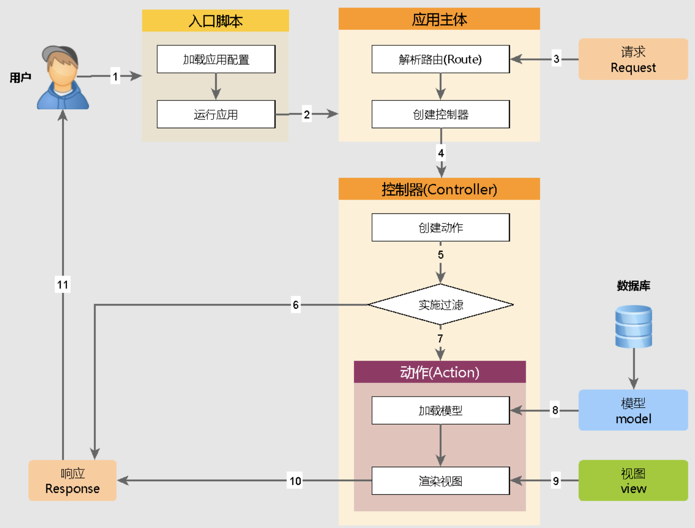

# PHP简介

PHP（Pre Hypertext Preprocessor） 是一种服务器端的弱类型的 html 脚本/编程语言，可快速书写动态生成的网页。

## 1 语法初步

PHP 是一种运行在服务器端的脚本语言，可以嵌入到 HTML 中。

### 1.1 PHP 代码标记

在 PHP 历史发展中，可以使用多种标记来区分 PHP 脚本。

- ASP 标记：<% php代码 %>
  
- 短标记：<? php代码 ?>
  

以上两种基本弃用，如果要使用需要在配置文件中开启。

- 脚本标记：<script language="php">php代码</script>
  
  ```html
  <html>
  
  <body>
      <b>
          <script language="php">
              // 脚本标记
              echo 'hello world';
          </script>
      </b>
  </body>
  </html>
  ```
  
- 标准标记：<?php php代码 ?>
  
  ```html
  <html>
  
  <body>
      <b>
          <?php
              // 标准标记
              echo 'hello world';
          ?>
      </b>
  </body>
  </html>
  ```
  

### 1.2 PHP 注释

- 行注释
  - //
    
  - ‘#‘
    
- 块注释
  
  - /**/

### 1.3 语句分隔符

在 PHP 代码中，代码是以行为单位，系统需要通过判断行的结束，该结束通常都是一个符号：分号`;`。

特殊说明：

1. PHP 中标记结束符 ?> 有自带语句结束符的效果，最后一行 PHP 代码可以没有语句结束符
  
2. PHP 中其实很多代码的书写并不是嵌入到 HTML 中，而是单独存在，通常书写习惯中就不建议使用标记结束符 ?>，PHP 会自动从开始到最后全部认为是 PHP 代码，从而解析。
  

## 2 变量

- 定义变量：在 PHP 中不需要任何关键字定义变量（赋值）。PHP 会根据变量的值，自动把变量转换为正确的数据类型。
  
  ```php
  // 定义变量
  $var1;
  // 定义变量的同时赋值
  $var2 = 1;
  ```
  
- 访问变量
  
  ```php
  // 通过 var2 变量名字找到存储的内容1，然后输出
  echo $var2;
  ```
  
- 删除变量
  
  ```php
  // 使用 unset(变量名字)
  unset($var2)
  ```
  

### 2.1 变量作用域

变量作用域是指脚本中变量可被引用/使用的部分。

| 作用域 | 描述  |
| --- | --- |
| `local` | 局部作用域 |
| `global` | 全局作用域 |
| `static` | 静态作用域 |
| `parameter` | 函数参数作用域 |

1. `local`- 局部变量的作用域。在函数内部声明，只能在函数内部访问。
  
  ```php
  <?php
  function test()
  {
      $a = 15;
      echo "内部输出结果：" . $a;
  }
  echo "外部输出结果：" . $a;  // 无法访问变量 a
  echo PHP_EOL;
  test();
  // 外部输出结果：
  // 内部输出结果：15
  ?>
  ```
  
2. `global`- 全局变量的作用域。在函数内调用函数外定义的全局变量，我们需要在函数中的变量前加上 global 关键字。
  
  ```php
  <?php
  $x=5;
  $y=10;
  
  function myTest()
  {
      global $x,$y;
      $y=$x+$y;
  }
  
  myTest();
  echo $y; // 输出 15
  ?>
  ```
  
  PHP 将所有全局变量存储在一个名为 $GLOBALS[index] 的数组中。 index 保存变量的名称。这个数组可以在函数内部访问，也可以直接用来更新全局变量。
  
  ```php
  <?php
  $x=5;
  $y=10;
  
  function myTest()
  {
      $GLOBALS['y']=$GLOBALS['x']+$GLOBALS['y'];
  } 
  
  myTest();
  echo $y; // 输出15
  ?>
  ```
  
3. `static`- 当一个函数完成时，它的所有变量通常都会被删除。然而，有时候您希望某个局部变量不要被删除。
  
  ```php
  <?php
  function myTest()
  {
      static $x=0;
      echo $x;
      $x++;
      echo PHP_EOL;    // 换行符
  }
  
  myTest(); // 输出0
  myTest(); // 输出1
  myTest(); // 输出2
  ?>
  ```
  
4. `parameter`- 参数是通过调用代码将值传递给函数的局部变量。参数是在参数列表中声明的，作为函数声明的一部分。
  
  ```php
  <?php
  function myTest($x)
  {
      echo $x;
  }
  myTest(5); // 输出5
  ?>
  ```
  

### 2.2 变量命名规则

1. 必须以“$”符号开始
  
2. 名字由字母、数字和下划线“_”构成，但是不能以数字开头
  
3. 在 PHP 中本身还允许中文变量（不建议）
  

### 2.3 预定义变量

提前定义的变量，系统定义的变量，存储许多需要用到的数据（预定义变量都是数组）

- `$_GET`：获取所有表单以 get 方式提交的数据
  
- `$_POST`：POST 提交的数据都会保存在此
  
- `$_REQUEST`：GET 和 POST 提交的都会保存
  
- `$GLOBALS`：PHP 中所有的全局变量
  
- `$_SERVER`：服务器信息
  
- `$_SESSION`：seesion 会话数据
  
- `$COOKIE`：cookie 会话数据
  
- `$ENV`：环境信息
  
- `FILES`：用户上传的文件信息
  

### 2.4 可变变量

如果一个变量保存的值刚好是另一个变量的名字，那么可以直接通过访问一个变量的道另外一个变量的值：在变量前面再多加一个 $ 符号。

```php
$a = 'b';
$b = 'bb';

// $$a -> bb
```

### 2.5 变量传值

将一个变量赋值给另一个变量。

变量传值一共两种方式：值传递，引用传递。

**值传递**：将变量保存的值赋值一份，然后将新的值给另一个变量保存（两个变量没有关系）。


**引用传递**：将变量保存的值所在的内存地址，传递给另外一个变量：两个变量指向同一块内存空间（两个变量是同一个值）。

```php
$新变量 = &$老变量;
```


代码实现：

```php
// 值传递
$a = 10;
$b = $a;
$b = 55;
echo $a, $b, '<br/>';  // 105

// 引用传递
$c = 10;
$d = &$c;
$c = 5;
echo $c, $d, '<br/>';  // 55
```

在内存中，通常有以下几个分区：

- 栈区：程序可以操作的内存部分（不存数据，运行程序代码），少但是快；
  
- 代码段：存储程序的内存部分（不执行）；
  
- 数据段：存储普通数据（全局区和静态区）；
  
- 堆区：存储复杂数据，大但是效率低。
  

## 3 常量

与变量一样，都是用来保存数据的，是一种在程序运行中不可改变的量（数据）。一旦被定义，通常数据不可改变（用户级别）。

### 3.1 常量定义方式

在 PHP 中常量有两种定义方式（5.3 之后才有两种）

1. 使用定义常量的函数：define('常量名', 常量值);
  
2. 5.3 之后才有的：const 常量名 = 值;
  

```php
define('PI', 3.14);
const PII = 3;
```

常量名字的命名规则

1. 常量不需要使用“$”符号，一旦使用系统就会认为是变量；
  
2. 常量的名字组成由字母、数字和下划线组成，不能以数字开头；
  
3. 常量的名字通常是以大写字母为主（与变量以示区别）；
  
4. 常量命名的规则比变量要松散，可以使用一些特殊字符，该方式只能使用 define 定义。
  

```php
// 定义特殊常量
define('-_-', 'smile');
// 错误使用方式
const -_- = 'smile';
```

【注意】

1. define 和 const 定义的常量是有区别的，在于访问权限区别。
  
2. 定义常量通常不区分大小写，但是可以区分，可以参照 define 函数的第三个参数。
  

```php
bool define(string $name, mixed $value, [, bool $case_insensitive = false])
```

### 3.2 常量使用形式

常量的使用与变量一样，不可改变值（在定义的时候必须赋值）。

对于特殊名字的敞亮，需要用到另外一个访问常量的函数：constant('常量名');

```php
echo PI;
echo constant('-_-');
```

说明：常量和变量的使用

1. 凡是数据会可能变化的，那么肯定是用变量；
  
2. 数据不一定会变的，可以使用常量或者变量（变量居多）；
  
3. 数据不允许被修改的，一定用常量。
  

### 3.3 系统常量

系统常量：系统帮助用户定义的常量，用户可以直接使用

常用的几个系统常量：

- PHP_VERSION：PHP 版本号
  
- PHP_INT_SIZE：整型大小
  
- PHP_INT_MAX：整型能表示的最大值
  

```php
// 系统变量
echo '<hr/>', PHP_VERSION, '<br/>', PHP_INT_SIZE, '<br/>', PHP_INT_MAX;
// 3.4.8
// 4  4表示整型所占用的字节数
// 2147483647
```

在 PHP 中还有一些特殊的常量，他们由双下划线开始 + 常量名 + 双下划线结束，这种常量称之为系统**魔术常量**：魔术常量的值通常会跟着环境变化，但是用户改变不了。

`__DIR__`：当前被执行的脚本所在电脑的绝对路径。

`__FILE__`：当前被执行的脚本所在的电脑的绝对路径（带自己文件的名字）。

`__LINE__`：当前所属的行数。

```php
// 魔术常量
echo '<hr/>';
echo __DIR__, '<br/>', __FILE__, '<br/>', __LINE__, '<br/>';
echo __LINE__;
```

`__NAMESPACE__`：当前所属的命名空间。

`__CLASS__`：当前所属的类。

`__METHOD__`：当前所属的方法。

## 4 数据类型

在 PHP 中指的是存储的数据本身的类型，而不是变量的类型。PHP 是一种弱类型语言，变量本身没有数据类型。

### 4.1 PHP 的八种数据类型

在 PHP 中将数据分为三大类八小类：

**简单（基本）数据类型：4个小类**

- 整型：int/integer，系统分配4个字节存储，表示整数类型（有前提）。
  
- 浮点型：float/double，系统分配8个字节存储，表示小数或者整型存不下的整数。
  
- 字符类型：string，系统根据实际长度分配，表示字符串（引号）。
  
- 布尔类型：bool/boolean，表示布尔类型，只有两个值：true和false。
  

**复合数据类型：2个小类**

- 对象类型：object，存放对象（面向对象）。
  
- 数组类型：array，存储多个数据（一次性）。
  

**特殊数据类型：2个小类**

- 资源类型：resource，存放资源数据（PHP 外部数据，如数据库、文件）。
  
- 空类型：NULL，只有一个值就是 NULL（不能运算）。
  

### 4.2 类型比较

PHP 变量比较，包含松散和严格比较。

- 松散比较：使用两个等号 == 比较，只比较值，不比较类型。
- 严格比较：用三个等号 === 比较，除了比较值，也比较类型。

```php
<?php
if(42 == "42") {
    echo '1、值相等';
}

echo PHP_EOL; // 换行符

if(42 === "42") {
    echo '2、类型相等';
} else {
    echo '3、类型不相等';
}
?>
```

### 4.3 类型转换

在很多条件下，需要指定的数据类型，需要外部数据（当前 PHP 取到的数据）转换成慕白哦数据类型。

两种转换方式：

- 自动转换：系统根据需求自己判定，自己转换（用的比较多，效率偏低）
  
- 强制（手动）转换：认为根据需要的目标类型转换
  

在转换过程中，用比较多的就是转布尔类型（判断）和转数值类型（算术运算）

其他类型转布尔类型：true 或者 false，在 PHP 中比较少类型会转变成 false


其他类型转数值的说明：

1. 布尔 true 为1，false 为0。
  
2. 字符串转数值有自己的规则
  
  1. 以字母开头的字符串，永远为0；
    
  2. 以数字开头的字符串，取到碰到的字符串为止（不会同时包含两个小数点）。
    

```php
// 数据类型

// 创建数据
$a = 'abc1.1.1';
$b = '1.1.1abc';
// 自动转换
echo $a + $b; // 算术+运算，系统先转换成数值类型（整型和浮点型），然后运算
// 强制转换
echo '<br/>', (float)$a, (float)$b;
// 1.1
// 01.1
```

### 4.4 类型判断

通过一组类型判断函数，来判断变量，最终返回这变量所保存数据的数据类型：是一组以 is_开头后面跟类型名字的函数：is_xxx(变量名);

bool 类型不能用 echo 来查看，可以使用 var_dump 结构查看

var_dump(变量1, 变量2...)

```php
// 判断数据类型
$a = 'abc1.1.1';
echo '<hr/>';
var_dump(is_int($a));  // false
var_dump(is_stirng($a));  // true
```

还有一组函数可以用来获取以及设定数据（变量）的类型。

gettype(变量名)：获取类型，得到的是该类型对应的字符串。

settype(变量名, 类型)：设定数据类型，与强制转换不同。

1. 强制转换（类型）变量名，是对数据值复制的内容进行处理（不会处理实际存储的内容）。

2. settype 会直接改变数据本身。
  

```php
// 获取类型
echo '<hr/>';
echo gettype($a), '<br/>';  // string

// 设置类型
var_dump(settype($b, 'int')); // true
echo gettype($b), $b; // integer1
```

### 4.5 整数类型

整数类型：保存整数数值（范围限制），4个字节存储数据，最大就是32位：42亿多。但是在 PHP 中默认是有符号类型（区分正负数）。默认 PHP 输出数值都会自动转换成10进制输出。

在 PHP 中提供了四种整型的定义方式：

```php
$a = 120;  // 10进制
$a = 0b110;  // 2进制
$a = 0120; // 8进制
$a = 0x120; // 16进制
```

### 4.6 浮点类型

小数类型以及超过整型所能存储范围的整数（不保证精度），精度范围大概在15个有效数字左右。

```php
$f = 1.23;
$f = 1.23e10;  // 科学计数法，其中e表示底10
```

尽量不要用浮点数做精确判断：浮点数保存的数据不够精确，而且在计算机中凡是小数基本上存的都不准确。

### 4.7 字符类型

一个字符串可以用4种方式表达。

#### 4.7.1 单引号

要表达一个单引号自身，需要在它的前面加一个反斜线（\）来转义。要表达一个反斜线自身，则用两个反斜线（\\\）。其他任何形式的反斜线都会被当作反斜线本身，比如说`\r`和`\n`并不代表任何特殊含义，就单纯是这两个字符本身。

【⚠️注意】不像**双引号**和**heredoc**语法结构，在单引号字符串中的变量和特殊字符的转移序列将不会被替换。

```php
<?php
echo 'this is a simple string';

// 可以录入多行
echo 'You can also have embedded newlines in
strings this way as it is
okay to do';

// 输出： Arnold once said: "I'll be back"
echo 'Arnold once said: "I\'ll be back"';

// 输出： You deleted C:\*.*?
echo 'You deleted C:\\*.*?';

// 输出： You deleted C:\*.*?
echo 'You deleted C:\*.*?';

// 输出： This will not expand: \n a newline
echo 'This will not expand: \n a newline';

// 输出： Variables do not $expand $either
echo 'Variables do not $expand $either';
?>
```

#### 4.7.2 双引号

如果是字符串包含在双引号中，PHP 将对以下特殊的字符进行解析：

| 序列  | 含义  |
| --- | --- |
| `\n` | 换行（ASCII 字符集中的 LF 或 0x0A (10)） |
| `\r` | 回车（ASCII 字符集中的 CR 或 0x0D (13)） |
| `\t` | 水平制表符（ASCII 字符集中的 HT 或 0x09 (9)） |
| `\v` | 垂直制表符（ASCII 字符集中的 VT 或 0x0B (11)） |
| `\e` | Escape（ASCII 字符集中的 ESC 或 0x1B (27)） |
| `\f` | 换页（ASCII 字符集中的 FF 或 0x0C (12)） |
| `\\` | 反斜线 |
| `\$` | 美元标记 |
| `\"` | 双引号 |
| `\[0-7]{1,3}` | 符合该正则表达式序列的是一个以八进制方式来表达的字符，which silently overflows to fit in a byte (e.g. "\400" === "\000") |
| `\x[0-9A-Fa-f]{1,2}` | 符合该正则表达式序列的是一个以十六进制方式来表达的字符 |
| `\u{[0-9A-Fa-f]+}` | 匹配正则表达式的字符序列是 unicode 码位， 该码位能作为 UTF-8 的表达方式输出字符串 |

和单引号字符串一样，转义任何其它字符都会导致反斜线被显示出来。用双引号定义的字符串最重要的特征是变量会被解析。

#### 4.7.3 heredoc 语法结构

> PHP EOF(heredoc)是一种在命令行shell（如sh、csh、ksh、bash、PowerShell和zsh）和程序语言（像Perl、PHP、Python和Ruby）里定义一个字符串的方法。

1. 必须后接分号，否则编译通不过；
  
2. EOF 可以用任意其它字符代替，只需保证结束表示与开始标识一致；
  
3. 结束表示必须顶格独自占一行（即必须从行首开始，前后不能衔接任何空白和字符）；
  
4. 开始标识可以不带引号或带单双引号，不带引号与带双引号效果一致，解释内嵌的变量和转义符号，带单引号则不解释内嵌的变量和转义符号；
  
5. 当内容需要内嵌引号（单引号或双引号）时，不需要加转义符，本身对但双引号转义。
  

【注意事项】

1. 以`<<<EOF`标记开始，以`EOF`标记结束，结束标记必须顶头写，不能有缩进和空格，且在结束标记末尾要有分号；
  
2. 开始标记和结束标记相同，比如常用大写的`EOT、EOD、EOF`来表示，但也不限于这几个，只要保证开始标记和结束标记不在正文中出现即可；
  
3. 位于开始标记和结束标记之间的变量可以被正常解析，但是函数则不可以。在 heredoc 中，变量不需要用连接符`.`或`,`来拼接。
  

```php
<?php
$name = "test";
$a = <<<EOF
    "abc"$name<br/>
    "123"
EOF;
// 结束需要独立一行且前后不能空格
echo $a;
// "abc"test
// "123"
?>
```

#### 4.7.4 nowdoc 语法结构

就像 heredoc 结构类似于双引号字符串，nowdoc 结构是类似于单引号字符串的。nowdoc 结构很象 heredoc 结构，但是 nowdoc 中**不进行解析操作**。这种结构很适合用于嵌入 PHP 代码或其它大段文本而无需对其中的特殊字符进行转义的情况。

一个 nowdoc 结构也用和 heredocs 结构一样的标记 `<<<`， 但是跟在后面的标识符要用单引号括起来，即 `<<<'EOT'`。heredoc 结构的所有规则也同样适用于 nowdoc 结构，尤其是结束标识符的规则。

```php
<?php
echo <<<'EOD'
abcdef,\\ and \'.
EOD;
// abcdef,\\ and \'.
?>
```

#### 4.7.5 存取和修改字符串中的字符

string 中的字符可以通过一个从 0 开始的下标，用类似 array 结构中的方括号包含对应的数字来访问和修改，比如 $str[42]。可以把 string 当成字符组成的 array。函数`substr()`和`substr_replace()`可用于操作多于一个字符的情况。

#### 4.7.6 有用的函数和运算符

字符串可以用 '.'（点）运算符连接起来，注意 '+'（加号）运算符*没有*这个功能。

```php
<?php
$a = "Hello ";
$b = $a . "World!"; // 现在 $b 包含 "Hello World!"

$a = "Hello ";
$a .= "World!";     // 现在 $a 包含 "Hello World!"
?>
```

一些常用的字符串处理函数如下

| 函数名 | 描述  |
| --- | --- |
| `trim()` | 删除字符串两端的空格或其他预定义字符 |
| `rtrim()` | 删除字符串右边的空格或其他预定义字符 |
| `chop()` | rtrim()的别名 |
| `ltrim()` | 删除字符串左边的空格或其他预定义字符 |
| `str_pad()` | 把字符串填充为指定的长度 |
| `str_repeat()` | 重复使用指定字符串 |
| `str_split()` | 把字符串分割到数组中 |
| `strrev()` | 反转字符串 |
| `wordwrap()` | 按照指定长度对字符串进行折行处理 |
| `str_shuffle()` | 随机地打乱字符串中所有字符 |
| `parse_str()` | 将字符串解析成变量 |
| `number_format()` | 通过千位分组来格式化数字 |
| `strtolower()` | 字符串转为小写 |
| `strtoupper()` | 字符串转为大写 |
| `ucfirst()` | 字符串首字母大写 |
| `ucwords()` | 字符串每个单词首字符转为大写 |
| `htmlentities()` | 把字符转为HTML实体 |
| `htmlspecialchars()` | 预定义字符转html编码 |
| `nl2br()` | \n转义为标签 |
| `strip_tags()` | 剥去 HTML、XML 以及 PHP 的标签 |
| `chr()` | 从指定的 ASCII 值返回字符 |
| `ord()` | 返回字符串第一个字符的 ASCII值 |
| `strcasecmp()` | 不区分大小写比较两字符串 |
| `strcmp()` | 区分大小写比较两字符串 |
| `strncmp()` | 比较字符串前n个字符,区分大小写 |
| `strncasecmp()` | 比较字符串前n个字符,不区分大小写 |
| `strnatcmp()` | 自然顺序法比较字符串长度,区分大小写 |
| `strnatcasecmp()` | 自然顺序法比较字符串长度,不区分大小写 |
| `chunk_split()` | 将字符串分成小块 |
| `strtok()` | 切开字符串 |
| `explode()` | 使用一个字符串为标志分割另一个字符串 |
| `implode()` | 同join,将数组值用预订字符连接成字符串 |
| `substr()` | 截取字符串 |
| `str_replace()` | 字符串替换操作,区分大小写 |
| `str_ireplace()` | 字符串替换操作,不区分大小写 |
| `substr_count()` | 统计一个字符串,在另一个字符串中出现次数 |
| `substr_replace()` | 替换字符串中某串为另一个字符串 |
| `similar_text()` | 返回两字符串相同字符的数量 |
| `strchr()` | 返回一个字符串在另一个字符串中开始位置到结束的字符串 |
| `strrchr()` | 返回一个字符串在另一个字符串中最后一次出现位置开始到末尾的字符串 |
| `stristr()` | 返回一个字符串在另一个字符串中开始位置到结束的字符串，不区分大小写 |
| `strtr()` | 转换字符串中的某些字符 |
| `strpos()` | 寻找字符串中某字符最先出现的位置 |
| `stripos()` | 寻找字符串中某字符最先出现的位置,不区分大小写 |
| `strrpos()` | 寻找某字符串中某字符最后出现的位置 |
| `strripos()` | 寻找某字符串中某字符最后出现的位置,不区分大小写 |
| `strspn()` | 返回字符串中首次符合mask的子字符串长度 |
| `strcspn()` | 返回字符串中不符合mask的字符串的长度 |
| `str_word_count()` | 统计字符串含有的单词数 |
| `strlen()` | 统计字符串长度 |
| `count_chars()` | 统计字符串中所有字母出现次数(0..255) |
| `md5()` | 字符串md5编码 |
| `mb_substr()` | 获取字符串的部分 |
| `mb_http_output()` | 设置/获取 HTTP 输出字符编码 |
| `mb_strlen()` | 获取字符串的长度 |
| `iconv()` | 字符串按要求的字符编码来转换 |

| 函数名 | 描述  |
| --- | --- |
| `trim()` | 删除字符串两端的空格或其他预定义字符 |
| `rtrim()` | 删除字符串右边的空格或其他预定义字符 |
| `chop()` | rtrim()的别名 |
| `ltrim()` | 删除字符串左边的空格或其他预定义字符 |
| `str_pad()` | 把字符串填充为指定的长度 |
| `str_repeat()` | 重复使用指定字符串 |
| `str_split()` | 把字符串分割到数组中 |
| `strrev()` | 反转字符串 |
| `wordwrap()` | 按照指定长度对字符串进行折行处理 |
| `str_shuffle()` | 随机地打乱字符串中所有字符 |
| `parse_str()` | 将字符串解析成变量 |
| `number_format()` | 通过千位分组来格式化数字 |
| `strtolower()` | 字符串转为小写 |
| `strtoupper()` | 字符串转为大写 |
| `ucfirst()` | 字符串首字母大写 |
| `ucwords()` | 字符串每个单词首字符转为大写 |
| `htmlentities()` | 把字符转为HTML实体 |
| `htmlspecialchars()` | 预定义字符转html编码 |
| `nl2br()` | \n转义为标签 |
| `strip_tags()` | 剥去 HTML、XML 以及 PHP 的标签 |
| `chr()` | 从指定的 ASCII 值返回字符 |
| `ord()` | 返回字符串第一个字符的 ASCII值 |
| `strcasecmp()` | 不区分大小写比较两字符串 |
| `strcmp()` | 区分大小写比较两字符串 |
| `strncmp()` | 比较字符串前n个字符,区分大小写 |
| `strncasecmp()` | 比较字符串前n个字符,不区分大小写 |
| `strnatcmp()` | 自然顺序法比较字符串长度,区分大小写 |
| `strnatcasecmp()` | 自然顺序法比较字符串长度,不区分大小写 |
| `chunk_split()` | 将字符串分成小块 |
| `strtok()` | 切开字符串 |
| `explode()` | 使用一个字符串为标志分割另一个字符串 |
| `implode()` | 同join,将数组值用预订字符连接成字符串 |
| `substr()` | 截取字符串 |
| `str_replace()` | 字符串替换操作,区分大小写 |
| `str_ireplace()` | 字符串替换操作,不区分大小写 |
| `substr_count()` | 统计一个字符串,在另一个字符串中出现次数 |
| `substr_replace()` | 替换字符串中某串为另一个字符串 |
| `similar_text()` | 返回两字符串相同字符的数量 |
| `strchr()` | 返回一个字符串在另一个字符串中开始位置到结束的字符串 |
| `strrchr()` | 返回一个字符串在另一个字符串中最后一次出现位置开始到末尾的字符串 |
| `stristr()` | 返回一个字符串在另一个字符串中开始位置到结束的字符串，不区分大小写 |
| `strtr()` | 转换字符串中的某些字符 |
| `strpos()` | 寻找字符串中某字符最先出现的位置 |
| `stripos()` | 寻找字符串中某字符最先出现的位置,不区分大小写 |
| `strrpos()` | 寻找某字符串中某字符最后出现的位置 |
| `strripos()` | 寻找某字符串中某字符最后出现的位置,不区分大小写 |
| `strspn()` | 返回字符串中首次符合mask的子字符串长度 |
| `strcspn()` | 返回字符串中不符合mask的字符串的长度 |
| `str_word_count()` | 统计字符串含有的单词数 |
| `strlen()` | 统计字符串长度 |
| `count_chars()` | 统计字符串中所有字母出现次数(0..255) |
| `md5()` | 字符串md5编码 |
| `mb_substr()` | 获取字符串的部分 |
| `mb_http_output()` | 设置/获取 HTTP 输出字符编码 |
| `mb_strlen()` | 获取字符串的长度 |
| `iconv()` | 字符串按要求的字符编码来转换 |

| 函数名 | 描述  |
| --- | --- |
| `trim()` | 删除字符串两端的空格或其他预定义字符 |
| `rtrim()` | 删除字符串右边的空格或其他预定义字符 |
| `chop()` | rtrim()的别名 |
| `ltrim()` | 删除字符串左边的空格或其他预定义字符 |
| `str_pad()` | 把字符串填充为指定的长度 |
| `str_repeat()` | 重复使用指定字符串 |
| `str_split()` | 把字符串分割到数组中 |
| `strrev()` | 反转字符串 |
| `wordwrap()` | 按照指定长度对字符串进行折行处理 |
| `str_shuffle()` | 随机地打乱字符串中所有字符 |
| `parse_str()` | 将字符串解析成变量 |
| `number_format()` | 通过千位分组来格式化数字 |
| `strtolower()` | 字符串转为小写 |
| `strtoupper()` | 字符串转为大写 |
| `ucfirst()` | 字符串首字母大写 |
| `ucwords()` | 字符串每个单词首字符转为大写 |
| `htmlentities()` | 把字符转为HTML实体 |
| `htmlspecialchars()` | 预定义字符转html编码 |
| `nl2br()` | \n转义为标签 |
| `strip_tags()` | 剥去 HTML、XML 以及 PHP 的标签 |
| `chr()` | 从指定的 ASCII 值返回字符 |
| `ord()` | 返回字符串第一个字符的 ASCII值 |
| `strcasecmp()` | 不区分大小写比较两字符串 |
| `strcmp()` | 区分大小写比较两字符串 |
| `strncmp()` | 比较字符串前n个字符,区分大小写 |
| `strncasecmp()` | 比较字符串前n个字符,不区分大小写 |
| `strnatcmp()` | 自然顺序法比较字符串长度,区分大小写 |
| `strnatcasecmp()` | 自然顺序法比较字符串长度,不区分大小写 |
| `chunk_split()` | 将字符串分成小块 |
| `strtok()` | 切开字符串 |
| `explode()` | 使用一个字符串为标志分割另一个字符串 |
| `implode()` | 同join,将数组值用预订字符连接成字符串 |
| `substr()` | 截取字符串 |
| `str_replace()` | 字符串替换操作,区分大小写 |
| `str_ireplace()` | 字符串替换操作,不区分大小写 |
| `substr_count()` | 统计一个字符串,在另一个字符串中出现次数 |
| `substr_replace()` | 替换字符串中某串为另一个字符串 |
| `similar_text()` | 返回两字符串相同字符的数量 |
| `strchr()` | 返回一个字符串在另一个字符串中开始位置到结束的字符串 |
| `strrchr()` | 返回一个字符串在另一个字符串中最后一次出现位置开始到末尾的字符串 |
| `stristr()` | 返回一个字符串在另一个字符串中开始位置到结束的字符串，不区分大小写 |
| `strtr()` | 转换字符串中的某些字符 |
| `strpos()` | 寻找字符串中某字符最先出现的位置 |
| `stripos()` | 寻找字符串中某字符最先出现的位置,不区分大小写 |
| `strrpos()` | 寻找某字符串中某字符最后出现的位置 |
| `strripos()` | 寻找某字符串中某字符最后出现的位置,不区分大小写 |
| `strspn()` | 返回字符串中首次符合mask的子字符串长度 |
| `strcspn()` | 返回字符串中不符合mask的字符串的长度 |
| `str_word_count()` | 统计字符串含有的单词数 |
| `strlen()` | 统计字符串长度 |
| `count_chars()` | 统计字符串中所有字母出现次数(0..255) |
| `md5()` | 字符串md5编码 |
| `mb_substr()` | 获取字符串的部分 |
| `mb_http_output()` | 设置/获取 HTTP 输出字符编码 |
| `mb_strlen()` | 获取字符串的长度 |
| `iconv()` | 字符串按要求的字符编码来转换 |

### 4.8 布尔类型

两个值 true 和 false，通常用于判断比较。

在进行某些数据判断的时候，需要特别注意类型转换。

【注意】

- empty()：判断数据的值是否为“空”，不是 null，如果为空则返回 true，不为空则返回 false。
  
- isset()：判断数据存储的变量本身是否存在，存在变量返回 true，不存在返回 false。
  

### 4.9 echo/print

`echo`和`print`区别：

- `echo`：可以输出一个或多个字符串；
  
- `print`：只允许一输出一个字符串，返回值总为1；
  
- echo 输出的速度比 print 快，echo 没有返回值，print 有返回值1。
  

## 5 对象

### 5.1 初始化

要创建一个新的对象 object，使用 new 语句实例化一个类。

```php
<?php
class test
{
    function do_test()
    {
        echo "test..."; 
    }
}

$bar = new test;
$bar -> do_test();
?>
```

### 5.2 转换为对象

如果将一个对象转换成对象，它将不会有任何变化。如果其它任何类型的值被转换成对象，将会创建一个内置类 `stdClass` 的实例。如果该值为 **`null`**，则新的实例为空。 array 转换成 object 将使键名成为属性名并具有相对应的值。

```php
<?php
$obj = (object) array('1' => 'foo');
var_dump($obj); // 输出 object(stdClass)#1 (1) { ["1"]=> string(3) "foo" }
var_dump(isset($obj->{'1'})); // 输出 'bool(true)'

// 对于其他值，会包含进成员变量名 scalar。
$obj = (object) 'good';
echo $obj->scalar;  // 输出 'good' 
?>
```

## 6 Enum 枚举

枚举是在类、类常量基础上的约束层， 目标是提供一种能力：定义包含可能值的封闭集合类型。

```php
<?php
enum Suit
{
    case Hearts;
    case Diamonds;
    case Clubs;
    case Spades;
}

function do_stuff(Suit $s)
{
    print_r($s); // 输出 Suit Enum ( [name] => Spades )
    echo "<br/>"; 
    echo var_dump($s); // 输出 enum(Suit::Spades)
}

do_stuff(Suit::Spades);
?>
```

### 6.1 类型转换

将 enum 转换为 object 不会有变化。 将 enum 转换为 array， 纯粹枚举会创建单个 `name` 键的数组； 回退枚举创建带 `name` 和 `value` 键的数组。 其他类型转换都会导致错误。

## 7 数组

能在单个变量中存储多个值的特殊变量。

`array()`用于创建数组，PHP 中有3种类型的数组：

- **数值数组**：带有数字 id 键的数组
  
- **关联数组**：带有指定的键的数组，每个键关联一个值
  
- **多维数组**：包含一个或多个数组的数组
  

### 7.1 数值数组

```php
<?php
$nums = array("one", "two", "three");
echo "There are ". $nums[0] . "," . $nums[1] . " and " . $nums[2] . ".";
// 获取数组长度
$len = count($nums);

// 遍历
for($x = 0; $x < $len; $x++)
{
    echo $nums[$x];
    echo "<br>";
}
?>
```

### 7.2 关联数组

```php
<?php
$age=array("Peter"=>"35","Ben"=>"37","Joe"=>"43");
/*
另一种创建方式
$age['Peter']="35";
$age['Ben']="37";
$age['Joe']="43";
*/
echo "Peter is " . $age['Peter'] . " years old.";

// 遍历
foreach($age as $x => $x_value)
{
    echo "Key=" . $x . ", Value=" . $x_value;
    echo "<br>";
}
?>
```

### 7.3 多维数组

```php
// 二维数组语法格式
array(
    array(elements...),
    array(elements...),
    ...
)

// 同理三维数组
array (
    array (
        array (elements...),
        array (elements...),
        ...
    ),
    array (
        array (elements...),
        array (elements...),
        ...
    ),
    ...
)
```

### 7.4 数组排序

- `sort()` - 对数组进行升序排列。
- `rsort()` - 对数组进行降序排列。
- `asort()` - 根据关联数组的值，对数组进行升序排列。
- `ksort()` - 根据关联数组的键，对数组进行升序排列。
- `arsort()` - 根据关联数组的值，对数组进行降序排列。
- `krsort()` - 根据关联数组的键，对数组进行降序排列。

## 8 函数

函数包括内建函数和自定义函数，PHP 中提供了超过1000个内建函数，可以参考[PHP 参考手册](https://www.runoob.com/php/php-ref-array.html)，这里介绍如何创建函数。

通常语法如下：

```php
<?php
function functionName()
{
    // 要执行的代码
}
?>
```

### 8.1 可变函数

PHP 支持可变函数的概念，也就是说如果一个变量名后有括号，PHP 将寻找与变量的值同名的函数，并尝试执行它。

```php
<?php
function a() 
{
    echo "aaaaa";
} 
function b() 
{
    echo "bbbbb";
} 
function c() 
{
    echo "ccccc";
} 
$fun = 'a';
$fun(); // 输出 aaaaa
?>
```

### 8.2 匿名函数

匿名函数，也叫闭包函数，允许临时创建一个没有制定名称的函数。

```php
<?php
    $url = function() {
        return 'www.baidu.com'
    };
    echo $url();
?>
```

### 8.3 箭头函数

箭头函数是 PHP 7.4以后的新特性，是一种更简洁的匿名函数写法。

```php
<?php
    $y = 1;
    $fn1 = fn($x) => $x + $y;
    var_export($fn1(1)); // 输出2
?>
```

### 8.4 函数的参数

#### 8.4.1 值传递

```php
<?php
    function printStr($str) 
    {
        echo $str;
    }
    printStr("fine");
?>
```

#### 8.4.2 引用传递

```php
<?php
    $res = "hello"
    function printStr(&$str) 
    {
        echo $str;
        $str .= "world";
    }
    printStr($res);
    echo "<br/>";
    echo $res;
?>
```

## 9 包含文件

在 PHP 中，可以在服务器执行 PHP 文件之前在该文件中插入一个文件的内容。有`include` 和`require`语句。

`include` 和`require`除了处理错误的方式不同之外，在其他方面是相同的：

- `require`生成一个致命错误（E_COMPLIE_ERROR），在错误发生后脚本**会停止执行**。
  
- `include`生成一个警告（E_WARNING），在错误发生后脚本**会继续执行**。
  

```php
include 'filename';
require 'filename';
```

`require`一般放在 PHP 文件的最前面，程序在执行前就会先导入要引用的文件；`include` 一般放在程序的流程控制中，当程序执行时碰到才会引用，简化程序的执行流程。

`include`和`include_once`的区别：

- `include`系统碰到一次执行一次。
  
- `include_once`系统碰到多次也只会执行一次。
  

## 10 命名空间

作用：

1. 用户编写的代码与PHP内部的类/函数等之间的名字发生冲突。
  
2. 为很长的标识符名称（通常是为了缓解第一类问题定义）创建一个别名，提高代码的可读性。
  

用`namespace`声明，如果一个文件中包含命名空间，它必须在其他所有代码之前声明。在声明命名空间之前唯一合法的代码是用于定义源文件编码方式的`declare`语句。

```php
<?php  
// 定义代码在 'MyProject' 命名空间中  
namespace MyProject;  

// ... 代码 ...  

// 同一个文件中可以定义不同的命名空间代码
```

使用：PHP命名空间中的类名可以通过三种方式引用

1. 非限定名称，或不包含前缀的类名称
  
2. 限定名称，或包含前缀的名称
  
3. 完全限定名称，或包含了全局前缀操作符的名称
  

## 11 PHP + Mysql

PHP 5以上的版本通常有两种方式连接 Mysql：

- **MySQLi extension** ("i" 意为 improved)
- **PDO (PHP Data Objects)**

### 11.1 连接数据库

```php
<?php
// mysqli
$servername = "localhost";
$username = "username";
$password = "password";
// 创建连接
$conn = new mysqli($servername, $username, $password);
// 检测连接
if ($conn->connect_error) {
    die("连接失败: " . $conn->connect_error);
} 
echo "连接成功";

// pdo
$servername = "localhost";
$username = "username";
$password = "password";
try {
    $conn = new PDO("mysql:host=$servername;", $username, $password);
    echo "连接成功"; 
}
catch(PDOException $e)
{
    echo $e->getMessage();
}
?>
```

### 11.2 执行 sql

```php
// mysqli
// 1. 创建数据库
$link->query("CREATE DATABASE test"); 
// 2. 创建表。在创建之前需要先选中一个数据库，在连接的时候可以指定数据库
$link = new mysqli($servername, $username, $password, $dbname); 
$link->query("CREATE TABLE accounts (...)"); 
// 3. 插入数据 
$link->query("INSERT INTO accounts (email, password) VALUES ('123@baidu.com', '123')"); 
// 4. 删除数据 
$link->query("DELETE FROM accounts WHERE email='123@baidu.com'"); 
// 5. 更改数据
$link->query("UPDATE accounts SET password='123456' WHERE email='123@baidu.com'"); 
// 6. 查询数据 
$link->query("SELECT email from accounts"); 

// pdo
// 1. 创建数据库
$link->exec("CREATE DATABASE test"); 
// 2. 创建表。在创建之前需要先选中一个数据库，在连接的时候可以指定数据库
$link = new PDO("mysql:host=$serverName;dbname=$dbname", $userName, $password); 
$link->exec("CREATE TABLE accounts (...)"); 
// 3. 插入数据 
$link->exec("INSERT INTO accounts (email, password) VALUES ('123@baidu.com', '123')"); 
// 4. 删除数据 
$link->exec("DELETE FROM accounts WHERE email='123@baidu.com'"); 
// 5. 更改数据
$link->exec("UPDATE accounts SET password='123456' WHERE email='123@baidu.com'");
// 6. 查询数据 
$link->exec("SELECT email from accounts"); 
```

# Yii 框架

Yii 是一个高性能，基于组件的 PHP 框架，用于快速开发现代 Web 应用程序。

Yii 主要有两个主要版本：1.1和2.0。1.1 版是上代的老版本，现在处于维护状态。2.0 版是一个完全重写的版本，采用了最新的技术和协议。

## 1 结构概述

Yii 应用参照模型-视图-控制器 （MVC） 设计模式来组织。 模型代表数据、业务逻辑和规则； 视图展示模型的输出；控制器 接受出入并将其转换为模型和视图命令。


除了MVC之外，还有

- 入口脚本：终端用户能直接访问的 PHP 脚本， 负责启动一个请求处理周期。
- 应用：能全局范围内访问的对象， 管理协调组件来完成请求.
- 应用组件：在应用中注册的对象， 提供不同的功能来完成请求。
- 模块：包含完整 MVC 结构的独立包， 一个应用可以由多个模块组建。
- 过滤器：控制器在处理请求之前或之后 需要触发执行的代码。
- 小部件：可嵌入到视图中的对象， 可包含控制器逻辑，可被不同视图重复调用。

### 1.1 入口脚本

入口脚本是应用启动流程中的第一环， 一个应用（不管是网页应用还是控制台应用）只有一个入口脚本。 终端用户的请求通过入口脚本实例化应用并将请求转发到应用。

Web 应用的入口脚本必须放在终端用户能够访问的目录下， 通常命名为 `index.php`， 也可以使用 Web 服务器能定位到的其他名称。

控制台应用的入口脚本一般在应用根目录下命名为 `yii`（后缀为.php）， 该文件需要有执行权限， 这样用户就能通过命令 `./yii <route> [arguments] [options]` 来运行控制台应用。

入口脚本主要完成以下工作：

- 定义全局常量；
- 注册 Composer 自动加载器；
- 包含 Yii 类文件；
- 加载应用配置；
- 创建一个应用实例并配置;
- 调用 yii\base\Application::run() 来处理请求。

```php
// web 应用入口脚本示例
<?php

defined('YII_DEBUG') or define('YII_DEBUG', true);
defined('YII_ENV') or define('YII_ENV', 'dev');

// 注册 Composer 自动加载器
require __DIR__ . '/../vendor/autoload.php';

// 包含 Yii 类文件
require __DIR__ . '/../vendor/yiisoft/yii2/Yii.php';

// 加载应用配置
$config = require __DIR__ . '/../config/web.php';

// 创建、配置、运行一个应用
(new yii\web\Application($config))->run();
```

### 1.2 应用

用主体是管理 Yii 应用系统整体结构和生命周期的对象。 每个 Yii 应用系统只能包含一个应用主体，应用主体在 入口脚本 中创建并能通过表达式 `\Yii::$app` 全局范围内访问。

应用主体配置文件中有许多重要的属性要配置，这些属性指定应用主体的运行环境。 比如，应用主体需要知道如何加载控制器 ， 临时文件保存到哪儿等等。 以下我们简述这些属性。

#### 1.2.1 必要属性

- `id`：用来区分其他应用的唯一标识ID，一般为数字。
  
- `basePath`：指定该应用的根目录，可以使用路径或路径别名来在配置 basePath 属性。
  

#### 1.2.2 重要属性

- `aliases`：该属性允许用一个数组定义多个别名数组的key为别名名称，值为对应的路径。
  
- `bootstrap`：这个属性很实用，它允许用数组指定启动阶段需要运行的组件。在启动阶段，每个组件都会实例化。如果组件类实现接口 yii\base\BootstrapInterface，也会调用 bootstrap() 方法。
  
- `catchAll`：该属性仅网页应用支持。 它指定一个要处理所有用户请求的控制器方法。
  
- `components`：这是最重要的属性，它允许你注册多个在其他地方使用的应用组件。
  
- ...
  

### 1.3 应用组件

应用主体是服务定位器， 它部署一组提供各种不同功能的 *应用组件* 来处理请求。 例如，`urlManager`组件负责处理网页请求路由到对应的控制器。 `db`组件提供数据库相关服务等等。

应用组件可以是任意对象，可以在应用主体配置 `yii\base\Application::$components$components` 属性。

#### 1.3.1 引导启动组件

一个应用组件只会在第一次访问时实例化， 如果处理请求过程没有访问的话就不实例化。 有时你想在每个请求处理过程都实例化某个组件即便它不会被访问， 可以将该组件ID加入到应用主体的`bootstrap`属性中。

#### 1.3.2 核心应用组件

Yii 定义了一组固定ID和默认配置的核心组件， 例如`request`组件 用来收集用户请求并解析路由；`db`代表一个可以执行数据库操作的数据库连接。

### 1.4 控制器

控制器是MVC模式中的一部分， 是继承`yii\base\Controller`类的对象。控制器从应用主体接管控制后会分析请求数据并传送到模型，传送模型结果到视图，最后生成输出响应信息。

### 1.5 模型

模型是是代表业务数据、规则和逻辑的对象，可通过继承`yii\base\Model` 或它的子类定义模型类。

### 1.6 视图

视图是展示数据到终端用户的代码，在网页应用中， 根据*视图模板*来创建视图，视图模板为PHP脚本文件， 主要包含HTML代码和展示类PHP代码。

### 1.7 模块

模块是独立的软件单元，由模型，视图，控制器和其他支持组件组成， 终端用户可以访问在应用主体中已安装的模块的控制器，模块被当成小应用主体来看待，和应用主体不同的是，模块不能单独部署，必须属于某个应用主体。

每个模块都有一个继承`yii\base\Module`的模块类， 该类文件直接放在模块的`base path`目录下， 并且能被自动加载。当一个模块被访问， 和应用主体实例类似会创建该模块类唯一实例，模块实例用来帮模块内代码共享数据和组件。

### 1.7 过滤器

过滤器是控制器动作执行之前或之后执行的对象。 例如访问控制过滤器可在动作执行之前来控制特殊终端用户是否有权限执行动作， 内容压缩过滤器可在动作执行之后发给终端用户之前压缩响应内容。

当一个动作有多个过滤器时，根据以下规则先后执行：

- 预过滤
  - 按顺序执行应用主体中 `behaviors()` 列出的过滤器。
  - 按顺序执行模块中 `behaviors()` 列出的过滤器。
  - 按顺序执行控制器中 `behaviors()` 列出的过滤器。
  - 如果任意过滤器终止动作执行， 后面的过滤器（包括预过滤和后过滤）不再执行。
- 成功通过预过滤后执行动作。
- 后过滤
  - 倒序执行控制器中 `behaviors()` 列出的过滤器。
  - 倒序执行模块中 `behaviors()` 列出的过滤器。
  - 倒序执行应用主体中 `behaviors()` 列出的过滤器。

### 1.8 小部件

小部件是在视图中使用的可重用单元， 使用面向对象方式创建复杂和可配置用户界面单元。小部件基本上在`views`中使用， 在视图中可调用`yii\base\Widget::widget()`方法使用小部件。

### 1.9 前端资源

Yii 中的资源是和 Web 页面相关的文件，可为 CSS 文件，JavaScript 文件，图片或视频等， 资源放在 Web 可访问的目录下，直接被 Web 服务器调用。

## 2 请求处理



流程如下：

1. 用户提交指向 入口脚本 web/index.php 的请求；
  
2. 入口脚本会加载配置数组并创建一个应用实例用于处理该请求；
  
3. 应用会通过 request(请求) 应用组件解析被请求的路由；
  
4. 应用创建一个 controller(控制器) 实例具体处理请求；
  
5. 控制器会创建一个 action(动作) 实例并为该动作执行相关的 Filters(访问过滤器)；
  
6. 如果任何一个过滤器验证失败，该动作会被取消；
  
7. 如果全部的过滤器都通过，该动作就会被执行；
  
8. 动作会加载一个数据模型，一般是从数据库中加载；
  
9. 动作会渲染一个 View(视图)，并为其提供所需的数据模型；
  
10. 渲染得到的结果会返回给 response(响应) 应用组件；
  
11. 响应组件会把渲染结果发回给用户的浏览器。
  

## 3 Yii + Mysql

### 3.1 DAO

Yii 包含了一个建立在 PHP PDO 之上的数据访问层 (DAO)。DAO为不同的数据库提供了一套统一的API。 其中 `ActiveRecord` 提供了数据库与模型(MVC 中的 M,Model) 的交互，`QueryBuilder` 用于创建动态的查询语句。 DAO提供了简单高效的SQL查询，可以用在与数据库交互的各个地方。

#### 3.1.1 连接数据库

想要访问数据库，你首先需要通过创建一个`yii\db\Connection`实例来与之建立连接。因为数据库连接需要在多个地方使用到， 所以通常以应用组件的方式来配置它，之后你就可以通过语句 `Yii::$app->db` 来使用数据库连接了。

```php
return [
    // ...
    'components' => [
        // ...
        'db' => [
            'class' => 'yii\db\Connection',
            'dsn' => 'mysql:host=localhost;dbname=example',
            'username' => 'root',
            'password' => '',
            'charset' => 'utf8',
        ],
    ],
    // ...
];
```

#### 3.1.2 执行 sql

一旦你拥有了 DB Connection 实例，你可以按照下列步骤来执行 SQL 查询：

1. 使用纯SQL查询来创建出`yii\db\Command`；
2. 绑定参数 (可选的)；
3. 调用`yii\db\Command`里 SQL 执行方法中的一个。

```php
// 返回多行. 每行都是列名和值的关联数组.
// 如果该查询没有结果则返回空数组
$posts = Yii::$app->db->createCommand('SELECT * FROM post')
            ->queryAll();

// 返回一行 (第一行)
// 如果该查询没有结果则返回 false
$post = Yii::$app->db->createCommand('SELECT * FROM post WHERE id=1')
           ->queryOne();

// 返回一列 (第一列)
// 如果该查询没有结果则返回空数组
$titles = Yii::$app->db->createCommand('SELECT title FROM post')
             ->queryColumn();

// 返回一个标量值
// 如果该查询没有结果则返回 false
$count = Yii::$app->db->createCommand('SELECT COUNT(*) FROM post')
             ->queryScalar();
```

上面部分中介绍的方法都处理的是从数据库返回数据的查询语句。对于那些不取回数据的语句， 应该调用的`yii\db\Command::execute()`方法。对于 增, 改和删语句，不再需要写纯SQL语句了， 可以直接调用`insert()`、`update()`、`delete()`， 来构建相应的 SQL 语句。这些方法将正确地引用表和列名称以及绑定参数值。

```php
// INSERT (table name, column values)
Yii::$app->db->createCommand()->insert('user', [
    'name' => 'Sam',
    'age' => 30,
])->execute();

// UPDATE (table name, column values, condition)
Yii::$app->db->createCommand()->update('user', ['status' => 1], 'age > 30')->execute();

// DELETE (table name, condition)
Yii::$app->db->createCommand()->delete('user', 'status = 0')->execute();
```

#### 3.1.3 操作数据库

Yii DAO 提供了一套完整的方法来让你操纵数据库模式， 如创建表、从表中删除一列，等等。这些方法罗列如下：

- `createTable()`：创建一张表
- `renameTable()`：重命名一张表
- `dropTable()`：删除一张表
- `truncateTable()`：删除一张表中的所有行
- `addColumn()`：增加一列
- `renameColumn()`：重命名一列
- `dropColumn()`：删除一列
- `alterColumn()`：修改一列
- `addPrimaryKey()`：增加主键
- `dropPrimaryKey()`：删除主键
- `addForeignKey()`：增加一个外键
- `dropForeignKey()`：删除一个外键
- `createIndex()`：增加一个索引
- `dropIndex()`：删除一个索引

### 3.2 Query Builder

查询构建器建立在`DAO`之上，相比于原生的SQL语句，查询构建器可以帮你 写出可读性更强的SQL相关的代码，并生成安全性更强的SQL语句。

使用查询构建器通常包含以下两个步骤：

1. 创建一个`yii\db\Query`对象来代表一条 SELECT SQL 语句的不同子句（例如 `SELECT`, `FROM`）。
2. 执行`yii\db\Query`的一个查询方法（例如：`all()`）从数据库当中检索数据。

```php
$rows = (new \yii\db\Query())
    ->select(['id', 'email'])
    ->from('user')
    ->where(['last_name' => 'Smith'])
    ->limit(10)
    ->all();
```

`yii\db\Query`提供了一整套的用于不同查询目的的方法。

- `all()`：将返回一个由行组成的数组，每一行是一个由名称和值构成的关联数组（译者注：省略键的数组称为索引数组）。
- `one()`：返回结果集的第一行。
- `column()`：返回结果集的第一列。
- `scalar()`：返回结果集的第一行第一列的标量值。
- `exists()`：返回一个表示该查询是否包结果集的值。
- `count()`：返回 `COUNT` 查询的结果。
- 其它集合查询方法：包括 `sum($q)`, `average($q)`, `max($q)`, `min($q)`等。`$q` 是一个必选参数， 既可以是一个字段名称，又可以是一个 DB 表达式。 

```php
// SELECT `id`, `email` FROM `user`
$rows = (new \yii\db\Query())
    ->select(['id', 'email'])
    ->from('user')
    ->all();

// SELECT * FROM `user` WHERE `username` LIKE `%test%`
$row = (new \yii\db\Query())
    ->from('user')
    ->where(['like', 'username', 'test'])
    ->one();
```

### 3.3 Active Record

AR 提供了一个面向对象的接口， 用以访问和操作数据库中的数据。Active Record 类与数据库表关联， AR 实例对应于该表的一行， AR 实例的属性表示该行中特定列的值。 您可以访问 AR 属性并调用 AR 方法来访问和操作存储在数据库表中的数据， 而不用编写原始 SQL 语句。

```php
// Customer AR类关联着 customer表，且name属性对应表的name列，下满就是插入数据写法
$customer = new Customer();
$customer->name = 'Qiang';
$customer->save();
```

##### 3.3.1 声明 AR 类

要想声明一个 Active Record 类，需要声明该类继承`yii\db\ActiveRecord`。

```php
namespace app\models;

use yii\db\ActiveRecord;

class Customer extends ActiveRecord
{
    const STATUS_INACTIVE = 0;
    const STATUS_ACTIVE = 1;

    /**
     * @return string Active Record 类关联的数据库表名称
     */
    public static function tableName()
    {
        return '{{customer}}';
    }
}
```

##### 3.3.2 连接数据库

AR 默认使用 `db`组件作为连接器访问和操作数据库数据。

```php
return [
    'components' => [
        'db' => [
            'class' => 'yii\db\Connection',
            'dsn' => 'mysql:host=localhost;dbname=testdb',
            'username' => 'demo',
            'password' => 'demo',
        ],
    ],
];
```

如果你要用不同的数据库连接，而不仅仅是 `db` 组件， 你可以重写`getDb()`方法。

##### 3.3.3 访问数据

查询过程大致如下三个步骤：

1. 通过`yii\db\ActiveRecord::find()`方法创建一个新的查询生成器对象；
2. 使用**查询生成器的构建方法**来构建你的查询；
3. 调用**查询生成器的查询方法**来取出数据到 Active Record 实例中。

```php
// 返回 ID 为 123 的客户：
// SELECT * FROM `customer` WHERE `id` = 123
$customer = Customer::find()
    ->where(['id' => 123])
    ->one();

// 取回所有活跃客户并以他们的 ID 排序：
// SELECT * FROM `customer` WHERE `status` = 1 ORDER BY `id`
$customers = Customer::find()
    ->where(['status' => Customer::STATUS_ACTIVE])
    ->orderBy('id')
    ->all();
```

根据主键获取数据行是比较常见的操作，所以 Yii 提供了两个快捷方法：

- `yii\db\ActiveRecord::findOne()`：返回一个 Active Record 实例，填充于查询结果的第一行数据。
- `yii\db\ActiveRecord::findAll()`：返回一个 Active Record 实例的数据，填充于查询结果的全部数据。

```php
// 返回 id 为 123 的客户 
// SELECT * FROM `customer` WHERE `id` = 123
$customer = Customer::findOne(123);

// 返回 id 是 100, 101, 123, 124 的客户
// SELECT * FROM `customer` WHERE `id` IN (100, 101, 123, 124)
$customers = Customer::findAll([100, 101, 123, 124]);
```

下面是增，改和查操作：

```php
// 插入新记录
$customer = new Customer();
$customer->name = 'James';
$customer->email = 'james@example.com';
$customer->save();

// 更新已存在的记录
$customer = Customer::findOne(123);
$customer->email = 'james@newexample.com';
$customer->save();

// 删除记录
$customer = Customer::findOne(123);
$customer->delete();
```

##### 3.3.4 AR 的生命周期

在每个生命周期中，会执行很多方法，如果需要定制需要的生命周期可以重写这些方法。还可以响应触发某些 Active Record 事件以便在生命周期中注入自定义代码。

###### 3.3.4.1 实例化生命周期

当通过 `new` 操作符新建一个 Active Record 实例时，会发生以下生命周期：

1. 类的构造函数调用;
2. `init()`：触发`EVENT_INIT`事件。

###### 3.3.4.2 查询数据生命周期

当通过查询方法查询数据时，每个新填充出来的 Active Record 实例 将发生下面的生命周期：

1. 类的构造函数调用;
  
2. `init()`：触发`EVENT_INIT`事件;
  
3. `afterFind()`：触发`EVENT_AFTER_FIND`事件。
  

###### 3.3.4.3 保存数据生命周期

当通过`save()`插入或更新 Active Record 实例时 会发生以下生命周期：

1. `beforeValidate()`：触发`EVENT_BEFORE_VALIDATE`事件。如果这方法返回 `false` 或者`yii\base\ModelEvent::$isValid`值为 `false`，接下来的步骤都会被跳过。
2. 执行数据验证。如果数据验证失败，步骤 3 之后的步骤将被跳过。
3. `afterValidate()`：触发`EVENT_AFTER_VALIDATE`事件。
4. `beforeSave()`：触发`EVENT_BEFORE_INSERT`或者`EVENT_BEFORE_UPDATE`事件。 如果这方法返回 `false` 或者`yii\base\ModelEvent::$isValid]` 值为 `false`，接下来的步骤都会被跳过。
5. 执行真正的数据插入或者更新。
6. `afterSave()`：触发`EVENT_AFTER_INSERT` 或者`EVENT_AFTER_UPDATE`事件。

###### 3.3.4.4 删除数据生命周期

当通过`delete()` 删除 Active Record 实例时， 会发生以下生命周期：

1. `beforeDelete()`：触发`EVENT_BEFORE_DELETE` 事件。 如果这方法返回 `false` 或者`yii\base\ModelEvent::$isValid`值为 `false`，接下来的步骤都会被跳过。
2. 执行真正的数据删除。
3. `afterDelete()`：触发`EVENT_AFTER_DELETE`事件。

# 参考

1. [PHP - Manual](https://www.php.net/manual/zh/language.types.string.php#language.types.string.syntax.nowdoc)
  
2. [PHP 教程 | 菜鸟教程](https://www.runoob.com/php/php-tutorial.html)
  
3. [Yii 2.0 权威指南](https://www.yiiframework.com/doc/guide/2.0/zh-cn)
  
4. [PHP常用函数 字符串处理函数 - 腾讯云开发者社区-腾讯云](https://cloud.tencent.com/developer/article/1562138)