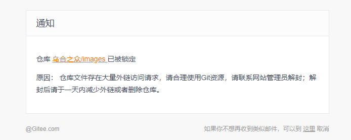
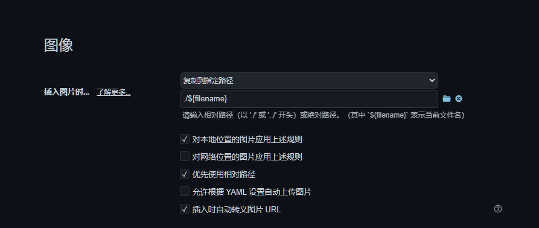

# 前言

之前博客的图片都是利用gitee当图床存储的，在上个月的某一天gitee突然给我发了个邮件屏蔽了我的图床仓库，如下：



周围用gittee当图床的同学也都是这个情况，属于是养肥之后收割了。博客图片全部失效，我之前也没有备份，直接心态崩了，看着满屏的gitee的logo就脑袋疼，还好之后联系管理员给我把仓库开了供我下载备份。由于3月到现在一直在忙着找实习，一直没空来管这个，最近总算有空来解决这个问题了。

# 解决

现在图片是有了，不管是找其他图床还是直接把图片和文章一块部署上去，都需要对文章里面图片的路径做一个全局替换。显然这是个体力活，对于体力活来说，必须偷懒，所以有了下面的一个脚本。

```python
import os
import regex as re
import time

def modifyContent(top):
    for root, dirs, files in os.walk(top, topdown=False):
        # 循环文件
        for file_name in files:
            file_name_split = file_name.split('.')

            try:
                if file_name_split[-1] == 'md':
                    # 找到md文件并且复制一份md文件路径
                    md_file_path = os.path.join(root, '.'.join(file_name_split))
                    copy_md_file_path = os.path.join(root, '.'.join([f'{file_name_split[0]}_copy', file_name_split[1]]))

                    # 打开md文件然后进行替换
                    with open(md_file_path, 'r', encoding='utf8') as fr, \
                            open(copy_md_file_path, 'w', encoding='utf8') as fw:
                        data = fr.read()
                        # 替换前的字符串 -- 替换后的字符串
                        data = re.sub('https://gitee.com/acacac13/images/raw/master', 'picture', data)
                        fw.write(data)  # 新文件一次性写入原文件内容
                    # 删除原文件
                    os.remove(md_file_path)
                    # 重命名新文件名为原文件名
                    os.rename(copy_md_file_path, md_file_path)
                    print(f'{md_file_path} done...')
                    time.sleep(0.5)
            except FileNotFoundError as e:
                print(e)
        time.sleep(0.5)

if __name__ == '__main__':
    top = r'....../source/_posts'
    modifyContent(top)
```


简单记录一下步骤：

1. 在博客的`source`文件夹下新建一个图片文件夹`picture`，并把所有图片放入其中；
2. 通过上面的脚本替换掉`_post`文件夹下所有文章中的图片路径；
3. 可以打开md文件看到已经可以正常显示图片了；
4. `hexo clean`；
5. `hexo g`查看`public`文件夹下是否有`picture`文件夹，若有则替换成功，若没有则检查第一步是否是在`source`文件夹下新建的图片文件夹；
6. 最后`hexo d`部署。

这样的话只是把封面图片和顶部图片恢复了，仔细查看public文件夹的文章路径可以知道用之前的相对路径是不行的，因此恢复文章的图片还得需要在`_post`文件夹下建立与文章相同文件名的文件夹放入图片，再修改文章中的图片路径，此时修改路径其实将 typora 的偏好设置设置如下然后再直接cv即可，后面的步骤就是正常的部署文章了。


