# 预备知识

## 二叉查找树

二叉查找树又叫二叉排序树，也叫二叉搜索树，左节点小于根节点，右节点大于根节点。没有键值相等的结点。

示例图：

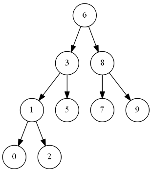

**实现：**

```java
public class BinarySearchTree<T> {
    T data;
    BinarySearchTree<T> left;
    BinarySearchTree<T> right;
    public BinarySearchTree(T data){
        this(data, null, null);
    }
    public BinarySearchTree(T data, BinarySearchTree<T> left, BinarySearchTree<T> right) {
        this.data = data;
        this.left = left;
        this.right = right;
    }
}
```

## 平衡二叉树

每一个结点的左子树和右子树的高度差最多为1的二叉查找树。因此查找、插入和删除的时间复杂度都变成了O(logn)

> 为了反映每个结点的高度差，在二叉查找树的结点中应该增加一个新的域——被称为平衡因子(BF)，它的值是某个根结点的左子树深度减右子树深度的值。易知，**对于一棵平衡二叉树，每个结点的平衡因子只可能是-1、0、1三种可能**

# 红黑树

含有红黑结点并能自平衡的二叉查找树，时间复杂度为O(logn)

**一颗含有n个结点的红黑树的高度最多为2log(n+1)**

性质：

1. 每个结点要么是黑色，要么是红色
2. 根结点是黑色
3. 每个叶子结点是黑色
4. 每个红色结点的两个子结点一定都是黑色，可以出现连续的黑色结点
5. **任意一结点到每个叶子结点的路径都包含数量相同的黑结点**
   * 如果一个结点存在黑子结点，那么该结点肯定有两个子结点

下图为一颗红黑树，其中的红色结点H和M同样存在叶子结点，并且是黑色的

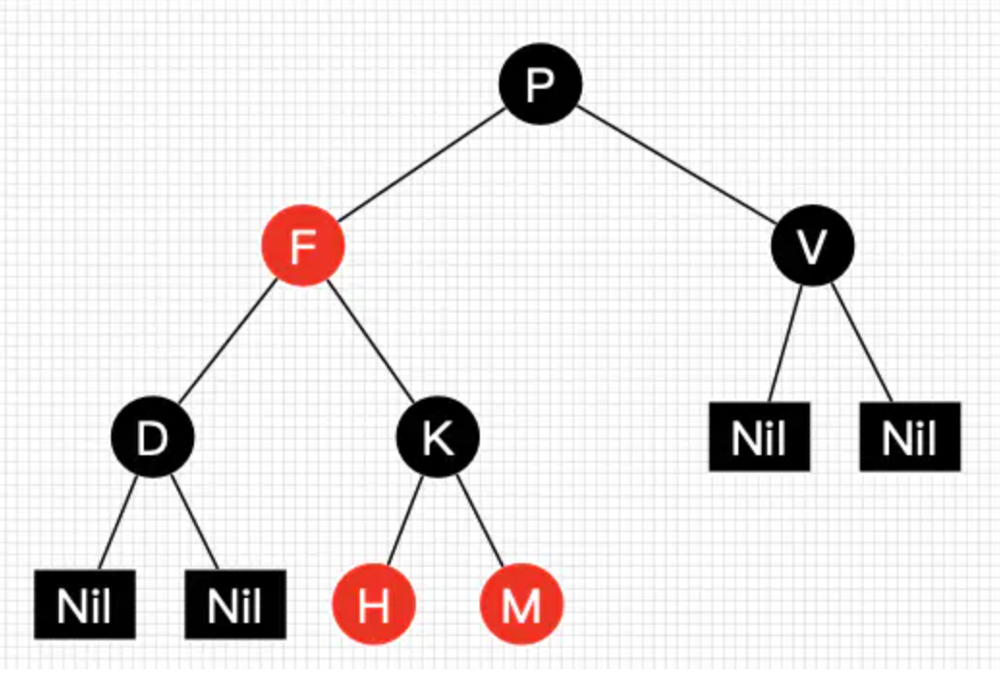

> 红黑树并不是一个完美平衡二叉查找树，根结点P的左子树显然比右子树高，但左子树和右子树的黑结点的层数是相等的，这种平衡叫做**黑色完美平衡**

红黑树实现代码：

```java
public class RBTree<T extends Comparable<T>, D>{

    //根节点
    private RBNode<T, D> root;

    /**
    * 结点的颜色
    */
    private static final Boolean RED = false;
    private static final Boolean BLACK = true;

    public class RBNode<T extends Comparable<T>, D>{
        //结点颜色
        private Boolean color;
        //键值
        private T key;
        //具体的数据
        private D data;
        private RBNode<T, D> parent;
        private RBNode leftChild;
        private RBNode rightChild;

        public RBNode(Boolean color, T key, D data, RBNode<T, D> parent, RBNode leftChild, RBNode rightChild) {
            this.color = color;
            this.key = key;
            this.data = data;
            this.parent = parent;
            this.leftChild = leftChild;
            this.rightChild = rightChild;
        }
    }
    ...
}
```

红黑树能够自平衡靠的是三种操作，分别是左旋，右旋和变色

* **左旋**：以某个结点为支点，其右子结点变为旋转结点的父结点，右子结点的左子结点变为旋转结点的右子结点，左子结点保持不变
* **右旋**：以某个结点为支点，其左子结点变为旋转结点的父结点，左子结点的右子结点变为旋转结点的左子结点，右子结点保持不变
* **变色**：结点的颜色由红变黑或由黑变红

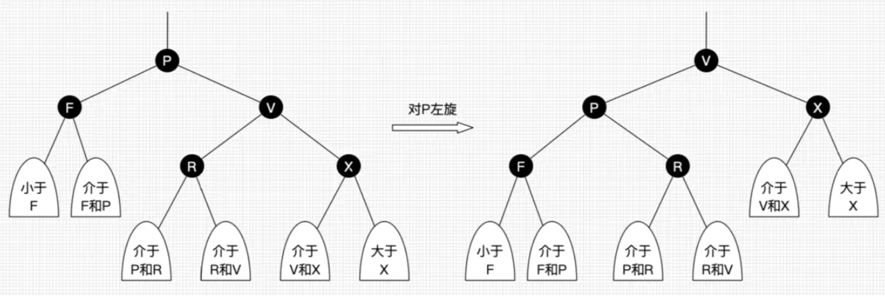


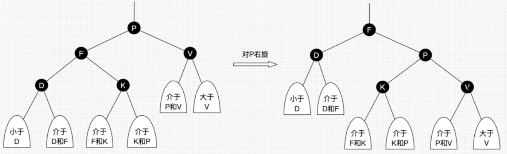

代码实现：

```java
/**
 * 对某个节点进行左旋
 * （当前节点就是父亲节点，整体过程就是 父亲下沉，右孩子上升，然后右孩子的左节点变成了原父亲的右节点）
 */
public void leftRotate(RBNode<T, D> x) {

    //右孩子
    RBNode<T, D> y = x.rightChild;

    if (y.leftChild != null) {
        //当前结点变成了右孩子的左孩子节点的父亲
        y.leftChild.parent = x;
    }
    //右孩子的左孩子结点变成了当前结点的右孩子结点
    x.rightChild = y.leftChild;
    //当前结点变成了原右孩子的左孩子结点
    y.leftChild = x;
    //当前的父亲变成了右孩子的父亲
    y.parent = x.parent;

    if (x.parent != null) {
        if (x.parent.leftChild == x) {
            x.parent.leftChild = y;
        } else {
            x.parent.rightChild = y;
        }
    } else {
        this.root = y;
    }
    x.parent = y;
}

/**
* 对某个节点进行右旋
*/
public void rightRotate(RBNode<T, D> x) {
    
    //左孩子
    RBNode<T, D> y = x.leftChild;

    if (y.rightChild != null) {
        //当前结点变成了左孩子的右孩子节点的父亲
        y.rightChild.parent = x;
    }

    //当前结点的父亲变成了左孩子的父亲
    y.parent = x.parent;
    //左孩子的右孩子变成了当前结点的左孩子
    x.leftChild = y.rightChild;
    //当前结点变成了原左孩子的右孩子结点
    y.rightChild = x;

    if (x.parent != null) {
        if (x.parent.leftChild == x) {
            x.parent.leftChild = y;
        } else {
            x.parent.rightChild = y;
        }
    } else {
        this.root = y;

    }
    x.parent = y;
}
```

小结：

* 左旋只影响旋转结点和其右子树的结构，把右子树的结点往左子树移了
* 右旋只影响旋转结点和其左子树的结构，把左子树的结点往右子树移了

## 红黑树查找

等同于二叉查找树的查找，下图为查找的流程图

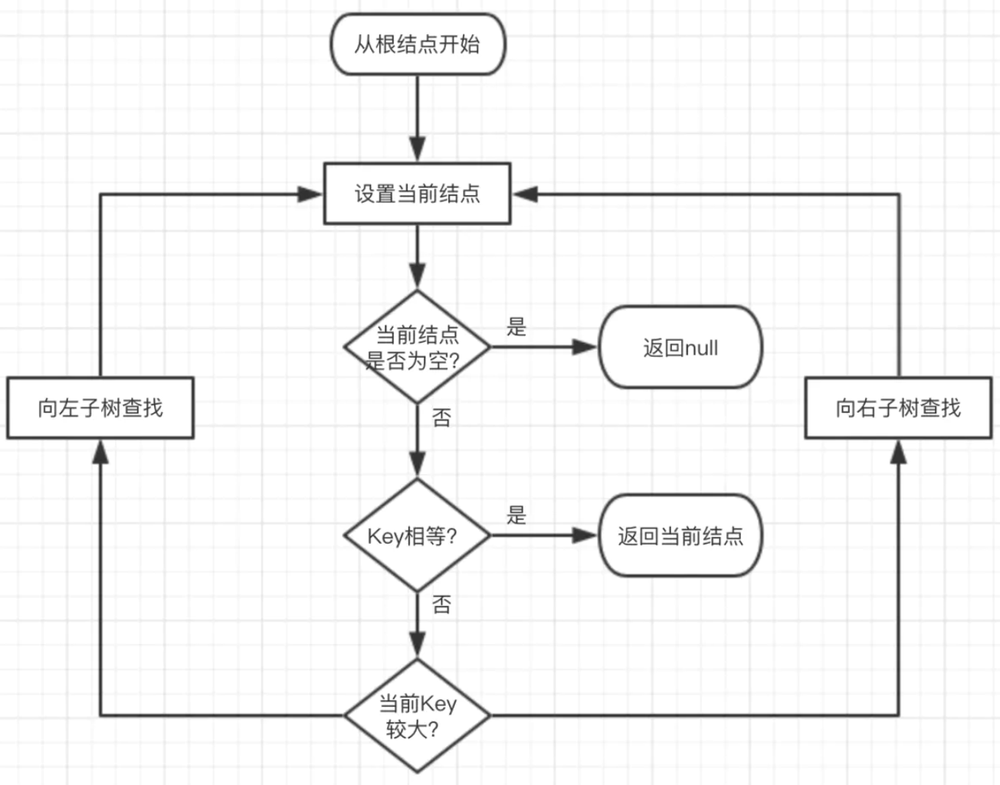

由于红黑树黑色完美平衡的特性，所以查找的最坏时间复杂度为O(2logn)

代码：

```java
/**
 * 红黑树的查找
 * 寻找为key值的节点（递归实现）
 */
public RBNode<T, D> search(T key, RBNode<T, D> node) {

    if (node != null) {
        //查找的过程，就是一直递归比较到叶子为止
        int com = key.compareTo(node.key);
        if (com < 0) {
            //目标key值小于当前key值
            return search(key, node.leftChild);
        } else if (com > 0) {
            //目标key值大于当前key值
            return search(key, node.rightChild);
        } else {
            return node;
        }
    }
    return null;
}

/**
 * 红黑树的查找
 * 寻找为key值的节点（非递归实现）
 */
public RBNode<T, D> iterativeSearch(T key, RBNode<T, D> node) {
    if (node != null){
        int com = key.compareTo(node.key);
        if (com < 0){
            node = node.leftChild;
        } else if (com > 0){
            node = node.rightChild;
        } else {
            return node;
        }
    }
    return null;
}
```

## 红黑树插入

红黑树的插入主要分为两部分：

1. 查找插入的位置即寻找插入的父结点
2. 插入后自平衡

下图为查找插入位置的流程图：

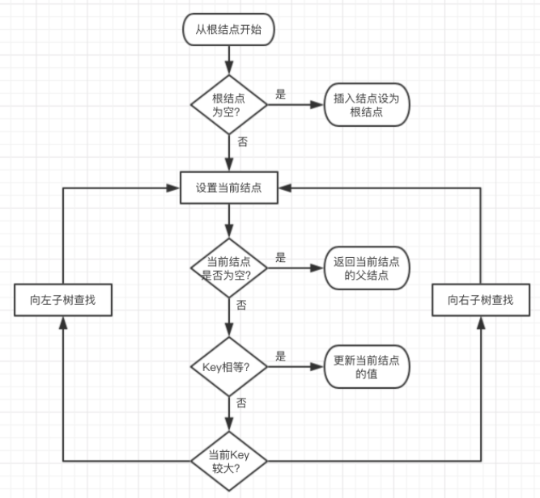

红黑树的插入场景有很多种，分别如下图所示：

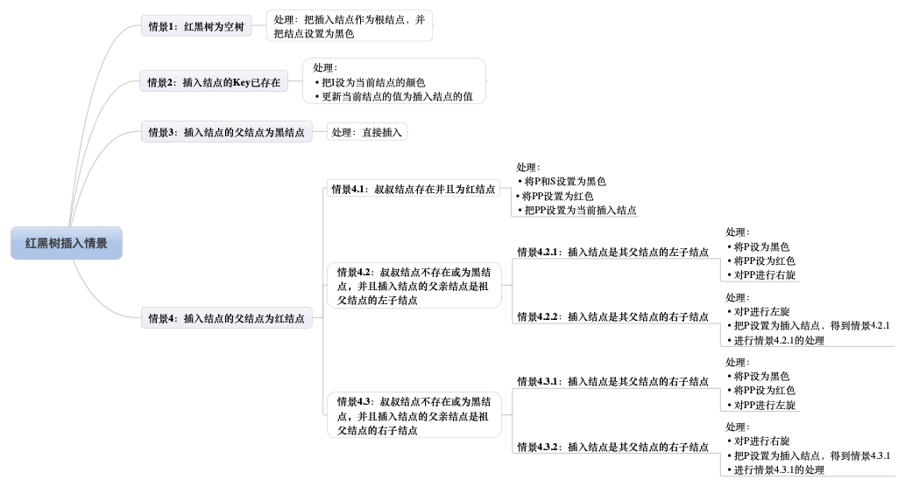

**注**：I表示插入结点，P表示插入结点的父结点，S表示插入结点的叔叔结点，PP表示插入结点的祖父结点

插入示例：

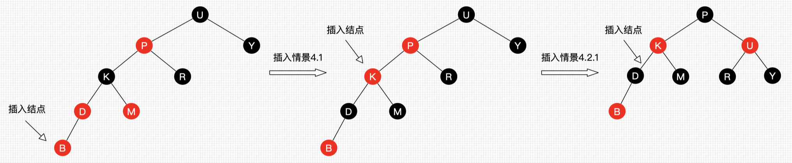

代码（略）

## 红黑树删除

红黑树的删除也包含两部分：

1. 查找目标结点
2. 删除后自平衡

二叉树删除结点找替代结点有3种情情景：

- 情景1：若删除结点无子结点，直接删除
- 情景2：若删除结点只有一个子结点，用子结点替换删除结点
- 情景3：若删除结点有两个子结点，用后继结点（大于删除结点的最小结点）替换删除结点

**把二叉树所有结点投射在X轴上，所有结点都是从左到右排好序的，所有目标结点的前后结点就是对应前继和后继结点**

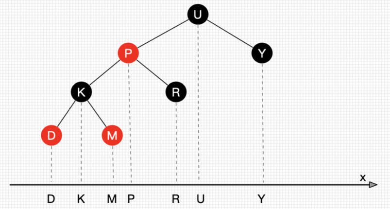

思路：**删除结点被替代后，在不考虑结点的键值的情况下，对于树来说，可以认为删除的是替代结点**

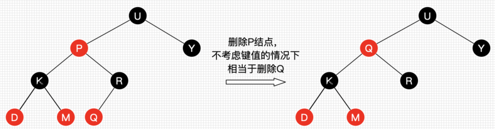

因此3种删除情景均可转换为情景1：

* 情景2：删除结点用其唯一的子结点替换，子结点替换为删除结点后，可以认为删除的是子结点，若子结点又有两个子结点，那么相当于转换为情景3，一直自顶向下转换，总是能转换为情景1
* 情景3：删除结点用后继结点（肯定不存在左结点），如果后继结点有右子结点，那么相当于转换为情景2，否则转为为情景1

小结：**删除操作删除的结点可以看作删除替代结点，而替代结点最后总是在树末，所以只用考虑删除树末结点的情景**

红黑树删除操作的所有情景如下图：


**注**：R表示替代结点，P表示替代结点的父结点，S表示替代结点的兄弟结点，SL表示兄弟结点的左子结点，SR表示兄弟结点的右子结点。灰色结点表示它可以是红色也可以是黑色

删除示例：

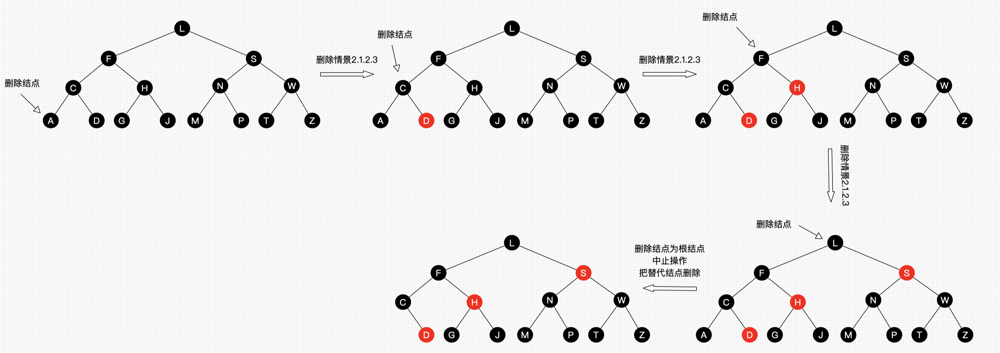

代码（略）

# 参考

1. [数据结构(二):二叉搜索树(Binary Search Tree) - 简书](https://www.jianshu.com/p/ff4b93b088eb)
2. [数据结构与算法--从平衡二叉树(AVL)到红黑树 - 简书](https://www.jianshu.com/p/3a6650269d39)
3. [30张图带你彻底理解红黑树 - 简书](https://www.jianshu.com/p/e136ec79235c)
